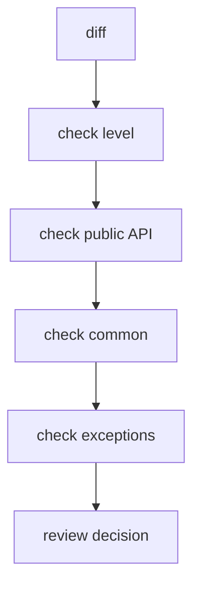

# Code Review Checklist

This guide helps review FEOD changes in PRs: new modules, code migration, public API, and fixes for architectural violations.



## When to Use

Use this checklist when reviewing changes that affect the structure of `app`, `pages`, `modules`, `common`, `global` or change imports between them.

## Prerequisites

- The PR author has indicated which levels and modules are changed.
- New or modified imports in the PR are visible.
- For a new module, its consumers are clear.
- If there is an exception, it is described in the PR or project documentation.

## Steps

1. Check the level of the changed code.

   The code should reside where its role matches the role of the level.

2. Check the public API.

   A new external consumer of a module should import only `@/modules/<name>`.

3. Find deep imports.

   ```ts
   // bad
   import { useCart } from '@/modules/cart/model/use-cart';
   ```

   Violation: External code depends on internal structure of the module.

4. Check `common`.

   If a file in `common` knows about the product domain, it should be a candidate for moving to a module.

5. Check `pages`.

   A page may assemble a scenario but should not become a source of reusable business logic.

6. Check `global`.

   `global` should contain only global declarations or side effects.

7. Check public API expansion.

   Each new export from `index.ts` should have an external consumer or a clear reason.

8. Check the module README.

   If the module is large, the README should match the actual structure and public API.

## Final Structure

The result of review is not an ideal project structure but a PR without new hidden violations:

```text
changed files
  -> correct level
  -> imports through public API
  -> no accidental common
  -> no accidental public exports
```

## Checklist

- Changed files are at the correct levels.
- External module imports go through the public API.
- The PR does not add a new deep import.
- `common` remains neutral.
- `pages` do not export reusable business logic.
- `global` contains only global declarations or side effects.
- A new public export has a consumer.
- Exceptions are explicitly described.

## Common Mistakes

- Reviewing only the file tree, not imports -> architectural violations remain in dependencies.
- Skipping `export *` -> internal module contents become public.
- Accepting a domain helper in `common` because it has a short name -> the common level gains hidden business logic.
- Demanding a perfect migration of all legacy in one PR -> review blocks gradual improvement.

## Related Pages

- [Code Smells](../reference/code-smells.md)
- [Import Matrix](../reference/import-matrix.md)
- [Module Contract](../reference/module-contract.md)
- [ESLint plugin](../tools/eslint-plugin.md)
