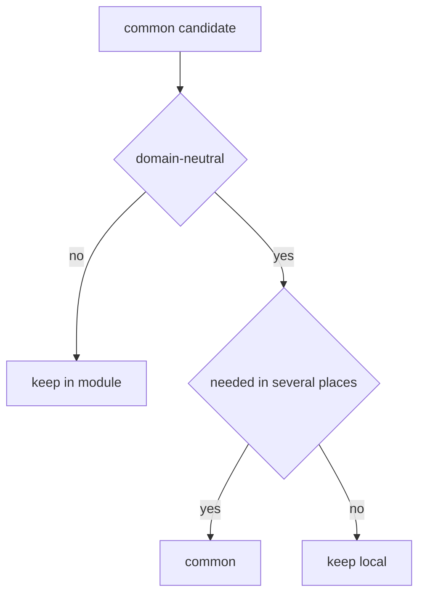

# How to Avoid Making common a Dumping Ground



## When to Use

Use this guide whenever you are considering moving code into `common`. Especially if the argument sounds like "it will be useful everywhere," "it is used by two modules," or "I don't know where else to put it."

`common` should contain neutral technical entities. It must not become a fallback container for domain logic.

## Entry Conditions

- You understand what problem the code solves.
- You know which modules or pages intend to use it.
- You can determine whether the code has domain meaning.
- You are willing to keep the code within its module, even if it is used in multiple places.

## Decisive Rule

You can place the code in `common` only if it remains useful and understandable without knowledge of the product domain.

If a helper, type, hook, component, or adapter knows about users, orders, permissions, cart, plans, documents, or another project domain, it should not be in `common`.

## Steps

1. Check for domain meaning.

   Question: `Can this code be explained without using product-specific terms?`

   Can go into `common`:

   ```ts
   formatDate(value: Date): string
   useDebounce(value, delay)
   Button
   PageLayout
   HttpClient
   ```

   Cannot go into `common`:

   ```ts
   formatOrderTotal(order)
   mapCheckoutPayload(draft)
   useCurrentUser()
   canEditInvoice(user, invoice)
   ```

2. Distinguish between Technical Helper and Domain Helper.

   A technical helper works with neutral types. A domain helper expresses a product rule.

   Technical:

   ```ts
   export function clamp(value: number, min: number, max: number) {}
   ```

   Domain:

   ```ts
   export function clampDiscount(discount: Discount, plan: BillingPlan) {}
   ```

   The second helper knows about discount rules and billing plans, so it should belong to the module that owns this domain.

3. Check if a Separate Module is Needed.

   If the code is needed by multiple modules but has domain meaning, often a cross-cutting module is required.

   Good:

   ```text
   modules/
     viewer/
       index.ts
       model/useCurrentUser.ts
       api/viewer-client.ts
   ```

   Bad:

   ```text
   common/
     user/
       useCurrentUser.ts
       viewer-client.ts
   ```

   Violation: the user domain is hidden in a common level.

4. Do not move types to `common` for convenient imports.

   A type belongs to its owner. If `Order` describes the `orders` module, export it from the public API of that module.

   Correct:

   ```ts
   import type { Order } from "@/modules/orders";
   ```

   Incorrect:

   ```ts
   import type { Order } from "@/common/types";
   ```

   Violation: the domain model is separated from the module responsible for its meaning.

5. Split `common` entities into separate mini-contracts.

   There should not be a single common `utils`.

   Good:

   ```text
   common/
     button/
       index.ts
       ui/Button.tsx
     format-date/
       index.ts
       lib/formatDate.ts
     http-client/
       index.ts
       lib/createHttpClient.ts
   ```

   Bad:

   ```text
   common/
     utils/
       formatDate.ts
       Button.tsx
       orderMapper.ts
       userStore.ts
   ```

   Violation: the folder does not show a contract and mixes technical and domain concerns.

6. Check `common` dependencies.

   The entity in `common` should not import `app`, `pages`, `modules`, or `global`. It can import external packages and public APIs of other independent `common` entities.

   Allowed:

   ```ts
   import { cx } from "@/common/cx";
   ```

   Forbidden:

   ```ts
   import type { User } from "@/modules/user";
   import { AppConfig } from "@/app/config";
   ```

   Violation: the common level starts to depend on product or app-level code.

## When Code Should Migrate from Common to a Module

Move code out of `common` into a module if:

- The name includes domain-specific terms;
- Types depend on the domain model;
- Tests describe business rules;
- Changing the code requires knowledge of one product or scenario;
- Consumers are few and all related to one domain area;
- Code cannot be safely used outside this scenario.

Example migration:

```text
common/
  order-mapper/
    index.ts
```

becomes:

```text
modules/
  orders/
    index.ts
    lib/map-order.ts
```

If the mapper is needed externally, the module decides whether to expose it through public API or provide a more stable public function.

## Checklist

- [ ] The code in `common` can be explained without using product-specific terms.
- [ ] The entity has its own `index.ts`.
- [ ] Inside, there are no domain types, stores, specific module APIs, or business rules.
- [ ] `common` does not import `modules`, `pages`, `app`, or `global`.
- [ ] Domain types are exported from their owner, not from a common type bag.
- [ ] Reuse did not replace the question of responsibility.

## Common Mistakes

- Treating "used in two places" as sufficient reason for `common`.
- Putting stores and query state into `common` because they are used by multiple pages.
- Creating `common/types.ts` for all project domain types.
- Hiding specific module APIs in a general HTTP catalog.
- Adding `utils` without public API or owner.

## Related Pages

- [Common](../structure/common.md)
- [Modules](../structure/modules.md)
- [Import Matrix](../reference/import-matrix.md)
- [Where to Place Code](./where-to-place-code.md)
