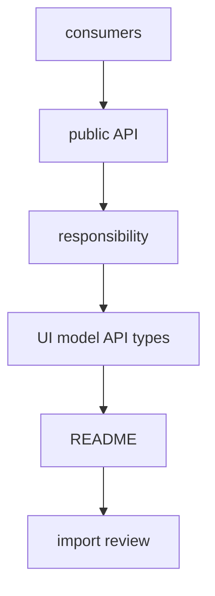

# How to Design a Module

This guide helps you design a module so it can be used through an explicit public API, changed without deep imports, and checked in code review. Start with the module's responsibility and consumers, not with folder structure.



## When to Use

Use this guide when you:

- create a new module;
- break down a large scenario into separate modules;
- move logic from `pages` or `app` to `modules`;
- restructure the public API of an existing module;
- check whether implementation details have leaked out.

## Entry Conditions

- You can name one main responsibility for the module.
- You understand who will be the consumer: `pages`, `app`, another module, or only the module itself.
- You know which dependencies the module should really have.
- You are ready to keep the internal structure private.

If you cannot formulate a single responsibility, the module is not yet designed. First, describe the scenario and its boundaries.

## Steps

1. Formulate the module's responsibility in one short statement.

   A good formulation answers the question: `What does this module do for the product?`

   Good examples:

   - `checkout` processes orders;
   - `notifications` displays and groups notifications;
   - `viewer` provides the current user and their session.

   Bad examples:

   - `shared-tools` stores everything useful;
   - `utils` contains helpers for various tasks;
   - `user-and-order` combines two unrelated areas.

   Anti-example:

   ```text
   modules/
     shared-tools/
       Button.tsx
       auth-client.ts
       order-mapper.ts
   ```

   Violation: the module does not express a single responsibility.

2. Define the consumers of the module before choosing files.

   Ask yourself:

   - Who will import this module?
   - What exactly do they need: component, function, hook, type, provider?
   - What should remain an internal detail?

   Typical solutions:

   - `Component` -> export it if it is needed outside the module; keep internal parts private.
   - `API-client` -> do not export it automatically; external code usually needs a scenario or adapted function, not a transport detail.
   - `store` -> export it only if external code really needs to work with it as a contract.
   - `helper` -> keep it private until it becomes part of the module's scenario.
   - `types` -> export them only if they describe public inputs and outputs.

   Good example:

   ```text
   Consumers of checkout:
   - pages/checkout needs <CheckoutFlow />
   - pages/checkout needs type CheckoutFlowProps
   - another module may call startCheckout()
   - paymentClient and mapCheckoutPayload remain internal
   ```

3. Design the public API as a minimal contract.

   External code imports the module only from its root. The public API should expose only what you are ready to support as an external contract.

   Good example:

   ```ts
   // modules/checkout/index.ts
   export { CheckoutFlow } from "./ui/CheckoutFlow";
   export { startCheckout } from "./model/startCheckout";

   export type { CheckoutFlowProps } from "./ui/CheckoutFlow";
   export type { CheckoutResult } from "./model/checkout.types";
   ```

   Anti-example:

   ```ts
   // modules/checkout/index.ts
   export * from "./api";
   export * from "./model";
   export * from "./ui";
   export * from "./lib";
   ```

   Violation: `export *` turns the internal structure into an implicit contract and exposes unnecessary details.

4. Distribute the internals by role, not by habit.

   Inside the module, you can have `ui`, `model`, `api`, `lib`, `config`, `types`, and other folders if they help keep one responsibility. These folders are optional and should not be mechanically copied.

   Practical rule:

   - `ui` -> public and internal components of the module;
   - `model` -> state, hooks, actions, selectors, domain state;
   - `api` -> transport and scenario adapters;
   - `lib` -> internal transformations and helpers;
   - `types` or `*.types.ts` -> types next to their owners;
   - `README.md` -> purpose and boundaries if not obvious.

   Good example:

   ```text
   modules/
     notifications/
       index.ts
       ui/
         NotificationsBell.tsx
         NotificationsPanel.tsx
         NotificationRow.tsx
       model/
         useNotifications.ts
         notifications-store.ts
         notifications.types.ts
       api/
         notifications-client.ts
       lib/
         group-notifications.ts
   ```

   Anti-example:

   ```text
   modules/
     notifications/
       index.ts
       helper.ts
       helper-2.ts
       new.ts
       test.ts
   ```

   Violation: a file dump does not show the role of parts of the module and quickly breaks navigation.

5. Hide implementation details and prohibit deep imports.

   External code should not know about `ui`, `api`, `model`, or `lib` inside the module. If a consumer needs an internal file, it is a signal to restructure the public API, not allow deep imports.

   Good example:

   ```ts
   import { NotificationsBell } from "@/modules/notifications";
   ```

   Anti-example:

   ```ts
   import { NotificationsBell } from "@/modules/notifications/ui/NotificationsBell";
   import { notificationsClient } from "@/modules/notifications/api/notifications-client";
   ```

   Violation: the consumer depends on folder structure, not the module's contract.

6. Check the module's dependencies before first integration.

   A short check by matrix:

   - The module can import `common`;
   - The module can import public API of other modules;
   - The module does not import `app`;
   - The module does not import `pages`;
   - The module does not import `global`;
   - The module does not do deep imports into the internals of another module;
   - Type-only imports are not an exception.

   Good example:

   ```ts
   import { Button } from "@/common/button";
   import { getViewer } from "@/modules/viewer";
   ```

   Anti-example:

   ```ts
   import { AppShell } from "@/app/AppShell";
   import { CatalogPage } from "@/pages/catalog";
   import { normalizeUser } from "@/modules/user/lib/normalizeUser";
   ```

   Violation: the module depends on forbidden levels and internal files of another module.

7. Add a README if its boundaries are not obvious without it.

   A README is especially needed when:

   - The module is large;
   - It has noticeable submodules;
   - The public API is not just one component;
   - There are non-trivial rules of usage;
   - Ownership matters for review and support.

   Minimum for a README:

   - Purpose of the module;
   - Who its consumers are;
   - What is exported from public API;
   - What is considered an internal detail;
   - Which dependencies are key.

   Anti-example:

   ```md
   # Checkout

   Various code for order processing lives here.
   ```

   Violation: README does not fix boundaries, contract, and usage rules.

## Final Structure

A typical result looks like this:

```text
modules/
  checkout/
    README.md
    index.ts
    ui/
      CheckoutFlow.tsx
      CheckoutSummary.tsx
    model/
      startCheckout.ts
      useCheckout.ts
      checkout.types.ts
    api/
      checkout-client.ts
    lib/
      map-checkout-payload.ts
    __tests__/
      startCheckout.test.ts
```

A typical `README.md` for a module:

```md
# Checkout

## Purpose

The module processes orders and assembles the checkout scenario.

## Consumers

- `pages/checkout`
- modules that need `startCheckout`

## Public API

- `CheckoutFlow`
- `startCheckout`
- `CheckoutFlowProps`
- `CheckoutResult`

## Internal Details

- `checkout-client`
- `map-checkout-payload`
- internal part components
```

## Checklist

- The module has one main responsibility.
- Consumers of the module are named before designing the file structure.
- Public API is minimal and listed explicitly in the root `index.ts`.
- There is no `export *` from internal directories in `index.ts`.
- Internal helpers, API-clients, and store are not exported without a clear reason.
- Domain types are exported only if they are needed for an external contract.
- The module does not import `app`, `pages`, `global`, or internals of other modules.
- External code can use the module without deep imports.
- The structure of the module explains roles: `ui`, `model`, `api`, `lib` or other meaningful zones.
- A README is added if its boundaries are not obvious.

## Common Mistakes

- Designing a module from a list of files, not from responsibility -> the module quickly becomes an arbitrary folder.
- Exporting `api-client`, `store`, and helpers "just in case" -> public API grows and records internal details.
- Using `export *` from module directories -> any internal change becomes a potential breaking change.
- Moving domain types to `common` for convenience -> responsibility of the module is split.
- Allowing deep imports as a temporary measure -> folder structure becomes part of the external contract.
- Keeping two unrelated areas in one module -> changes start conflicting on ownership and review.
- Not fixing consumers and usage rules in README for large modules -> boundaries are again explained verbally.

## Related Pages

- [Modules](../structure/modules.md)
- [Public API](../reference/public-api.md)
- [How to Write a Module README](./module-readme.md)
- [Naming Rules](../reference/naming.md)
