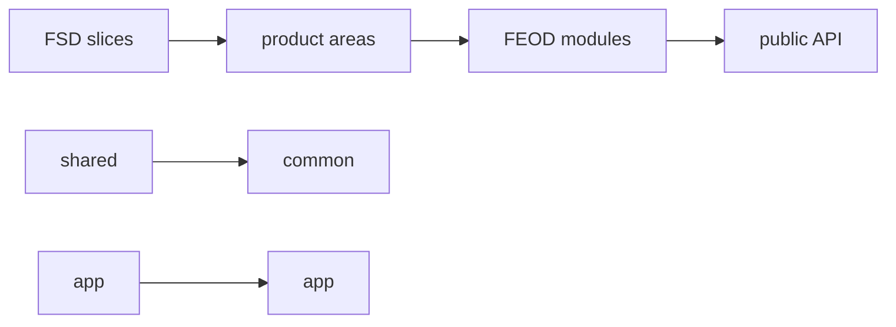

# Migration from FSD



## When to Use

Use this guide if your project is already built on Feature-Sliced Design and the team wants to migrate to FEOD without rewriting the application from scratch.

FSD terms are used here only for mapping. After migration, the main language of the project will be the levels of FEOD: `app`, `pages`, `modules`, `common`, `global`.

## Prerequisites

- You have an existing FSD structure and a list of used layers.
- The team understands which `entities`, `features`, `widgets` are independent product domains.
- There is a possibility to introduce public API and change imports gradually.

## Steps

1. Describe the current FSD layers.

   Identify which folders are actually being used: `app`, `pages`, `widgets`, `features`, `entities`, `shared`. Note separately places where a layer exists only nominally.

2. Transfer `app` almost directly.

   FSD `app` usually maps well to FEOD `app`: entrypoints, providers, router, bootstrap, and top-level composition.

3. Transfer `pages` almost directly.

   FSD `pages` usually remains FEOD `pages`. Check that pages have not become sources of reusable business logic.

4. Decompose `shared`.

   Neutral UI primitives, utilities, framework helpers, and common types move to `common`. Code with a product meaning should not remain in `common`.

5. Reduce `entities`, `features`, `widgets` to `modules` if this fits the chosen canonical FEOD version.

   Group by responsibility rather than old layer names. For example, `entities/user`, `features/change-email`, and `widgets/profile-card` may become parts of one module `user` if they describe a single domain.

6. Recheck each module's public API.

   Old `index.ts` files might export too much. The new public API should expose only the supported external contract.

7. Simplify contentious boundaries.

   If code was spread across `entities`, `features`, and `widgets`, choose one responsibility and gather related parts together.

8. Document differences in the project README.

   The README should explain that the project no longer uses FSD as its main language, with FSD terms remaining only in migration context.

9. Technical checks can be deferred until stabilization.

   Lint rules, FEOD config, and AI rules are added on a subsequent technical stage. Until then, it is important not to imitate architecture with checks but to align real contracts.

## Example Mapping

| FSD | FEOD | Comment |
| --- | --- | --- |
| `app` | `app` | Typically transferred almost directly. |
| `pages` | `pages` | Remains route-level composition. |
| `shared` | `common` or `global` | Only neutral entities go to `common`; declarations and polyfills go to `global`. |
| `entities` | `modules` | If an entity describes a product domain. |
| `features` | `modules` | If a feature is a scenario or part of module responsibility. |
| `widgets` | `modules` or `pages` | Depends on whether it's a reusable product unit or page composition. |

## Good Example

```text
src/
  modules/
    user/
      index.ts
      ui/
        UserMenu.tsx
      model/
        useCurrentUser.ts
      api/
        user-client.ts
```

```ts
import { UserMenu, useCurrentUser } from "@/modules/user";
```

Here the former parts of `entities/user`, `features/current-user`, and `widgets/user-menu` are gathered around one responsibility and exposed through public API.

## Bad Example

```text
src/
  modules/
    entities/
    features/
    widgets/
```

Violation: the project renamed the top level but kept FSD as an internal taxonomy without FEOD responsibility boundaries.

```ts
import { userModel } from "@/modules/user/model/user-model";
```

Violation: migration did not replace deep imports and left module internals exposed as an external contract.

## Checklist

- [ ] FSD terms are used only in the migration guide and README, not as the main language of FEOD.
- [ ] `app` and `pages` are transferred without mixing with business logic.
- [ ] `shared` is broken down into `common`, `global`, and product modules.
- [ ] `entities`, `features`, `widgets` are grouped by responsibility in `modules`.
- [ ] Each module has an explicit public API.
- [ ] Deep imports are replaced gradually.
- [ ] Technical checks can be deferred until structure stabilization.

## Common Mistakes

- Keeping FSD layers inside `modules` -> FEOD becomes only a superficial renaming.
- Considering `shared` as automatic `common` -> domain code ends up in the common level.
- Moving `widgets` to `pages`, even though they are used in multiple scenarios -> reusable product unit loses its owner.
- Rewriting structure without updating public API -> consumers continue to depend on internal files.
- Enabling lint before mapping is complete -> the team gets errors for transitional states, not help.

## Related Pages

- [Levels](../core-concepts/levels.md)
- [Modularity](../core-concepts/modularity.md)
- [Import Matrix](../reference/import-matrix.md)
- [Public API](../reference/public-api.md)
- [Terms](../reference/terms.md)
