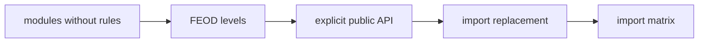

# Migration from Modular Architecture



## When to Use

Use this guide if the project is already divided into large folders or modules, but it lacks explicit FEOD levels, a public API for modules, and checked import rules.

The goal of migration is not to rewrite the entire project at once, but to gradually make boundaries visible and manageable.

## Entry Conditions

- The current project structure exists.
- The team can identify main pages and product areas.
- There is an ability to change imports incrementally.
- For contentious places, temporary migration aliases or compatible exports can be left in place.

## Steps

1. Document the current project map.

   List entrypoints, route-level screens, product areas, common UI primitives, utilities, and global connections. Do not rename files at this step.

2. Extract `app`.

   Move application bootstrapping, providers, top-level router, layout shell, and wiring into `app`. Do not move business logic specific to scenarios here.

3. Extract `pages`.

   Route-level screens become pages. A page aggregates a scenario from modules and `common`, but does not become the source of reusable logic.

4. Separate product modules from `common`.

   Product-specific code is moved into `modules`. Neutral UI primitives, utilities, framework helpers, and domain-agnostic common types remain in `common`.

5. Introduce public API for modules.

   Each module should have a root `index.ts`. Start by exporting existing external points of use, then gradually narrow the contract.

6. Find deep imports.

   Look for imports into internal folders within modules: `ui`, `model`, `api`, `lib`, `config`, `types`. Each such import is either translated to public API or marked as temporary migration debt.

7. Gradually close module internals.

   Do not break all consumers at once. Add compatible exports, update consumers in batches, and remove temporary entries after migration.

8. Add architectural checks in the next technical stage.

   Lint rules, AI rules, and FEOD config are introduced only after the basic structure stabilizes. This guide fixes the order of migration, not the technical implementation of checks.

## Final Structure

```text
src/
  app/
    main.tsx
    router/
    providers/
  pages/
    catalog/
      index.ts
      ui/
  modules/
    catalog/
      index.ts
      ui/
      model/
      api/
    cart/
      index.ts
      ui/
      model/
  common/
    ui/
    format-date/
    http-client/
  global/
    env.d.ts
    polyfills/
```

## Good Example

```ts
// pages/catalog/ui/CatalogPage.tsx
import { ProductList } from "@/modules/catalog";
import { PageLayout } from "@/common/ui/page-layout";
```

The import follows the allowed direction and goes through public API.

## Bad Example

```ts
// pages/catalog/ui/CatalogPage.tsx
import { ProductList } from "@/modules/catalog/ui/ProductList";
import { cartStore } from "@/modules/cart/model/cart-store";
```

Violation: The page depends on module internals and locks in the old file structure as an external contract.

## Checklist

- [ ] Entry points and providers are in `app`.
- [ ] Route-level screens are in `pages`.
- [ ] Product areas are in `modules`.
- [ ] Neutral UI and utilities are in `common`.
- [ ] Global declarations and polyfills are in `global`.
- [ ] Each module has an `index.ts`.
- [ ] New imports do not bypass public API.
- [ ] Temporary deep imports are marked as migration debt.
- [ ] Lint/technical checks are deferred to the next technical stage.

## Common Mistakes

- Attempting a big bang rewrite -> migration halts product work.
- Renaming all folders without changing dependencies -> the structure looks like FEOD, but contracts remain old.
- Moving common domain code into `common` -> product responsibility loses its owner.
- Closing public API without compatible exports -> consumers break simultaneously.
- Enabling the linter before structure stabilizes -> the team gets noise instead of a controlled migration.

## Related Pages

- [Import Matrix](../reference/import-matrix.md)
- [Public API](../reference/public-api.md)
- [Where to Place Code](./where-to-place-code.md)
