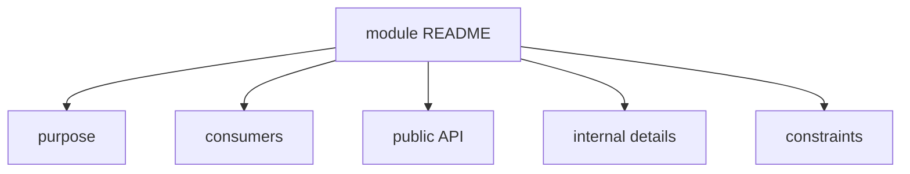

# How to Write a Module README



## When to Use

A README is not needed for every small module. Write it when it's difficult to understand the responsibility, public API, limitations, or ownership of a module without additional text.

Use this guide if:

- The module is large or critical;
- It has submodules;
- The public API involves more than one component;
- Other modules use this module;
- Regular questions arise about boundaries in reviews;
- There are dependency, runtime, or migration limitations for the module.

## Entry Conditions

- The module has a name and a single main responsibility.
- External consumers are known.
- The public API is expressed in the root `index.ts` or planned as part of the work.
- It's clear which files contain internal details.

## README Structure

The minimal module README should answer four questions:

- Why does the module exist;
- What can be imported externally;
- What cannot be imported externally;
- Which dependencies and limitations are important for changes.

A recommended template is:

```md
# <Module Name>

## Purpose

Briefly: what product responsibility does the module hold.

## Consumers

- `pages/...`
- `app` if the module is connected at the top level
- other modules, if allowed through public API

## Public API

- `ExportName`
- `useSomething`
- `SomeType`

## Internal Details

- `api/*`
- `model/internal-*`
- part components

## Submodules

- `delivery` - ...
- `payment` - ...

## Dependencies and Limitations

- what the module can import;
- which dependencies are prohibited;
- temporary migration notes, if any.
```

Remove sections that don't apply to a specific module. The README should not become a formal document for its own sake.

## Good Example

```md
# Checkout

## Purpose

The module processes orders: collects delivery, payment, and final confirmation.

## Consumers

- `pages/checkout`
- `pages/cart`, if needed for a short transition to checkout

## Public API

- `CheckoutFlow`
- `startCheckout`
- `CheckoutResult`

## Internal Details

- `api/checkout-client`
- `delivery/*`
- `payment/*`
- `lib/map-checkout-payload`

## Submodules

- `delivery` stores the delivery form and its local model logic.
- `payment` stores the payment step and adapts to payment providers.

## Dependencies and Limitations

The module can import `common` and public API from other modules. External consumers use only `@/modules/checkout`. Submodules are not imported directly.
```

What is correct here:

- Purpose relates to product responsibility;
- Public API is listed explicitly;
- Internal details are named as closed off;
- Submodules are described as parts of the parent module;
- Limitations relate to import matrix.

## Bad Example

```md
# Checkout

Everything for checkout lives here.

Components in `ui`, logic in `model`, api in `api`.
```

Violation: README repeats folder names but does not explain boundaries, consumers, and public API.

## Steps

1. Start with the purpose.

   One or two sentences should answer what the module is responsible for. If unrelated areas need to be listed, the module is likely too broad.

2. Name the consumers.

   Indicate who imports the module. This helps verify that every export is truly needed by external code.

3. List public API.

   The list should match the meaning of the root `index.ts`. README does not replace `index.ts`, but it helps understand intent.

4. Document internal details.

   Name what cannot be imported externally: raw clients, stores, mappers, part components, internal types.

5. Describe submodules if they exist.

   Submodules are described as internal parts of the parent module. If external code should use their results, the path still goes through the public API of the parent module.

6. Add limitations.

   Only important rules should be fixed:

   - prohibited dependencies;
   - temporary migration aliases;
   - test requirements;
   - ownership or review notes.

## Checklist

- [ ] README explains the module's responsibility, not just folder structure.
- [ ] Public API is listed explicitly and matches `index.ts`.
- [ ] Internal details are named as closed off.
- [ ] Submodules are not described as an automatic external contract.
- [ ] Limitations help with reviews and maintenance.
- [ ] README does not promise future implementation without an accepted current decision.

## Common Mistakes

- Writing README like folder contents -> it becomes outdated and unhelpful after a week.
- Not listing public API -> the external contract has to be guessed from exports again.
- Not explaining what is closed off -> consumers continue to do deep imports.
- Documenting every small function -> README turns into a manual API reference.
- Leaving migration notes without a deadline or owner -> temporary rules become permanent.

## Related Pages

- [How to Design a Module](./design-module.md)
- [Working with Submodules](./submodules.md)
- [Modules](../structure/modules.md)
- [Public API](../reference/public-api.md)
