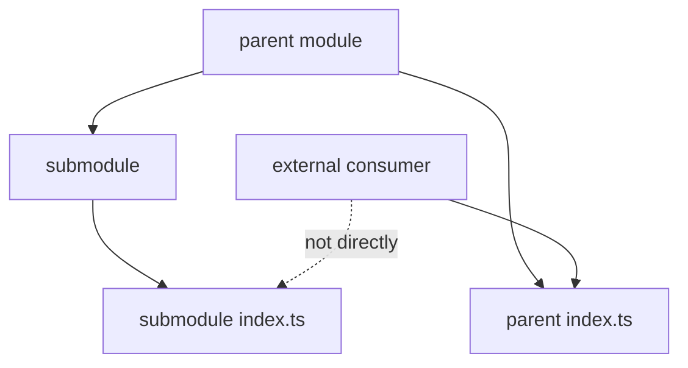

# Working with Submodules



## When to Use

Use this guide if within a single module there are stable parts with their own structure: `delivery`, `payment`, `permissions`, `filters`, `settings`, `details`.

A submodule helps organize the internals of a large module. It does not create a new top level in FEOD and is not itself an external contract.

## Prerequisites

- The parent module has one clear responsibility.
- The part relates to this responsibility, not to a standalone product domain.
- There is a reason to keep the part's own `ui`, `model`, `api`, `lib` or tests.
- The team understands who will use the part: only the parent module or an external consumer through the parent's public API.

## Steps

1. Check that the submodule should not become a separate module.

   A submodule is appropriate if it does not have its own lifecycle outside of the parent responsibility.

   Submodule:

   ```text
   modules/
     checkout/
       delivery/
       payment/
   ```

   Separate module:

   ```text
   modules/
     payments/
       index.ts
     checkout/
       index.ts
   ```

   If `payments` is used outside checkout and has its own external contract, it is better to make it a standalone module.

2. Provide the submodule with an internal `index.ts` for local organization only.

   An internal `index.ts` helps the parent module not know the submodule's file structure.

   ```ts
   // modules/checkout/payment/index.ts
   export { PaymentStep } from "./ui/PaymentStep";
   export { usePayment } from "./model/usePayment";
   ```

   This file does not mean that external code can import `@/modules/checkout/payment`.

3. Export only through the parent to the outside.

   If an external consumer should use a part of the submodule, the parent module explicitly includes it in its public API.

   Correct:

   ```ts
   // modules/checkout/index.ts
   export { CheckoutFlow } from "./ui/CheckoutFlow";
   export { PaymentStep } from "./payment";
   ```

   ```ts
   import { PaymentStep } from "@/modules/checkout";
   ```

   Incorrect:

   ```ts
   import { PaymentStep } from "@/modules/checkout/payment";
   import { usePayment } from "@/modules/checkout/payment/model/usePayment";
   ```

   Violation: The consumer bypasses the public API of the parent module.

4. Do not use a submodule as a way to hide unnecessary depth.

   A submodule should have a clear boundary. If it immediately contains several more levels of submodules, review the model again.

   Acceptable depth:

   ```text
   modules/
     admin-users/
       filters/
         index.ts
         ui/UserFilters.tsx
         model/useUserFilters.ts
   ```

   Suspicious depth:

   ```text
   modules/
     admin/
       users/
         filters/
           advanced/
             presets/
   ```

   A depth greater than two or three levels is acceptable only as an intentional exception for a complex domain with clear ownership.

5. Keep the submodule's dependencies within the parent.

   The submodule may use internal parts of the parent module and `common` if this does not create a cyclic dependency. It should not import `app`, `pages`, `global` or internals from other modules.

   Allowed:

   ```ts
   import { Button } from "@/common/button";
   import { useCheckoutDraft } from "../model/useCheckoutDraft";
   ```

   Forbidden:

   ```ts
   import { CheckoutPage } from "@/pages/checkout";
   import { paymentClient } from "@/modules/payments/api/payment-client";
   ```

6. Document only significant submodules.

   Not every submodule requires a separate README. But if the submodule affects the parent's public API, has non-trivial constraints, or frequently causes errors in reviews, document it in the parent module's README.

## Good Example

```text
modules/
  user/
    README.md
    index.ts
    ui/UserMenu.tsx
    permissions/
      index.ts
      ui/UserPermissionsPanel.tsx
      model/useUserPermissions.ts
    model/useCurrentUser.ts
```

```ts
// modules/user/index.ts
export { UserMenu } from "./ui/UserMenu";
export { UserPermissionsPanel } from "./permissions";
export { useCurrentUser } from "./model/useCurrentUser";
```

The consumer uses only the root module:

```ts
import { UserMenu, UserPermissionsPanel } from "@/modules/user";
```

## Bad Example

```ts
import { UserPermissionsPanel } from "@/modules/user/permissions";
import { mapPermission } from "@/modules/user/permissions/lib/mapPermission";
```

Violation: The presence of `permissions/index.ts` is taken as permission for external imports of the submodule.

## Checklist

- [ ] Submodule remains part of one parent responsibility.
- [ ] Internal `index.ts` of the submodule is not considered external public API.
- [ ] Everything needed outside is exported through the root of the parent module.
- [ ] Depth of nesting does not exceed two or three levels without explicit justification.
- [ ] The submodule does not import `app`, `pages`, `global`, or internals from other modules.
- [ ] The parent's README explains significant submodules and constraints.

## Related Pages

- [Modules](../structure/modules.md)
- [Public API](../reference/public-api.md)
- [Import Matrix](../reference/import-matrix.md)
- [How to Split a Large Module](./split-large-module.md)
