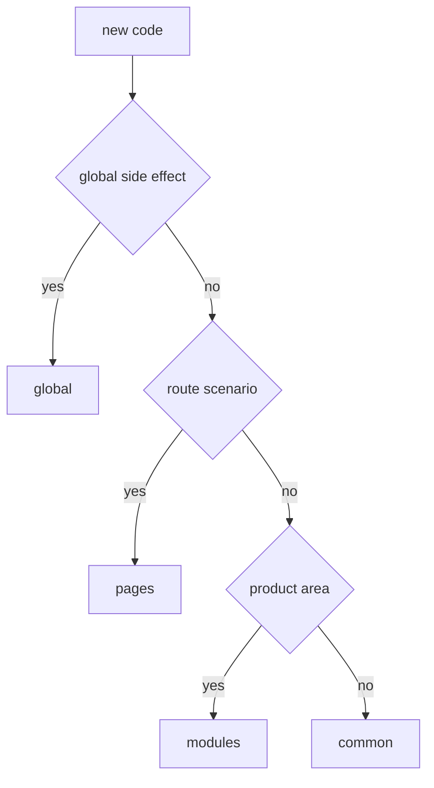

# Where to Place Code

This guide helps you quickly choose the right level for new code: `app`, `pages`, `modules`, `common`, or `global`. Start with the code's responsibility, not with whichever folder is convenient.



## When to Use

Use this guide when you:

- add a new component, helper, store, API client, types, or page;
- move code out of an overgrown folder;
- check whether code has landed on the wrong level;
- want to make a decision without reading the entire reference section.

## Entry Conditions

- You understand what problem the new code solves.
- You know who will use it: entrypoint, page, one module, several modules, or the whole application.
- You are ready to distinguish product responsibility from technical reusability.

If these conditions are not met, start by describing the usage scenario. Any level choice without this is random.

## Steps

1. Determine if the code has a global effect.

   If the file is for `.d.ts`, shim, polyfill, `declare global` or side-effect import, it belongs in `global`.

   Good example:

   ```text
   global/
     vite-env.d.ts
     polyfills/
       resize-observer.ts
   ```

   Anti-example:

   ```text
   global/
     env.ts
     lib/formatMoney.ts
   ```

   Violation: regular importable code cannot be hidden in `global`.

2. Check if the code assembles the entire application.

   If the code is responsible for bootstrapping, top-level router, providers, app shell, or wiring between major parts of the system, it belongs in `app`.

   Typically includes:

   - entrypoint;
   - `App.tsx`;
   - root router;
   - app-level providers;
   - global effects wired from entrypoint.

   Good example:

   ```ts
   import { AppRouter } from "@/pages";
   import { AuthSessionProvider } from "@/modules/auth";
   import { ErrorBoundary } from "@/common/error-boundary";

   export function App() {
     return (
       <ErrorBoundary>
         <AuthSessionProvider>
           <AppRouter />
         </AuthSessionProvider>
       </ErrorBoundary>
     );
   }
   ```

   Anti-example:

   ```ts
   import { normalizeUser } from "@/modules/user/lib/normalizeUser";
   ```

   Violation: `app` should not do deep imports into module internals.

3. Check if the code is related to a specific route or screen.

   If the code exists only as a route-level composition, reads route params, collects page-level loading/error state, or describes a specific screen, it belongs in `pages`.

   Typical question: `Is this a page or a module?`

   - If the entity makes sense only within one route, it is `pages`.
   - If the entity expresses an independent product scenario and can be used on multiple screens, it is `modules`.

   Good example:

   ```text
   pages/
     checkout/
       index.ts
       ui/
         CheckoutPage.tsx
       model/
         useCheckoutRoute.ts
   ```

   Anti-example:

   ```ts
   import { CatalogPage } from "@/pages/catalog";
   import { paymentClient } from "@/modules/checkout/api/paymentClient";
   ```

   Violation: a page should not import another page or reach into module internals.

4. Check if the code expresses an independent product responsibility.

   If the code describes a product scenario, domain, or isolated feature, it belongs in `modules`.

   Signals that a module is needed:

   - the code has its own consumers;
   - it will have UI, model, API, and tests around one responsibility;
   - it needs to be used from several pages or other modules;
   - it can be exposed through an explicit public API.

   Typical solutions:

   - `Component` -> in `modules`, if it is product-oriented; in `common`, if it is a technical primitive without domain meaning.
   - `API-client` -> in `modules`, if it serves one product scenario; in `common`, if it is neutral transport or a framework adapter.
   - `store` -> in `modules`, if the state belongs to the scenario; in `pages`, if the state is only route-level; not in `common` for a product store.
   - `helper` -> in `modules`, if the helper knows about the domain; in `common`, if it is a technical utility without business meaning.
   - `types` -> next to the owner of responsibility; domain types are not moved to `common` for convenience of import.

   Good example:

   ```text
   modules/
     checkout/
       index.ts
       ui/
         CheckoutFlow.tsx
       model/
         useCheckout.ts
         checkout.types.ts
       api/
         checkout-client.ts
       lib/
         map-checkout-payload.ts
   ```

   ```ts
   import { CheckoutFlow } from "@/modules/checkout";
   ```

   Anti-example:

   ```text
   modules/
     shared-tools/
       Button.tsx
       useDebounce.ts
       auth-client.ts
       order-mapper.ts
   ```

   Violation: the directory mixes unrelated responsibilities and hides a dumping ground.

5. Check if the code is technically general, not product-oriented.

   If the entity can be reused without domain binding and does not know about specific modules, it belongs in `common`.

   Typically includes:

   - UI primitives;
   - formatters;
   - validators without domain meaning;
   - framework helpers;
   - non-business hooks;
   - neutral infrastructure adapters.

   Good example:

   ```text
   common/
     button/
       index.ts
       ui/Button.tsx
     use-debounce/
       index.ts
       lib/useDebounce.ts
   ```

   Anti-example:

   ```text
   common/
     checkout-api/
       api/createOrder.ts
     user/
       model/userStore.ts
   ```

   Violation: product APIs and stores do not become `common` just because they are convenient to reuse.

6. Cross-reference the decision tree before creating a file.

   ```text
   New code
   ├─ Does it have global effect or environment declaration?
   │  └─ Yes -> global
   ├─ Assembles the entire application, bootstrap or app wiring?
   │  └─ Yes -> app
   ├─ Exists only as a route or screen?
   │  └─ Yes -> pages
   ├─ Expresses product responsibility or scenario?
   │  └─ Yes -> modules
   ├─ Is it a technically general entity without product meaning?
   │  └─ Yes -> common
   └─ Otherwise -> you have not yet defined the responsibility; do not create a file
   ```

7. Check if the choice violates the import matrix.

   Quick check:

   - `app` can import `pages`, `modules`, `common`;
   - `pages` can import `modules`, `common`;
   - `modules` can import `common` and public API of other modules;
   - `common` can import only public API of other entities in `common` and external packages;
   - `global` is not a regular application dependency.

   If the new code requires a forbidden import, the problem is almost always with the chosen level, not the matrix.

## Final Structure

A typical layout after making decisions looks like this:

```text
app/
  App.tsx
  router/
pages/
  checkout/
    index.ts
    ui/
modules/
  checkout/
    index.ts
    ui/
    model/
    api/
    lib/
common/
  button/
    index.ts
    ui/
  use-debounce/
    index.ts
global/
  vite-env.d.ts
  polyfills/
```

Short reminder of typical entities:

| Entity | Where to Place |
| --- | --- |
| Page | `pages` |
| Route-level loader, error state, reading params | `pages` |
| Product component | `modules` |
| UI primitive | `common` |
| API-client for one scenario | `modules` |
| Neutral HTTP adapter | `common` |
| Product store | `modules` |
| Store only for one route | `pages` |
| Business helper | `modules` |
| Technical helper | `common` |
| Domain types of module | next to the module |
| `.d.ts`, polyfill, shim | `global` |

## Checklist

- Code is placed by responsibility, not import convenience.
- For an entity, you can briefly answer why it is in `app`, `pages`, `modules`, `common` or `global`.
- The new path does not require forbidden imports according to the matrix.
- Product logic did not slip into `common`.
- Route-level code did not slip into `app` or `modules` without reason.
- Regular importable code did not slip into `global`.
- Domain types, stores, and API-clients are next to their owner.
- External consumers will use the entity through the public API of its level or module.

## Typical Mistakes

- Placing code in `common` because it is used in two places -> `common` turns into a hidden repository of product logic.
- Placing a large user scenario in `pages` -> the screen starts to own business logic that cannot be properly reused.
- Placing a technical helper in `modules` because it appeared next to the module -> the module starts dragging someone else's responsibility.
- Placing an imported runtime config in `global` -> a forbidden application dependency on `global` appears.
- Moving domain types to `common` for convenience -> the model of the module loses its owner.
- Violating public API deep imports to "not create extra exports" -> file structure becomes an implicit contract.

## Related Pages

- [Levels](../core-concepts/levels.md)
- [Import Matrix](../reference/import-matrix.md)
- [Public API](../reference/public-api.md)
- [Code Smells](../reference/code-smells.md)
