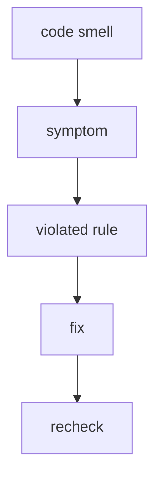

# Code Smells

Status: normative reference document



This page defines common signs of FEOD structure violations. A smell does not always mean an immediate runtime error, but it does mean an architectural risk that should be understood in review, lint rules, and AI rules.

Each smell is described in the same way:

- symptom - how the violation looks in code;
- why it matters - which FEOD contract it breaks;
- how to fix - where to move code or imports;
- related rules - which pages define the norm.

## Deep Imports

### Symptom

Code imports an internal file or internal directory of another FEOD entity:

```ts
import { OrderCard } from "@/modules/order/ui/OrderCard";
import { normalizeOrder } from "@/modules/order/lib/normalizeOrder";
import { formatMoney } from "@/common/format/lib/formatMoney";
```

### Why It Matters

A deep import bypasses the public API and turns internal structure into an external contract. After that, files cannot be safely moved, helpers cannot be renamed, and internal directories cannot be changed: consumers already depend on implementation details.

### How to Fix

Import another FEOD entity only from the root of its public API:

```ts
import { OrderCard, normalizeOrder } from "@/modules/order";
import { formatMoney } from "@/common/format";
```

If the needed symbol is not in the public API, first decide whether it should be a public contract. If yes, add an explicit export to the root `index.ts`. If no, rewrite the consumer through an existing public scenario.

### Related Rules

- [Import Matrix](./import-matrix.md)
- [Public API](./public-api.md)
- [Naming Rules](./naming.md)

## Module Internals Leaking

### Symptom

A module exports private stores, selectors, DTOs, raw clients, internal part-components, or state types to the outside:

```ts
// modules/user/index.ts
export { userStore } from "./model/userStore";
export { userClient } from "./api/userClient";
export type { UserCacheState } from "./model/internal-state";
```

### Why It Matters

Consumers start managing the module's internal state and knowing its transport details. The public API stops being a stable contract and turns into a list of files that happened to be convenient from the outside.

### How to Fix

Keep only supported scenarios, components, and input or output types in the public API:

```ts
// modules/user/index.ts
export { UserMenu } from "./ui/UserMenu";
export { useCurrentUser } from "./model/useCurrentUser";
export type { User, UserId } from "./model/types";
```

For external code, expose a stable function, hook, component, or adapter instead of an internal store, raw client, or cache shape.

### Related Rules

- [Public API](./public-api.md)
- [Modules](../structure/modules.md)

## `common` as a Dumping Ground

### Symptom

`common` contains domain types, a specific module's API, stores, query state, scenario helpers, or a generic `utils` without clear responsibility:

```text
common/
  types.ts
  utils/
    orderMapper.ts
    userStore.ts
  checkout-api/
    createOrder.ts
```

### Why It Matters

`common` becomes a hidden center of product logic. Domain rules are separated from their owners, dependencies start going through a shared directory, and module boundaries lose their meaning.

### How to Fix

Keep only neutral technical entities in `common`, where they remain understandable without product knowledge. Move domain code to the owner module or to an independent cross-cutting module.

```text
modules/
  orders/
    index.ts
    lib/map-order.ts

common/
  format-date/
    index.ts
    lib/formatDate.ts
```

### Related Rules

- [Common](../structure/common.md)
- [How to Avoid Making common a Dumping Ground](../guides/common-boundaries.md)
- [Import Matrix](./import-matrix.md)

## Business Logic in `pages`, `app`, `common` or `global`

### Symptom

The main product scenario, business rule, or scenario state lives not in `modules`, but in `pages`, `app`, `common`, or `global`:

```ts
// pages/checkout/lib/submitOrder.ts
export async function submitOrder() {}

// common/order-rules/canCancelOrder.ts
export function canCancelOrder(order) {}

// global/auth/store.ts
export const authStore = {};
```

### Why It Matters

FEOD expects product logic to live in `modules`. If it spreads across other levels, it becomes unclear who owns the rule, where to test it, and which public API to use.

### How to Fix

Move business logic into a module with a clear responsibility. Keep `pages` for route-level composition, `app` for application assembly, `common` for neutral technical entities, and `global` for rare global effects.

### Related Rules

- [Modules](../structure/modules.md)
- [Pages](../structure/pages.md)
- [Common](../structure/common.md)
- [Global](../structure/global.md)

## Over-Nested Submodules

### Symptom

A long chain of nested submodules appears inside a module:

```text
modules/
  admin/
    users/
      filters/
        advanced/
          presets/
            model/
```

### Why It Matters

Excessive nesting hides real responsibilities. It is often a sign that several independent areas have been mixed into one module, or that a submodule is being used to hide excess complexity.

### How to Fix

Check which parts have an independent lifecycle and external contract. If a subpart lives separately from the parent, move it to its own module. If it remains part of the parent, limit depth and keep the public entry through the parent's root `index.ts`.

### Related Rules

- [Modules](../structure/modules.md)
- [Working with Submodules](../guides/submodules.md)
- [Public API](./public-api.md)

## Accidental Public API

### Symptom

`index.ts` exports everything indiscriminately or re-exports internal directories through `export *`:

```ts
// modules/profile/index.ts
export * from "./api";
export * from "./model";
export * from "./ui";
export * from "./lib";
```

### Why It Matters

Any export from the root `index.ts` is treated as supported public API. `export *` makes accidental helpers, internal types, and file-structure details public, and linters and AI rules cannot distinguish intentional contracts from leaks.

### How to Fix

List public exports explicitly:

```ts
export { ProfileCard } from "./ui/ProfileCard";
export { useProfile } from "./model/useProfile";
export type { Profile, ProfileId } from "./model/profile.types";
```

If a symbol is needed only inside the module, do not export it from the root `index.ts`.

### Related Rules

- [Public API](./public-api.md)
- [Naming Rules](./naming.md)

## Page as Reusable Source

### Symptom

Other pages, modules, or `app` import a component, helper, or hook from a specific page:

```ts
import { CheckoutSummary } from "@/pages/checkout/ui/CheckoutSummary";
import { useCheckoutRoute } from "@/pages/checkout/model/useCheckoutRoute";
```

### Why It Matters

The page becomes an implicit shared source. Route-level code starts defining a reusable contract, and the dependency graph loses its rule: `app` assembles pages, pages assemble modules, and modules do not depend on pages.

### How to Fix

If the code is needed outside a specific route, move it to a module or a neutral `common` entity. Keep only route-bound composition, loading, error and empty states, and minimal route logic in `pages`.

### Related Rules

- [Pages](../structure/pages.md)
- [Modules](../structure/modules.md)
- [Import Matrix](./import-matrix.md)

## Related Rules

- [Import Matrix](./import-matrix.md)
- [Public API](./public-api.md)
- [Naming Rules](./naming.md)
- [How to Avoid Making common a Dumping Ground](../guides/common-boundaries.md)
