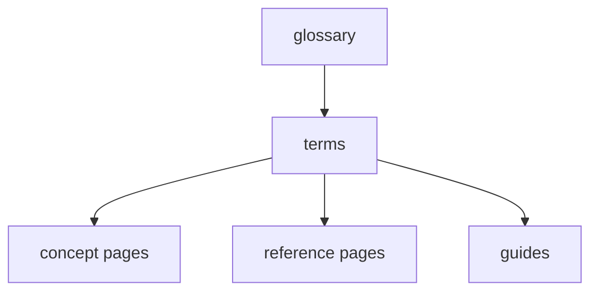

# Glossary

Status: reference document

This page gives short definitions of FEOD terms. For detailed rules, see the related reference and structure pages.

## Terms

| Term | Short Definition | Learn More |
| --- | --- | --- |
| FEOD | An architectural approach to frontend application structure through levels, FEOD entities, explicit dependencies, and public API. | [Levels](../core-concepts/levels.md) |
| Level | A top structural area of FEOD with its own role and dependency rules. Canonical levels: `app`, `pages`, `modules`, `common`, `global`. | [Levels](../core-concepts/levels.md), [Import Matrix](./import-matrix.md) |
| Layer | An explanatory term for readers familiar with FSD. In FEOD, the primary term is `level`. | [Terms](./terms.md) |
| Module | An independent product responsibility on the `modules` level that hides its internal structure and exposes an explicit public API. | [Modules](../structure/modules.md), [Public API](./public-api.md) |
| Submodule | An internal structural part of a parent module. A submodule does not become an external contract until the parent module explicitly exports it through its public API. | [Modules](../structure/modules.md), [Public API](./public-api.md) |
| Public API | An explicit public contract of an FEOD entity through which that entity may be used from the outside. For a module, the public API entry point is usually the root `index.ts`. | [Public API](./public-api.md) |
| `public API` | The canonical English term for the explicit public contract of an FEOD entity. | [Public API](./public-api.md), [Terms](./terms.md) |
| FEOD entity | A file or directory with a clear role in the project structure. An FEOD entity is a structural unit, not a DDD entity. | [Terms](./terms.md) |
| DDD entity | A domain entity from Domain-Driven Design. In FEOD, it is not a synonym for FEOD entity. | [Terms](./terms.md) |
| Module contract | A set of explicit module promises: responsibility, public API, consumers, and hidden internal details. | [Module Contract](./module-contract.md) |
| `app` | The level for application composition and startup: entrypoint, bootstrap, root providers, top-level routing, and wiring. | [Levels](../core-concepts/levels.md) |
| `pages` | The level for user screens, routes, and route-level composition. | [Levels](../core-concepts/levels.md) |
| `modules` | The level for product capabilities, user scenarios, and isolated areas of responsibility. | [Modules](../structure/modules.md) |
| `common` | The level for independent reusable technical FEOD entities without product coupling. | [Common](../structure/common.md) |
| `global` | The level for rare infrastructure connections with global effect: declarations, shims, polyfills, and side-effect imports. It is not a normal importable contract. | [Global](../structure/global.md) |
| Deep import | An import that bypasses an FEOD entity's public API and points to its internal file or internal directory. | [Import Matrix](./import-matrix.md) |
| Route-level screen | A screen tied to an application route and usually placed on the `pages` level. | [Pages](../structure/pages.md) |
| Adapter layer | A thin layer that connects framework routing or runtime with FEOD pages and modules. | [Next.js and Nuxt](../frameworks/next-nuxt.md) |
| Module README | A document inside a module that describes responsibility, consumers, public API, and constraints. | [How to Write a Module README](../guides/module-readme.md) |
| MAINTAINERS | An ownership file for a large or critical module. It is not required for every small module. | [Naming Rules](./naming.md) |
| FEOD Analyzer | A CLI tool that builds a graph of FEOD entities, detects import and public API violations, and exports an HTML/JSON report. | [FEOD Analyzer](../tools/feod-analyzer.md) |
| ESLint plugin | A tooling direction for automated checks of imports, public API, and other FEOD constraints. | [ESLint plugin](../tools/eslint-plugin.md) |
| AI rules | A set of rules for AI assistants that helps generate and review code within FEOD boundaries. | [AI rules](../tools/ai-rules.md) |
| FEOD config | Machine-readable configuration of project levels, aliases, rules, and exceptions. | [FEOD config](../tools/feod-config.md) |
| Exception | An explicit local deviation from a rule with a reason, scope, and review condition. | [Rule Exceptions](../community/exceptions.md) |
| Framework appendix | An additional page about applying FEOD in a specific frontend framework without changing the base rules. | [Framework appendices](../frameworks/index.md) |
| FEOD variation | An explicitly recorded deviation from the canonical FEOD structure for a specific project. A variation is not a second canon and should describe its trade-offs. | [FEOD Variations](../about/variations.md) |

## Related Reference Pages

- [Terms](./terms.md) - normative rules for term usage.
- [Import Matrix](./import-matrix.md) - allowed import directions between levels.
- [Public API](./public-api.md) - rules for a module's public contract.
- [Module Contract](./module-contract.md) - the minimal module contract and its boundaries.
