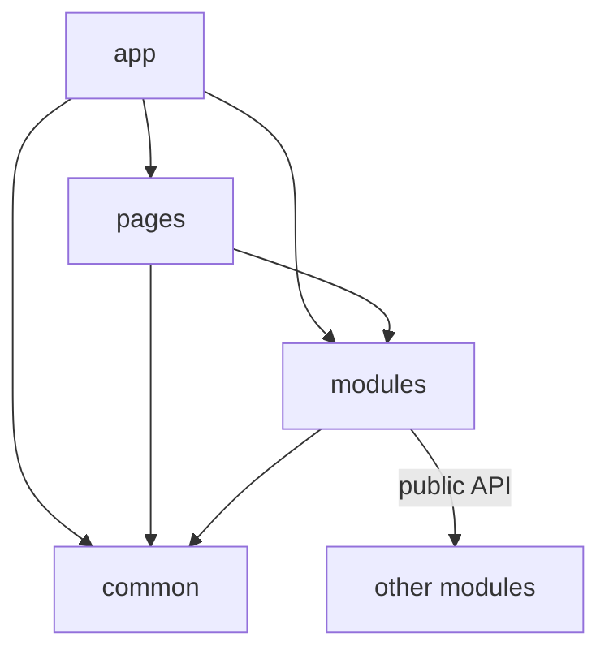

# Import Matrix

Status: normative reference document



This page defines the allowed imports between FEOD top-level levels. The rules apply to a frontend application with the canonical levels `app`, `pages`, `modules`, `common`, and `global`.

## Basic Rule

If file `A` imports file `B`, then `A` depends on `B` and uses `B`.

On this page:

- import direction is read left to right: `A -> B`;
- dependency direction matches import direction: `A` depends on `B`;
- usage direction matches import direction: `A` uses `B`;
- the reverse wording is "`B` is used from `A`", but it does not imply a reverse import.

Do not mix these two ways of speaking. The wording "`modules` are used by pages" means that `pages` may import `modules`, not the other way around.

## What Code on Each Level May Import

The table answers this question: "If a file is located on level X, which top-level levels may it import?"

| Code on Level | May Import | Must Not Import Directly |
| --- | --- | --- |
| `app` | `pages`, `modules`, `common` | `global`, internals of other pages, internals of other modules, deep imports |
| `pages` | `modules`, `common` | `app`, `global`, other pages, internals of other modules, deep imports |
| `modules` | `common`, public API of other modules, public API of its own submodules | `app`, `pages`, `global`, internals of other modules, deep imports |
| `common` | public API of other `common` entities, external packages | `app`, `pages`, `modules`, `global`, internals of other `common` entities, deep imports |
| `global` | nothing from FEOD levels | `app`, `pages`, `modules`, `common`, internals of product code |

Notes:

- the `modules` row allows dependencies between modules only through the public API of the target module;
- the `common` row allows dependencies inside `common` only between independent `common` entities and only through their public API;
- the `global` row does not make `global` a normal application dependency: application code does not import `global` directly, and `global` itself does not depend on FEOD product levels.

## Who May Import a Level

The table answers the reverse question: "Which levels may depend on level X?"

| Imported Level | Who May Import It | Who Must Not Import It |
| --- | --- | --- |
| `app` | nobody | `pages`, `modules`, `common`, `global` |
| `pages` | `app` | `pages`, `modules`, `common`, `global` |
| `modules` | `app`, `pages`, other `modules` | `common`, `global` |
| `common` | `app`, `pages`, `modules`, other `common` entities | `global` |
| `global` | nobody directly | `app`, `pages`, `modules`, `common`, importing `global` as a normal application contract |

This table does not change dependency direction. For example, if `app` imports `pages`, the dependency points from `app` to `pages`. You cannot conclude from this that `pages` depends on `app`.

## Public API Is Required for Other Modules

Another module may be imported only through its public API.

Correct:

```ts
import { UserAvatar, getUserDisplayName } from "@/modules/user";
```

Incorrect:

```ts
import { UserAvatar } from "@/modules/user/ui/UserAvatar";
import { normalizeUser } from "@/modules/user/lib/normalizeUser";
```

The rule is the same for `app`, `pages`, `modules`, and `common`: when code refers to another FEOD entity, it refers to that entity's public API, not to its internal file structure.

## Submodules of Another Module

A submodule is an internal structural part of its parent module until the parent module explicitly exports its contract.

Forbidden:

```ts
import { UserPermissionsPanel } from "@/modules/user/permissions";
import { mapPermission } from "@/modules/user/permissions/lib/mapPermission";
```

Allowed only if the parent module intentionally includes this contract in its public API:

```ts
import { UserPermissionsPanel } from "@/modules/user";
```

A submodule does not become public merely because it has its own `index.ts`.

## Deep Imports

Deep import is an import that bypasses an FEOD entity's public API and points to its internal file or internal directory.

Forbidden:

```ts
import { api } from "@/modules/order/api/client";
import { OrderCard } from "@/modules/order/ui/OrderCard";
import { formatMoney } from "@/common/format/lib/formatMoney";
```

Allowed:

```ts
import { getOrder, OrderCard } from "@/modules/order";
import { formatMoney } from "@/common/format";
```

For a linter, the practical rule is this: an external import of an FEOD entity should end at the root of its public API, not at an internal segment such as `ui`, `api`, `model`, `lib`, `config`, `types`, or a concrete file.

## `global` Is Not Imported Directly

The `global` level stores code that affects the whole application: environment declarations, shims, polyfills, runtime initialization, and rare side-effect connections. It is an infrastructure connection point, not a public API for application code.

Application code does not import `global` as a dependency:

```ts
// forbidden
import "@/global/styles.css";
import { env } from "@/global/env";
```

Global effects are connected in one controlled place: through an entrypoint, build tool configuration, HTML template, runtime bootstrap, or another infrastructure mechanism of the project. After that connection, code in `app`, `pages`, `modules`, and `common` should not access `global` directly.

## Exceptions

An exception is allowed only if it is explicitly described in a project architectural decision and can be checked by tooling.

Allowed classes of exceptions:

- an application entrypoint connects global styles or polyfills before the application starts;
- test infrastructure connects test setup, mocks, or polyfills outside the production graph;
- build-time configuration imports files that are not part of the frontend application's runtime graph;
- a temporary migration alias is allowed for a limited time and points to the target public API, not to internals.

An exception must not turn a module's internal file into an implicit public API.

## Related Rules

- A module's public API is described on the [Public API](./public-api.md) page.
- A level contract does not replace a module contract: the [Import Matrix](./import-matrix.md) says which levels may depend on one another, while [Public API](./public-api.md) says which symbols may be used.
- External packages are not FEOD levels, but importing an external package must not bypass a local architectural contract. If a package is wrapped in `common` or in a module, the rest of the code uses that wrapper.
- Relative imports are allowed inside the same FEOD entity, but they must not be used to access a neighboring or parent entity owned by someone else.
- Type-only import is not an exception: types from another module are also imported through its public API.
- The terms `level`, `public API`, `global`, and `deep import` are defined on the [Terms](./terms.md) page.
- Typical violations of these rules are collected on the [Code Smells](./code-smells.md) page.
