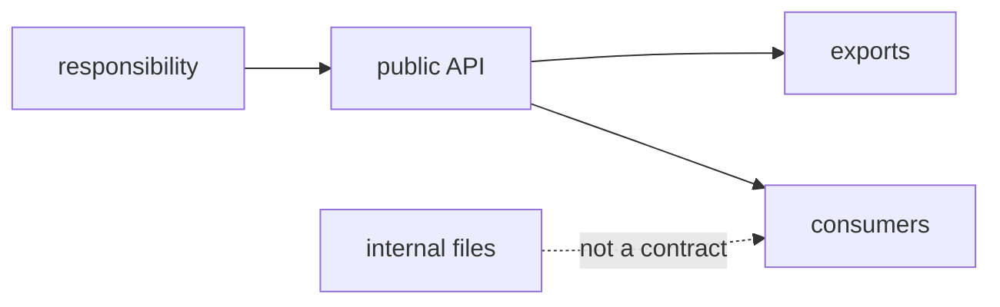

# Module Contract

A module contract defines which responsibility a module takes on, who consumes it, what it exports, and which internal details it hides.



## Strict Rule

A module must have one clear product responsibility and an explicit public API. Everything not exported from the root `index.ts` is considered the module's internal implementation.

## Minimal Contract

| Contract Part | Where It Is Defined | Why It Is Needed |
| --- | --- | --- |
| Module name | directory name in `modules` | Shows the product area |
| Responsibility | README or a short description in review | Limits module growth |
| Public API | root `index.ts` | Provides a supported import surface |
| Internal details | directories such as `ui`, `model`, `api`, `lib`, and others | May change without affecting the external contract |
| Dependency constraints | README, review checklist, or FEOD config | Help avoid hidden coupling |

## Good Example

```text
src/modules/checkout/
  ui/
    checkout-form.tsx
  model/
    use-checkout.ts
  api/
    submit-order.ts
  README.md
  index.ts
```

```ts
// src/modules/checkout/index.ts
export { CheckoutForm } from './ui/checkout-form';
export { useCheckout } from './model/use-checkout';
```

The contract shows that external consumers can use the checkout form and the scenario hook. The API request remains an internal detail.

## Bad Example

```ts
// src/modules/checkout/index.ts
export * from './ui/checkout-form';
export * from './api/submit-order';
export * from './model/internal-state';
export * from './lib/debug';
```

Violation: `index.ts` mixes the supported contract, internal model, API details, and debug code.

## Exceptions

A small module may omit a README if its responsibility is obvious from its name, structure, and public API. This exception does not remove the requirement for an explicit `index.ts`.

## Related Rules

- [Public API](./public-api.md)
- [Naming Rules](./naming.md)
- [How to Design a Module](../guides/design-module.md)
- [How to Write a Module README](../guides/module-readme.md)
