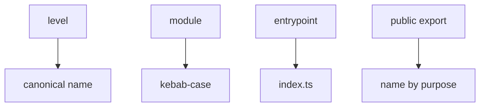

# Naming Rules

Status: normative reference document



This page defines names for levels, modules, submodules, `index.ts`, README/MAINTAINERS, and public exports. The rules make the FEOD structure suitable for review, lint rules, and AI rules.

## Top-Level Names

FEOD uses only these canonical top-level level names:

```text
app
pages
modules
common
global
```

Rules:

- write level names only in this form;
- use the term `level`, not `layer`, as the primary term in reference documents;
- use `global`, not `globals`;
- do not introduce additional top-level levels without a separate architectural decision.

## Module Names

A module name should denote one independent responsibility:

```text
modules/
  checkout/
  user/
  notifications/
  feature-flags/
```

Rules:

- a module name reflects a subject area or product scenario;
- a name does not describe a technical folder such as `components`, `hooks`, `services`, or `utils`;
- a name does not disguise a generic container such as `shared-tools`, `misc`, or `helpers`;
- a cross-cutting module keeps a subject role: `viewer`, `auth`, `notifications`, `feature-flags`;
- if the responsibility cannot be named briefly and in product terms, the module boundary is not clear yet.

Incorrect:

```text
modules/
  components/
  hooks/
  utils/
  shared-tools/
```

## Submodule Names

A submodule is named after a stable subtask inside the parent module:

```text
modules/
  checkout/
    delivery/
    payment/
  user/
    permissions/
    settings/
```

Rules:

- a submodule name describes a part of the parent's responsibility;
- a submodule does not get the name of an independent product area if it should become a separate module;
- a submodule is not named after a technical folder type if it already contains `ui`, `model`, `api`, or `lib`;
- nesting deeper than two or three levels requires explicit justification.

Having an `index.ts` inside a submodule does not make the submodule name an external import contract.

## `index.ts`

The root `index.ts` of an FEOD entity denotes its public API.

Rules:

- the root `index.ts` of a module or `common` entity contains only explicit public exports;
- external code imports another FEOD entity from its root;
- `index.ts` must not use `export *` from internal directories;
- an internal submodule `index.ts` is used for local organization but does not automatically become an external public API;
- if a symbol is absent from `index.ts`, external code should not import that symbol.

Correct:

```ts
export { UserAvatar } from "./ui/UserAvatar";
export { useCurrentUser } from "./model/useCurrentUser";
export type { User, UserId } from "./model/types";
```

Incorrect:

```ts
export * from "./ui";
export * from "./model";
export * from "./lib";
```

## README and MAINTAINERS

`README.md` and `MAINTAINERS` are written in uppercase as customary for these files:

```text
modules/
  notifications/
    README.md
    MAINTAINERS
    index.ts
```

Rules:

- `README.md` is needed when module boundaries, public API, submodules, or constraints are not obvious;
- `MAINTAINERS` is needed for large, critical, or ownership-sensitive modules;
- a small obvious module does not have to include README or MAINTAINERS;
- the README of a parent module describes significant submodules if they affect public API or often cause review mistakes.

## Public Export Names

A public export should be understandable without knowing the internal file structure.

Rules:

- components are named as nouns or noun phrases in `PascalCase`: `UserAvatar`, `CheckoutFlow`;
- hooks and composables are named with the `use` prefix: `useCurrentUser`, `useCheckoutDraft`;
- functions are named with a verb or verb phrase: `getUserDisplayName`, `formatDate`, `createHttpClient`;
- types for public props are named after the component: `UserAvatarProps`;
- domain types are exported from their owner: `User`, `UserId`, `Order`;
- internal names such as `InternalState`, `RawDto`, `StoreShape`, or `MapperConfig` do not become public only for import convenience;
- a public name should not repeat an internal folder: do not use `UserModel`, `UserLib`, or `CheckoutApi` as a replacement for a clear contract.

Example:

```ts
// modules/user/index.ts
export { UserAvatar } from "./ui/UserAvatar";
export { getUserDisplayName } from "./lib/getUserDisplayName";
export { useCurrentUser } from "./model/useCurrentUser";

export type { User, UserId } from "./model/types";
export type { UserAvatarProps } from "./ui/UserAvatar";
```

## Names of `common` Entities

A `common` entity is named after a neutral technical contract:

```text
common/
  button/
  format-date/
  http-client/
  use-debounce/
```

Rules:

- the name should be understandable without product terms;
- do not use generic `utils`, `helpers`, `shared`, or `types`;
- do not put a domain name in `common` if it belongs to a module;
- each independent `common` entity has its own `index.ts`.

Incorrect:

```text
common/
  user/
  order-types/
  utils/
  shared/
```

## Names on the `pages` Level

A page is named after the route or screen it assembles:

```text
pages/
  checkout/
  profile/
  catalog/
```

Rules:

- a page name should not become the name of a reusable contract for other levels;
- route-bound helpers may live inside the page, but they are not imported by other pages or modules;
- if a file name or export starts sounding like a general scenario, move it to `modules`.

## Names on the `global` Level

`global` stores only infrastructure entities with global effect:

```text
global/
  vite-env.d.ts
  shims/
  polyfills/
  types/
  styles/
```

Rules:

- do not name imported helpers, UI, or stores as part of `global`;
- do not use `global` as a synonym for `common`;
- globally effective files should be connected through an infrastructure entry point, test setup, or build-time configuration.

## Related Rules

- [Terms](./terms.md)
- [Glossary](./glossary.md)
- [Import Matrix](./import-matrix.md)
- [Public API](./public-api.md)
- [Code Smells](./code-smells.md)
- [Modules](../structure/modules.md)
- [Pages](../structure/pages.md)
- [Common](../structure/common.md)
- [Global](../structure/global.md)
