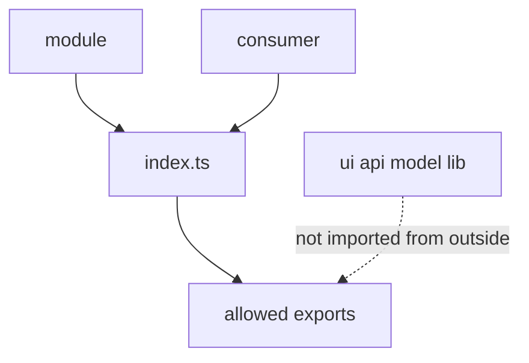

# Public API

Status: normative reference document



A module's `public API` is its explicit public contract through which the module may be used from the outside.

In FEOD, a module is not a set of files. A module exposes a limited contract to the outside and keeps its internal structure closed to consumers.

## Module Contract

Public API answers this question: "What is other code allowed to import from this module?"

A module contract includes only the entities the team is ready to support as the module's external surface:

- UI components used outside the module;
- functions and services needed by other modules, pages, or `app`;
- input and output types of public functions;
- constants and enum-like values, if they are part of external behavior;
- public submodule contracts, if the parent module intentionally exposes them.

Internal module files are not public API, even if they export symbols at the TypeScript level.

## Role of `index.ts`

The root `index.ts` file of a module is the module's public API entry point.

Normative rule:

```text
External code imports a module from the module root.
```

Correct:

```ts
import { UserAvatar, getUserDisplayName } from "@/modules/user";
```

Incorrect:

```ts
import { UserAvatar } from "@/modules/user/ui/UserAvatar";
import { getUserDisplayName } from "@/modules/user/lib/getUserDisplayName";
```

`index.ts` does not have to export everything inside the module. Its job is the opposite: keep only the supported contract public and hide implementation details.

## What to Export

Export only stable external-contract elements from `index.ts`.

Allowed exports:

- components and functions that module consumers actually need;
- types of public props, parameters, results, and events;
- public factories, adapters, and hooks, if they are the official way to work with the module;
- named submodule contracts, if the parent module intentionally makes them part of the API;
- minimal domain-specific constants, if the consumer cannot use the module correctly without them.

Example:

```ts
// modules/user/index.ts
export { UserAvatar } from "./ui/UserAvatar";
export { UserMenu } from "./ui/UserMenu";
export { getUserDisplayName } from "./lib/getUserDisplayName";
export { useCurrentUser } from "./model/useCurrentUser";

export type { User, UserId } from "./model/types";
export type { UserAvatarProps } from "./ui/UserAvatar";
```

This `index.ts` shows intent: the consumer sees a small list of supported capabilities and does not know how the module is arranged internally.

## What Not to Export

Implementation details are not exported from the public API.

Do not export:

- private helpers from `lib` that are needed only by the module itself;
- internal selectors, stores, reducers, signals, or atoms, if they are not a public contract;
- raw API clients, DTOs, and transport details, if the consumer needs a ready scenario or an adapted type;
- internal layout components and part-components that should not be used separately;
- mocks, fixtures, test builders, and story-only entities;
- config files, tokens, and constants that reflect the module's internal structure;
- types that describe private state, cache shape, or the response structure of a specific backend endpoint.

If a consumer needs an internal helper, that is not a reason to export the helper automatically. First decide whether the helper is part of the module's external scenario. If yes, the public API should expose the scenario in a stable form; if no, the consumer should solve the task through the existing contract.

## Anti-Example: `export *`

`export *` from internal directories is forbidden for a module's public API.

Incorrect:

```ts
// modules/user/index.ts
export * from "./api";
export * from "./model";
export * from "./ui";
export * from "./lib";
```

Why this is a mistake:

- the public API starts depending on accidental file structure;
- internal helpers and types leak to the outside;
- any rename inside the module becomes a breaking change for consumers;
- it becomes impossible to understand which symbols are supported as the contract;
- linters and AI rules cannot distinguish intentional exports from implementation leaks.

If several symbols need to be exposed from one directory, list them explicitly:

```ts
export { UserAvatar } from "./ui/UserAvatar";
export type { UserAvatarProps } from "./ui/UserAvatar";
```

## How to Change Internals Without Breaking Consumers

A module may be freely reorganized internally as long as its public API stays the same.

Allowed without changing consumers:

- move a file from `lib` to `model`, if the export from `index.ts` stays the same;
- rename an internal helper, if the public name does not change;
- change a component implementation, if its public props and behavior are preserved;
- replace a transport client, if the public function returns the same contract;
- split a large file into several internal files without changing root exports.

A breaking change occurs when the public contract changes:

- an export is removed from `index.ts`;
- the name of a public export changes;
- the type of public props, parameters, or result changes;
- the semantics of a public function change while its signature stays the same;
- a public submodule stops being exported through the parent module.

Before changing public API, update consumers, migration instructions, or a compatible alias. A temporary alias should remain in `index.ts` and lead to public API, not to an internal file.

## Submodules and Public API

A submodule may have its own `index.ts` for internal organization, but that file does not automatically become an external contract.

An external consumer imports a submodule contract through the parent module:

```ts
import { UserPermissionsPanel } from "@/modules/user";
```

Not through an internal path:

```ts
import { UserPermissionsPanel } from "@/modules/user/permissions";
```

If the team wants to make a submodule an independent FEOD entity, it should be moved to the level of an independent module or explicitly described as a separate public project contract. Until then, the submodule is internal structure of the parent module.

## Type-Only Exports

Types are part of public API just like runtime exports.

Correct:

```ts
export type { User, UserId } from "./model/types";
```

Incorrect:

```ts
export type * from "./model/internal-state";
```

A consumer must not import private types through a deep import merely because they disappear after compilation. The architectural dependency exists for type-only imports as well.

## Related Rules

- Rules for who may import a module are described on the [Import Matrix](./import-matrix.md) page.
- Public API is responsible for the symbol contract, while the import matrix is responsible for allowed dependency direction.
- Public API must not mirror the folder structure `ui`, `api`, `model`, `lib`; these folders are implementation details of a module.
- An external package may be hidden behind the public API of a module or `common` if the project wants to control its dependency on that package.
- Any export from `index.ts` should be treated as a supported contract until it is explicitly marked as deprecated and removed according to the project's migration rules.
- Normative wording for `public API` is defined on the [Terms](./terms.md) page.
- Mistakes such as `export *` and deep imports are described on the [Code Smells](./code-smells.md) page.
