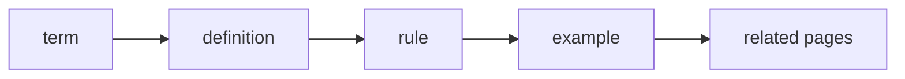

# Terms

Status: normative reference document



This page defines which terms to use in FEOD documentation. If another page conflicts with these rules, update that page.

## Canonical Level Names

FEOD user-facing documentation uses only these top-level names:

```text
app
pages
modules
common
global
```

Rules:

- write level names only in this form;
- write `global`, not `globals`;
- do not translate level names;
- do not introduce additional top-level levels without a separate architectural decision.

## Level and Layer

The primary English term for `app`, `pages`, `modules`, `common`, and `global` is `level`.

| Write | Do Not Write |
| --- | --- |
| `modules level` | `modules layer` as the primary term |
| `top-level pages` | `pages layer` in a heading or definition |
| `FEOD levels` | freely alternate between `level` and `layer` |

`Layer` is allowed only as an explanation for readers familiar with FSD:

```text
In FEOD this is called a level; for an FSD audience, the closest analogue is a layer.
```

After that explanation, the page should use the term `level`.

## Public API

Canonical form:

- `public API`.

This form means an explicit public contract through which an FEOD entity may be used from the outside.

Rules:

- use `public API` when `index.ts`, import examples, or code identifiers appear nearby;
- use `public API` for English explanatory pages;
- do not write `public contract`, `pub API`, or other informal variants.

Normative wording:

```text
A module's public API is its explicit public contract through which the module may be used from the outside.
```

## FEOD Entity and DDD Entity

`FEOD entity` and `DDD entity` are not synonyms.

| Term | Meaning |
| --- | --- |
| FEOD entity | A file or directory with a clear role in the project structure. |
| DDD entity | A domain entity from Domain-Driven Design. |

Rules:

- describe an FEOD entity as a structural unit with a role and constraints;
- do not explain an FEOD entity as a kind of DDD entity;
- if a page mentions DDD, explicitly separate these concepts;
- do not use the English word `entity` without clarification when referring to an FEOD entity.

Allowed short wording:

```text
An FEOD entity is a structural unit with a role, not a domain entity from DDD.
```

## Module and Submodule

`Module` is an independent product responsibility on the `modules` level.

`Submodule` is an internal structural part of a parent module. A submodule does not become an external contract merely because it has its own `index.ts`.

| Write | Do Not Write |
| --- | --- |
| `a module exposes its public API through the root index.ts` | `a module is a set of files` |
| `a submodule remains part of the parent module` | `a submodule can be imported directly from the outside` |
| `the parent module exports the submodule contract` | `a submodule index.ts is automatically public` |

If a submodule should become an independent FEOD entity, describe that as a separate architectural decision, not as a consequence of a nested folder.

## Deep Import

`Deep import` is an import that bypasses an FEOD entity's public API and points to its internal file or internal directory.

Write:

```text
A deep import into module internals is forbidden.
```

Do not write:

```text
A deep import is allowed if the path works in TypeScript.
```

A working TypeScript import does not make a path valid under FEOD rules.

## Normative Wording

| Meaning | Use | Do Not Use |
| --- | --- | --- |
| Top structural area | `level` | `layer` as the primary term |
| Canonical global level | `global` | `globals` |
| Public contract of a module | `public API` | `pub API`, `public contract` |
| Structural FEOD unit | `FEOD entity` | `DDD entity`, unless the topic is DDD |
| Nested part of a module | `submodule` | `independent module`, unless the parent has exposed the contract |
| Bypassing the public contract | `deep import` | `direct import`, when the meaning is ambiguous |

## Before Publishing a Page

The author checks:

1. Top-level levels are named `app`, `pages`, `modules`, `common`, and `global`.
2. The primary term for top-level structural areas is `level`.
3. `Layer` is used only as an explanation for an FSD audience.
4. The page consistently uses the form `public API`.
5. FEOD entity is explicitly separated from DDD entity.
6. `global` is never replaced with `globals`.
7. A submodule is not described as an external contract without an export from the parent module.
8. Deep import is not presented as an allowed path to an FEOD entity's internals.

## Related Pages

- [Glossary](./glossary.md)
- [Import Matrix](./import-matrix.md)
- [Public API](./public-api.md)
- [Levels](../core-concepts/levels.md)
