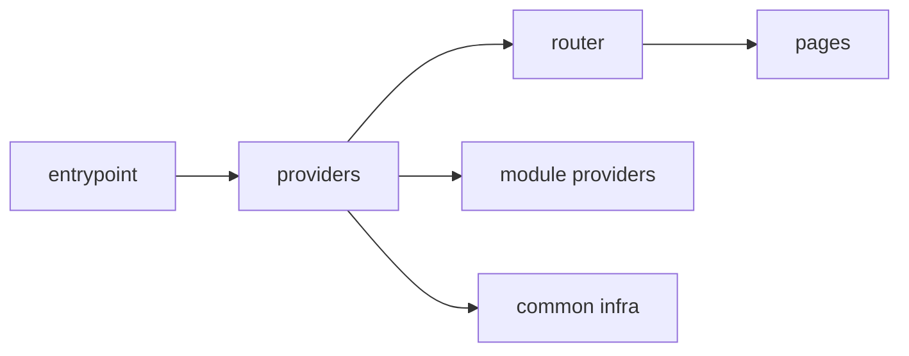

# App



## Short Definition

`app` is the top level for application composition and startup. It assembles the entrypoint, router, providers, layout shell, global connections, and wiring between major parts of the system.

## What Problem It Solves

Without a separate `app` level, application startup and product logic get mixed in random files. Router, providers, global side effects, and domain scenarios start living together, and the boundary between infrastructure and application code becomes unclear.

## Base Rule

The `app` level stores only what is needed to assemble the application as a whole:

- entrypoints and bootstrap;
- top-level router;
- application providers;
- global styles and entrypoint side effects;
- layout shell;
- app-level integrations;
- dependency wiring between `pages`, `modules`, and `common`.

`app` may import only `pages`, `modules`, and `common`. Code from `modules` and `pages` does not import `app`.

## Why

`app` must remain a controlled entry point. If domain logic enters this level, it becomes a second `modules` and stops explaining where application infrastructure ends and product code begins.

This boundary simplifies navigation. A file from `app` immediately signals that it is responsible for composition, not for a specific user scenario.

## What Usually Belongs in `app`

- `main.tsx`, `bootstrap.ts`, `index.tsx`;
- `App.tsx`, `AppShell.tsx`;
- `router/` with top-level route configuration;
- `providers/` with root providers;
- connection of global styles, polyfills, and runtime setup;
- composition of cross-cutting application-level integrations.

## What Must Not Belong in `app`

- domain business logic;
- logic for a specific page;
- internals of other modules through deep imports;
- reusable logic with no app-level purpose;
- a `shared` or `common` dumping ground "just in case";
- code that requires importing `app` from `modules` or `pages`.

## Good example

```text
app/
  main.tsx
  App.tsx
  router/
    index.tsx
  providers/
    QueryProvider.tsx
    AuthProvider.tsx
  layouts/
    AppShell.tsx
```

```ts
// app/App.tsx
import { AppRouter } from "@/pages";
import { AppShell } from "./layouts/AppShell";
import { AuthProvider } from "./providers/AuthProvider";
import { QueryProvider } from "./providers/QueryProvider";

export function App() {
  return (
    <QueryProvider>
      <AuthProvider>
        <AppShell>
          <AppRouter />
        </AppShell>
      </AuthProvider>
    </QueryProvider>
  );
}
```

What is correct here:

- `app` assembles the application instead of implementing a domain scenario;
- the router comes through the `pages` level public API;
- providers and shell remain part of application composition;
- there are no deep imports into module internals.

## Bad example

```ts
// app/session.ts
import { normalizeUser } from "@/modules/user/lib/normalizeUser";
import { CheckoutPage } from "@/pages/checkout";

export async function refreshSession() {
  const page = CheckoutPage;
  return normalizeUser(page);
}
```

Violation:

- `app` imports an internal file of another module;
- `app` depends on an internal page path instead of its route-level contract;
- the composition level started writing domain logic.

## Common Mistakes

- Putting `checkout`, `profile`, or `catalog` scenarios into `app` -> those scenarios should live in `modules`.
- Turning `app` into a place for random helpers -> a new `common` dumping ground appears without an explicit role.
- Importing `global` as an application contract -> global connections must enter through an entrypoint or another infrastructure mechanism.
- Exporting internal parts of `app` outward and using them in `modules` or `pages` -> the dependency direction is violated.
- Storing page-level loading and error state in `app` when they belong to a single route -> this is the `pages` area.

## Exceptions

Only infrastructure exceptions are allowed:

- an entrypoint connects global styles, polyfills, or shims;
- test bootstrap raises providers and setup outside the production graph;
- build-time configuration uses files that are not part of the application runtime graph.

These exceptions do not make `app` a source of domain logic and do not allow lower levels to import `app`.

## Advanced Patterns

The following patterns are allowed, but they are not part of the base description of the `app` level:

- multiple entrypoints for different builds or platforms;
- a composition root for dependency injection;
- splitting shell into authenticated and public variants;
- app-level observability, feature flags, and experiment wiring;
- SSR bootstrap, hydration, and environment adapters.

Add them only after the base role of `app` is already clear and does not conflict with the import matrix.

## Related Pages

- [Levels](../core-concepts/levels.md)
- [Dependency rules](../core-concepts/dependency-rules.md)
- [Import matrix](../reference/import-matrix.md)
- [Code smells](../reference/code-smells.md)
