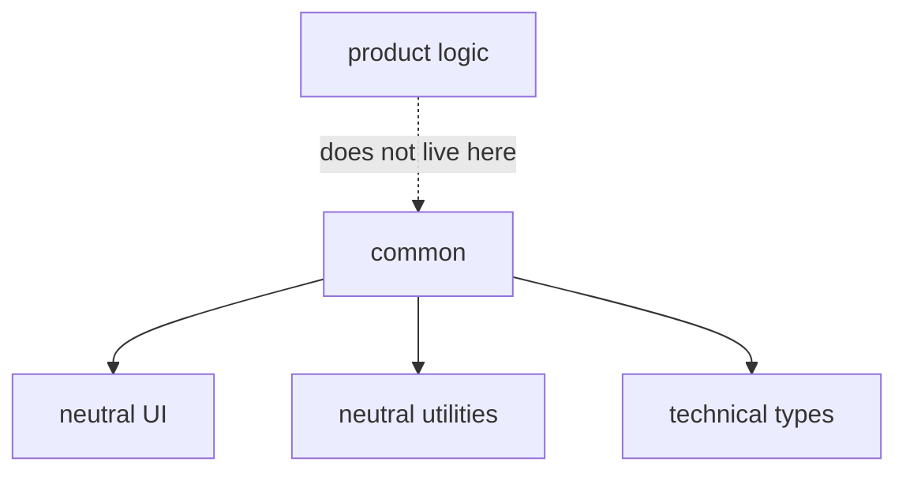

# Common



## Short Definition

`common` is the level for independent reusable FEOD entities without product binding. It stores only shared technical contracts that can be used by `app`, `pages`, `modules`, and other `common` entities.

## What Problem It Solves

Without a separate level for neutral technical entities, identical UI primitives, utilities, and framework helpers start getting duplicated across modules. The opposite extreme is also dangerous: if everything unclear is put into `common`, it turns into a hidden shared directory with no boundaries.

## Rule

`common` may contain only non-business reusable entities:

- UI primitives;
- utilities;
- shared types;
- framework helpers;
- non-business hooks and composables;
- shared constants.

`common` must not contain business logic, domain entities, APIs of a specific module, scenario state, or any code that semantically belongs to a module.

## Why

`common` is needed as a narrow technical level, not as a fallback container. The stricter its boundary, the easier it is to understand whether an entity is truly shared or should stay inside a module. This keeps application logic close to the domain area and prevents shared code from becoming an implicit dependency center.

## What Usually Belongs in `common`

`common` usually contains:

- buttons, inputs, modal primitives, and layout primitives;
- date, number, and string formatters, plus technical validators with no domain meaning;
- wrappers around framework APIs that do not know about a specific product;
- shared UI or infrastructure types;
- hooks and composables such as `useDebounce`, `useMediaQuery`, and `usePrevious`;
- platform-level or UI-level constants not tied to one module.

## What Must Not Belong in `common`

`common` must not contain:

- domain rules;
- entities such as `User`, `Order`, or `Invoice` if they belong to a specific product;
- API clients for catalog, checkout, profile, or another module;
- stores, reducers, query state, or other scenario state;
- code that appeared only because the author did not know which module to put it in.

If an entity is needed by one module or describes one product scenario, it belongs in `modules`, not in `common`.

## Good example

```text
common/
  button/
    index.ts
    ui/Button.tsx
  use-debounce/
    index.ts
    lib/useDebounce.ts
  format-date/
    index.ts
    lib/formatDate.ts
  breakpoints/
    index.ts
    config/breakpoints.ts
```

```ts
import { Button } from "@/common/button";
import { useDebounce } from "@/common/use-debounce";
import { formatDate } from "@/common/format-date";
```

Why this is correct:

- all entities are reusable outside one module;
- they do not describe a product scenario;
- external code imports them through public API.

## Bad example

```text
common/
  user/
    model/userStore.ts
  checkout-api/
    api/createOrder.ts
  cart-summary/
    ui/CartSummary.tsx
```

Violation: `common` contains a domain model, an API of a specific module, and UI for a product scenario.

## Common Mistakes

- Moving code to `common` because it "might be useful later" -> the level starts growing without an explicit responsibility.
- Moving domain entity types to `common` to make imports more convenient -> the domain model gets separated from the module that owns it.
- Keeping one module's API client in `common` -> a module technical detail becomes a false shared contract.
- Putting stores, reducers, and query state here -> scenario state loses boundaries and starts leaking between modules.
- Publishing overly large helpers from `common` that effectively assemble a business rule -> the shared level starts containing application logic.

## Exceptions

There are no exceptions for business logic. If code looks shared but knows about the domain, first check whether it needs a separate module or submodule.

## Related Pages

- [Levels](../core-concepts/levels.md)
- [Dependency rules](../core-concepts/dependency-rules.md)
- [Import matrix](../reference/import-matrix.md)
- [How not to turn common into a dumping ground](../guides/common-boundaries.md)
- [Code smells](../reference/code-smells.md)
