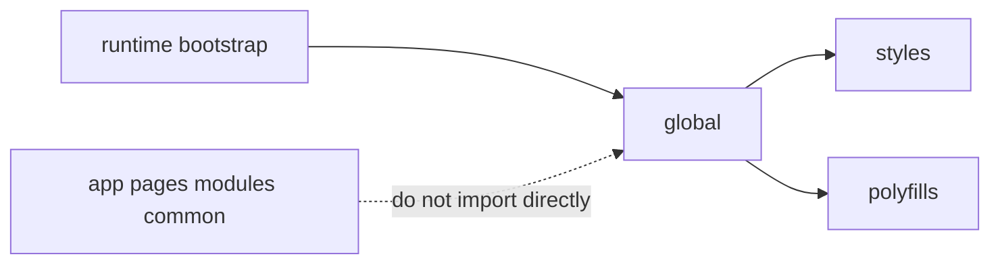

# Global



## Short Definition

`global` is the level for rare infrastructure connections that affect the entire application. It is not a regular application level and must not be used as a place for imported shared code.

## What Problem It Solves

Some things must be connected once and have a global effect: `.d.ts`, shims, polyfills, global type extensions, and side-effect imports. If this code is mixed with `app`, `common`, or modules, it becomes an implicit dependency and starts looking like a regular reusable contract.

## Rule

`global` may contain only infrastructure entities with global effect:

- `.d.ts`;
- shims;
- polyfills;
- global type extensions;
- side-effect imports.

`global` is a rare and risky level. It must not contain business logic, UI, helpers, a hidden shared directory, or any imported entities.

## Why

`global` is hard to localize and hard to review visually. Code at this level affects not one scenario, but the whole application at once. Therefore `global` must be small, explicit, and connected only through an infrastructure entry point, not through regular imports from product code.

## What Usually Belongs in `global`

`global` usually contains:

- `env.d.ts`, `vite-env.d.ts`, and other environment declarations;
- shims for the platform or test environment;
- polyfills connected before the application starts;
- `declare global` and other global type extensions;
- side-effect imports such as global styles or runtime setup, if the project connects them through an entrypoint or configuration.

## What Must Not Belong in `global`

`global` must not contain:

- components, layout primitives, or other UI;
- helpers, utilities, and composables that can be imported where needed;
- product constants, types, and models;
- API clients, stores, or scenario logic;
- files that other levels import as a regular dependency.

If an entity should be imported from `app`, `pages`, `modules`, or `common`, it does not belong in `global`.

## Good example

```text
global/
  vite-env.d.ts
  shims/
    match-media.ts
  polyfills/
    resize-observer.ts
  types/
    window.d.ts
  styles/
    reset.css
```

```ts
// application entrypoint
import "@/global/styles/reset.css";
import "@/global/polyfills/resize-observer";
```

Why this is correct:

- every file either declares a global contract or provides a global side effect;
- the connection comes from an infrastructure entry point as an exception for global effects;
- `global` is not used as a directory for regular imported entities.

## Bad example

```text
global/
  env.ts
  ui/Spinner.tsx
  lib/formatMoney.ts
  auth/store.ts
```

```ts
import { env } from "@/global/env";
import { formatMoney } from "@/global/lib/formatMoney";
```

Violation: `global` turned into a hidden shared directory with imported helpers, UI, and state.

## Common Mistakes

- Putting a helper into `global` only because it is needed "everywhere" -> frequency of use does not make code global.
- Storing runtime config here as an imported module -> a regular application dependency on `global` appears.
- Putting component styles and UI primitives into `global` -> the level starts mixing infrastructure and interface code.
- Using `global` as a synonym for `common` -> the boundary between imported shared code and global effects disappears.
- Thinking that `global` and `globals` are equivalent -> FEOD documentation uses only `global` as the canonical name.

## Exceptions

Exceptions are allowed only for infrastructure connection. For example, an entrypoint, test setup, or build-time configuration may connect files from `global` if this does not turn them into a regular application contract.

## Related Pages

- [Levels](../core-concepts/levels.md)
- [Dependency rules](../core-concepts/dependency-rules.md)
- [Import matrix](../reference/import-matrix.md)
- [Terms](../reference/terms.md)
