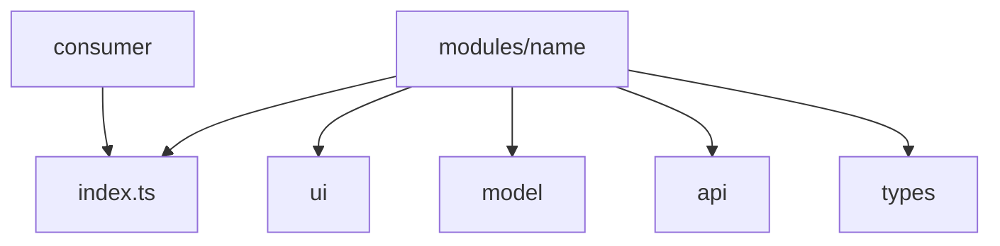

# Modules



## Short Definition

`modules` is the main level for FEOD product logic. A module gathers one area of responsibility, stores its internal structure, and exposes only an explicit public API outward.

## What Problem It Solves

Without a strong `modules` level, application logic spreads across pages, `app`, and `common`. Scenarios become hard to reuse, internals start being imported directly, and the structure stops reflecting real responsibility boundaries.

## Base Rule

A module must represent one independent responsibility. External code uses a module only through its public API, while the module's internal structure remains private.

`modules` is the deepest Structure page in the base FEOD description. Everything deeper belongs to the internal organization of the module itself, not to a separate top-level level.

## Why

A module localizes change. UI, model, api, tests, and helper logic for one responsibility live together and change together.

An explicit public API keeps the external contract small. This allows the team to change a module's internals without breaking consumers and without violating the reference rules for deep imports.

## Base Module Structure

A module has no mandatory set of internal directories, but it must have:

- a module root with an explicit `index.ts`;
- a clear area of responsibility;
- an internal structure shaped by that responsibility;
- local tests proportional to the risk of change.

A typical structure:

```text
modules/
  profile/
    index.ts
    ui/
      ProfileCard.tsx
    model/
      useProfile.ts
      profile.types.ts
    api/
      profile-client.ts
    lib/
      map-profile.ts
    __tests__/
      useProfile.test.ts
```

## Module Public API

External code imports a module only from its root:

```ts
import { ProfileCard, useProfile } from "@/modules/profile";
```

Deep imports into module internals are forbidden:

```ts
import { ProfileCard } from "@/modules/profile/ui/ProfileCard";
import { mapProfile } from "@/modules/profile/lib/map-profile";
```

The detailed contract rules are defined by [Public API](../reference/public-api.md). This Structure page fixes the role of that contract: a module is not a set of files, a module is responsibility plus an explicit external entry point.

## Submodules

A submodule is needed when a stable subtask with its own internal structure appears inside one module. A submodule remains part of the parent module until the parent explicitly opens it outward through its own public API.

Correct:

```text
modules/
  checkout/
    index.ts
    delivery/
      index.ts
      ui/
        DeliveryForm.tsx
    payment/
      index.ts
      ui/
        PaymentForm.tsx
```

```ts
// modules/checkout/index.ts
export { DeliveryForm } from "./delivery";
export { PaymentForm } from "./payment";
```

Incorrect:

```ts
import { DeliveryForm } from "@/modules/checkout/delivery";
```

Violation: external code uses the submodule as a separate contract without an export from the parent module root.

## Cross-Cutting Modules

A cross-cutting module is acceptable if one responsibility participates in several scenarios and several pages while still remaining one domain area. Such a module does not become `common` only because it is used in several places.

Examples:

- `auth`;
- `viewer`;
- `feature-flags`;
- `notifications`.

A cross-cutting module must keep its domain role and must not depend on `pages` or `app`.

## Single-File Modules

A single-file module is acceptable if the responsibility is small but already independent. In that case, the module must still look like a module, not like a random file without a contract.

Correct:

```text
modules/
  logout/
    index.ts
```

```ts
// modules/logout/index.ts
export function logout() {
  // implementation
}
```

It is incorrect to create a separate directory for one file if the responsibility has no independent meaning. Then it is usually part of another module or a `common` entity.

## Module Interaction

Modules may import other modules only through their public API. Dependency direction is defined by the import matrix, not by which module is "more important."

Allowed:

```ts
import { getViewer } from "@/modules/viewer";
```

Forbidden:

```ts
import { getViewer } from "@/modules/viewer/model/getViewer";
import { AppShell } from "@/app/AppShell";
import { CatalogPage } from "@/pages/catalog";
```

Violation:

- deep import into another module's internals;
- importing `app` from `modules`;
- importing `pages` from `modules`.

## Testing

Module testing should be local to the risk of change:

- unit tests for local logic and transformations;
- component tests for public UI contracts;
- integration tests for the module scenario if it connects several internal parts.

A page must not be the only place where module behavior is checked. If an error belongs to the module's responsibility, the test should live next to the module or its public contract.

## README and MAINTAINERS

`README.md` is needed when module boundaries are not obvious without it or when a module has notable usage rules. A README usually records:

- the module purpose;
- what belongs to the public API;
- what counts as an internal detail;
- which submodules and dependencies are key.

`MAINTAINERS` is needed for large or critical modules where it is important to quickly understand the team or owners responsible for the area. This file is not mandatory for every small module, but it is useful where ownership affects change speed and review.

## Good example

```text
modules/
  notifications/
    README.md
    MAINTAINERS
    index.ts
    ui/
      NotificationsBell.tsx
      NotificationsPanel.tsx
    model/
      useNotifications.ts
      notifications-store.ts
      notifications.types.ts
    api/
      notifications-client.ts
    lib/
      group-notifications.ts
    __tests__/
      notifications-store.test.ts
```

```ts
// modules/notifications/index.ts
export { NotificationsBell } from "./ui/NotificationsBell";
export { NotificationsPanel } from "./ui/NotificationsPanel";
export { useNotifications } from "./model/useNotifications";

export type { NotificationItem } from "./model/notifications.types";
```

What is correct here:

- one responsibility brings together UI, model, api, and tests;
- only the explicit public API is opened outward;
- ownership and purpose are recorded next to the module;
- the structure can grow inward without exposing internal files outward.

## Bad example

```text
modules/
  shared-tools/
    Button.tsx
    useDebounce.ts
    auth-client.ts
    user-store.ts
    order-mapper.ts
```

Violation: the directory at the `modules` level mixes unrelated responsibilities and effectively masks a `common` dumping ground or a set of random files.

```ts
import { userStore } from "@/modules/profile/model/user-store";
import { AppRouter } from "@/app/router";
```

Violation:

- external code goes into another module's internals;
- a module depends on `app`.

## Common Mistakes

- Creating a module by folder name rather than responsibility -> the structure looks tidy but carries no architectural meaning.
- Opening almost everything outward through `export *` -> public API becomes a snapshot of the internal structure.
- Treating a submodule as an external contract by itself -> until the parent exports it, it is an internal part of the module.
- Moving domain code to `common` because it is needed in two modules -> reuse does not cancel product ownership.
- Testing a module only through e2e or a page -> local errors are harder to detect and isolate.
- Not recording ownership for a large module -> the next author spends time figuring out boundaries and owners.

## Exceptions

A small module may do without `README.md` and `MAINTAINERS` if its purpose is obvious from its name, structure, and public API. This exception does not remove the requirement for an explicit responsibility and contract.

A temporary migration module is acceptable if it already has clear boundaries and a deletion or merge plan. Temporary status does not justify deep imports or mixing several unrelated areas.

## Advanced Patterns

The following patterns are not part of the base module description and should be considered separately:

- multistage submodules deeper than two or three levels;
- plugin-like modules with extension point registration;
- bounded contexts and DDD terms on top of the FEOD structure;
- cross-runtime modules for web, mobile, and SSR with different adapters;
- microfrontend boundaries and module federation.

The base rules still do not change: one responsibility, explicit public API, and no forbidden dependencies.

## Related Pages

- [Modularity](../core-concepts/modularity.md)
- [Fractality](../core-concepts/fractality.md)
- [Import matrix](../reference/import-matrix.md)
- [Public API](../reference/public-api.md)
- [Naming rules](../reference/naming.md)
- [Code smells](../reference/code-smells.md)
