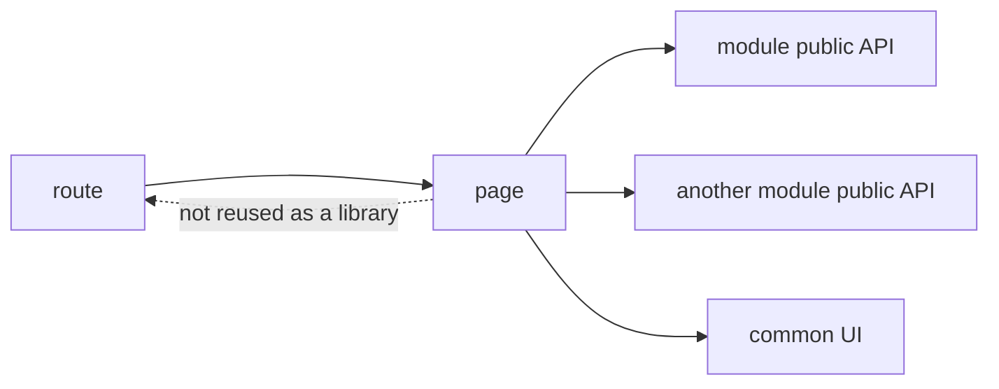

# Pages



## Short Definition

`pages` is the level for route-level components and screen composition. It connects a route to the modules, layout wrappers, and page-level loading or error states it needs.

## What Problem It Solves

Without the `pages` level, routes start living directly in `app` or get spread across modules. Then it becomes hard to tell where the screen exists as a user entry point and where a reusable product scenario exists.

## Base Rule

The `pages` level stores minimal route logic:

- route-level page components;
- composition of modules and `common` entities for one screen;
- page-level loading, empty, and error states;
- minimal route logic such as reading route params and selecting the required composition.

`pages` may import only `modules` and `common`. `pages` does not import `app`, other pages, `global`, or internals of other modules.

## Why

A page should be the assembly point for a screen, not the main place for business logic. This keeps the user route readable and makes a reusable scenario easy to extract or reuse through `modules`.

It also keeps the dependency graph simple: `app` assembles pages, pages assemble modules, and modules do not know about routes.

## What Usually Belongs in `pages`

- a route-level page component;
- local composition of several modules on one screen;
- page-level loading, error, empty, and forbidden states;
- reading `params`, `query`, and route meta;
- page-specific layout wiring.

## What Must Not Belong in `pages`

- core product business logic;
- reusable logic used as a source for other pages or modules;
- global application initialization;
- direct dependencies between pages;
- deep imports into internals of other modules.

## Good example

```text
pages/
  checkout/
    index.ts
    ui/
      CheckoutPage.tsx
    model/
      useCheckoutRoute.ts
```

```ts
// pages/checkout/ui/CheckoutPage.tsx
import { CheckoutFlow } from "@/modules/checkout";
import { PageLayout } from "@/common/page-layout";
import { useCheckoutRoute } from "../model/useCheckoutRoute";

export function CheckoutPage() {
  const { orderId, isInvalid } = useCheckoutRoute();

  if (isInvalid) {
    return <PageLayout title="Checkout">Invalid order</PageLayout>;
  }

  return (
    <PageLayout title="Checkout">
      <CheckoutFlow orderId={orderId} />
    </PageLayout>
  );
}
```

What is correct here:

- the page assembles the screen from module public API;
- route logic stays minimal and belongs to the route;
- the reusable `CheckoutFlow` scenario lives in `modules`, not in the page.

## Bad example

```ts
// pages/checkout/ui/CheckoutPage.tsx
import { submitOrder } from "@/pages/checkout/lib/submitOrder";
import { paymentClient } from "@/modules/checkout/api/paymentClient";
import { CatalogPage } from "@/pages/catalog";

export function CheckoutPage() {
  return submitOrder(paymentClient, CatalogPage);
}
```

Violation:

- the page became the source of core business logic;
- there is a deep import into module internals;
- the page depends directly on another page.

## Common Mistakes

- Keeping a large user scenario inside one page -> if the scenario is not only needed by the route, it should become a module.
- Making a page the source of reusable hooks and helpers -> this turns `pages` into an implicit shared-logic level.
- Importing `app` to access router, providers, or shell -> those dependencies must come from above.
- Placing shared UI with no screen binding in `pages` -> this belongs to `common` or `modules`.
- Hiding core route logic in `app` even though it belongs to one route -> the screen loses locality.

## Exceptions

An exception is allowed only for truly route-bound logic that has no meaning outside a specific route. For example, parsing a compound route param or mapping a route segment to a specific page-level composition.

This exception does not allow moving core business logic into `pages` and does not make a page a source of reusable contracts for other levels.

## Advanced Patterns

The following patterns are allowed, but they are not part of the base description of the `pages` level:

- nested routes with several page shells;
- route-level data loaders and actions;
- route-based code splitting;
- page-specific access policies and redirects;
- SSR or streaming wiring for one route.

These decisions must keep the page as route-level composition, not as a replacement for the `modules` level.

## Related Pages

- [Levels](../core-concepts/levels.md)
- [Import matrix](../reference/import-matrix.md)
- [Public API](../reference/public-api.md)
- [Code smells](../reference/code-smells.md)
