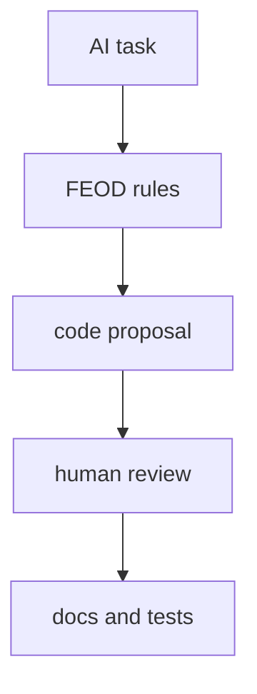

# AI rules

AI rules help assistants generate and review code within FEOD boundaries. They are not a source of the methodology and should link to normative pages.



## When to use

Use AI rules if the team uses AI assistants for:

- module generation;
- code review;
- import migration;
- writing module README files;
- finding code smells.

## Inputs

A good rule set is built from explicit sources:

- the project level map;
- the list of modules and their public API;
- the import matrix;
- local exceptions;
- naming rules;
- module README format.

Do not ask an assistant to guess the architecture from a few files if the project already has a fixed contract.

## Rule format

Minimum set:

```md
# FEOD rules for this project

- Use `app`, `pages`, `modules`, `common`, `global` as top-level folders.
- Import external modules only through `@/modules/<name>`.
- Do not import files from another module's `ui`, `model`, `api` or `lib`.
- Keep domain-specific code out of `common`.
- Do not create new top-level folders without updating the architecture decision.
```

## Good example

Prompt to an assistant:

```md
Create a `checkout` module.
Follow FEOD rules:
- root public API in `src/modules/checkout/index.ts`
- no exports from internal API client
- page imports only from `@/modules/checkout`
```

The result can be checked against public API and the import matrix.

## Bad example

```md
Refactor this project to FEOD automatically.
```

Violation: the task does not define boundaries, rule sources, allowed changes, or verification criteria.

## Result validation

After an AI assistant works, check:

1. New files are placed at the correct levels.
2. External imports go through public API.
3. `common` did not receive domain code.
4. `index.ts` does not export internal details.
5. The module README does not contradict the actual public API.

## What must not be delegated without review

- automatically accepting new import matrix exceptions;
- extending a module's public API without a consumer;
- moving domain logic into `common`;
- bulk legacy migration without a baseline and tests.

## Related pages

- [Import matrix](../reference/import-matrix.md)
- [Module contract](../reference/module-contract.md)
- [Code smells](../reference/code-smells.md)
- [Writing a module README](../guides/module-readme.md)
