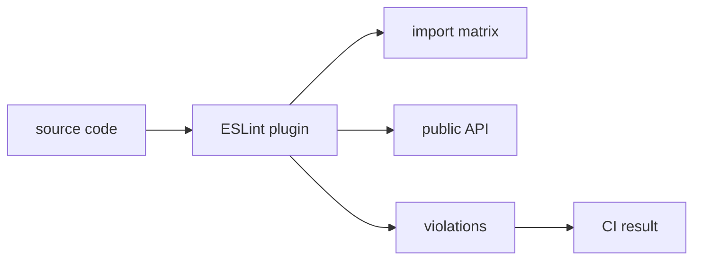

# ESLint plugin

This page describes the ESLint plugin scenario for FEOD. The tool should check already accepted rules, not replace the team's architectural decision.



## When to connect it

Connect the ESLint plugin after the project has fixed:

- the top-level `app`, `pages`, `modules`, `common`, `global` levels;
- module public API through `index.ts`;
- external import rules;
- allowed local exceptions.

If these rules are still disputed, agree on them first in the project documentation or README.

## What to check

Minimum rule set:

| Check | Violation | Related rule |
| --- | --- | --- |
| Ban deep imports | `@/modules/cart/model/cart-store` | [Public API](../reference/public-api.md) |
| Direction of level imports | `modules` imports `pages` | [Import matrix](../reference/import-matrix.md) |
| Ban direct `global` imports | `import '@/global/styles'` from a module | [Global](../structure/global.md) |
| Ban domain `common` | `common/cart/helpers` | [Common](../structure/common.md) |
| Control public API | `export *` from module internals | [Code smells](../reference/code-smells.md) |

## Good example

```ts
// pages/cart/ui/cart-page.tsx
import { CartSummary } from '@/modules/cart';
import { Button } from '@/common/ui/button';
```

The import goes through the module public API and a neutral common primitive.

## Bad example

```ts
// pages/cart/ui/cart-page.tsx
import { cartStore } from '@/modules/cart/model/cart-store';
```

Violation: the page bypasses the public API of the `cart` module.

## What the linter does not cover

The linter cannot reliably decide:

- whether the product responsibility is named correctly;
- whether public API is small enough;
- whether code belongs in `common` by meaning if the name is neutral;
- whether an exception is justified for a specific project.

These decisions remain in review and project documentation.

## CI flow

Minimum flow:

1. Check new imports locally before commit.
2. Block new violations in CI.
3. For a legacy project, keep a baseline or a list of temporary exceptions.
4. Remove exceptions after consumers move to public API.

## Adoption checklist

- FEOD rules are already described in the project.
- The linter blocks new deep imports.
- Legacy exceptions have an owner and a reason.
- CI shows a clear message with a link to reference.
- Exceptions do not become a permanent way to bypass the architecture.

## Related pages

- [Import matrix](../reference/import-matrix.md)
- [Public API](../reference/public-api.md)
- [Code review checklist](../guides/code-review.md)
- [FEOD config](./feod-config.md)
