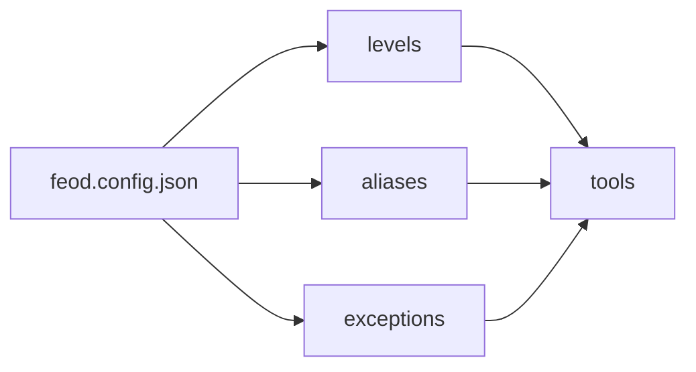

# FEOD config

FEOD config captures machine-readable methodology configuration for the linter, AI rules, and internal project checks.



## When to use

Config is needed when the team wants to check rules automatically or pass them to tools without manually retelling them.

For a small project, README and reference pages are enough. Config becomes useful when exceptions, custom aliases, or several applications appear.

## Minimum schema

```json
{
  "root": "src",
  "levels": ["app", "pages", "modules", "common", "global"],
  "modulePublicApi": "index.ts",
  "aliases": {
    "@": "src"
  }
}
```

## Extended schema

```json
{
  "root": "src",
  "levels": ["app", "pages", "modules", "common", "global"],
  "modulePublicApi": "index.ts",
  "aliases": {
    "@": "src"
  },
  "rules": {
    "noDeepImports": true,
    "noPagesToModules": true,
    "noDomainCommon": true,
    "noGlobalImports": true
  },
  "exceptions": [
    {
      "rule": "noDeepImports",
      "from": "src/pages/legacy/**",
      "to": "src/modules/legacy/**",
      "reason": "Temporary migration baseline"
    }
  ]
}
```

## Fields

| Field | Required | Value |
| --- | --- | --- |
| `root` | yes | Source code root |
| `levels` | yes | Canonical FEOD top-level levels |
| `modulePublicApi` | yes | Module public API file name |
| `aliases` | no | Project import aliases |
| `rules` | no | Enabled automatic checks |
| `exceptions` | no | Explicit temporary exceptions |

## Good example

```json
{
  "root": "src",
  "levels": ["app", "pages", "modules", "common", "global"],
  "modulePublicApi": "index.ts"
}
```

Config reflects canonical FEOD without unnecessary deviations.

## Bad example

```json
{
  "root": "src",
  "levels": ["app", "pages", "widgets", "shared", "misc"],
  "modulePublicApi": "*"
}
```

Violation: the config mixes FEOD with another structure and disables explicit public API.

## Rules for exceptions

An exception must have:

- the rule it violates;
- scope;
- reason;
- an owner or removal process if the project requires it.

An exception without a reason is considered a hidden methodology change.

## Related pages

- [ESLint plugin](./eslint-plugin.md)
- [AI rules](./ai-rules.md)
- [Import matrix](../reference/import-matrix.md)
- [Naming rules](../reference/naming.md)
