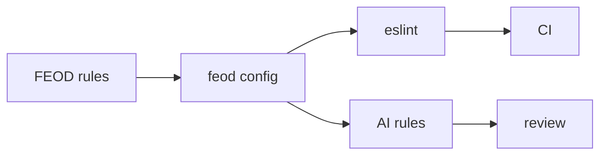

# Tools

Tools help apply FEOD in a project, but they do not replace understanding the methodology. First the team fixes the structure, levels, public API, and import rules; then it connects tools to support these decisions in code and review.

## What is included in the first stage

In the first stage, the documentation describes only three directions.

| Tool | Why it is needed | Description status |
| --- | --- | --- |
| [ESLint plugin](./eslint-plugin.md) | Check architectural violations: bypassing public API, reverse dependencies, deep imports. | Adoption scenario, checks, and CI flow. |
| [AI rules](./ai-rules.md) | Give AI assistants rules for project structure, review, and code generation. | Rule set, inputs, and result validation. |
| [FEOD config](./feod-config.md) | Capture configuration for levels, modules, and allowed deviations. | Contract for the linter, AI rules, and internal checks. |

## How to write Tools pages

Every Tools page answers practical questions:

1. When to connect the tool.
2. Which inputs it needs.
3. What it checks or generates.
4. Which errors it does not cover.
5. How the team validates the result.

## What must not be promised

A future tool must not be described as a finished product. If the technical implementation is not confirmed, the page should say directly that it is a roadmap item or product scenario.

A tool is not the source of rules. The source of rules is the `Reference`, `Structure`, and `Core Concepts` sections.

## Related sections

- [Import matrix](../reference/import-matrix.md)
- [Public API](../reference/public-api.md)
- [Code smells](../reference/code-smells.md)
- [Naming rules](../reference/naming.md)
- [Code review checklist](../guides/code-review.md)
