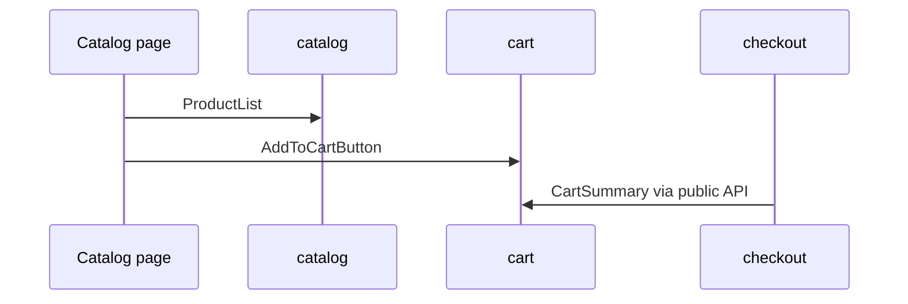

# E-commerce Project Walkthrough

This tutorial walks through a connected e-commerce scenario and shows how FEOD distributes catalog, cart, checkout, and user data.



## When to Use It

Use this page after a basic introduction to FEOD levels. This is not a reference for every rule, but a step-by-step walkthrough of one project.

## Prerequisites

- The reader knows the `app`, `pages`, `modules`, `common`, and `global` levels.
- The reader understands the role of the public API.
- The project has several connected product scenarios.

## Steps

1. Describe the user scenarios.

   ```text
   - the user browses the catalog
   - adds a product to the cart
   - proceeds to checkout
   - uses profile data during checkout
   ```

2. Extract modules by responsibility.

   ```text
   catalog   # products, filters, cards
   cart      # cart contents
   checkout  # order placement
   user      # user data
   ```

3. Put route-level screens in `pages`.

   ```text
   pages/
     catalog/
     cart/
     checkout/
   ```

4. Expose module public APIs.

   ```ts
   // modules/catalog/index.ts
   export { ProductGrid } from './ui/product-grid';
   export { useProducts } from './model/use-products';
   export type { Product } from './model/types';
   ```

   ```ts
   // modules/cart/index.ts
   export { AddToCartButton } from './ui/add-to-cart-button';
   export { CartSummary } from './ui/cart-summary';
   export { useCart } from './model/use-cart';
   ```

5. Compose pages from modules.

   ```tsx
   // pages/catalog/ui/catalog-page.tsx
   import { ProductGrid } from '@/modules/catalog';

   export function CatalogPage() {
     return <ProductGrid />;
   }
   ```

   ```tsx
   // pages/cart/ui/cart-page.tsx
   import { CartSummary } from '@/modules/cart';
   import { CheckoutStartButton } from '@/modules/checkout';

   export function CartPage() {
     return (
       <main>
         <CartSummary />
         <CheckoutStartButton />
       </main>
     );
   }
   ```

6. Check module interaction.

   The `checkout` module may use the public API of `cart` and `user` if order placement truly depends on cart contents and user data.

   ```ts
   // good
   import { useCart } from '@/modules/cart';
   import { useUser } from '@/modules/user';
   ```

   ```ts
   // bad
   import { cartStore } from '@/modules/cart/model/cart-store';
   ```

   Violation: `checkout` depends on the internal model of `cart`.

7. Keep only neutral primitives in `common`.

   ```text
   common/ui/button
   common/ui/dialog
   common/lib/format-price
   ```

   `format-price` is acceptable in `common` if it does not know about the catalog, cart, or product-specific discounts.

## Resulting Structure

```text
src/
  app/
  pages/
    catalog/
    cart/
    checkout/
  modules/
    catalog/
    cart/
    checkout/
    user/
  common/
    ui/
    lib/
  global/
```

## Checklist

- Each module maps to a product responsibility.
- Pages compose scenarios but do not become a source of shared logic.
- Modules import each other only through public APIs.
- `common` does not know about products, cart, or checkout.
- Internal stores and API clients are not imported externally.

## Common Mistakes

- Creating a single `shop` module for all scenarios -> catalog, cart, and checkout changes start interfering with each other.
- Putting `cartStore` in `common` -> domain state becomes global shared code.
- Using the `cart` page as a source of logic for checkout -> `pages` turns into a reusable layer.
- Exporting all internal catalog types -> the public API stops being manageable.

## Related Pages

- [E-commerce Example](../examples/ecommerce.md)
- [Import Matrix](../reference/import-matrix.md)
- [Code Smells](../reference/code-smells.md)
- [How Not to Turn common into a Dumping Ground](../guides/common-boundaries.md)
