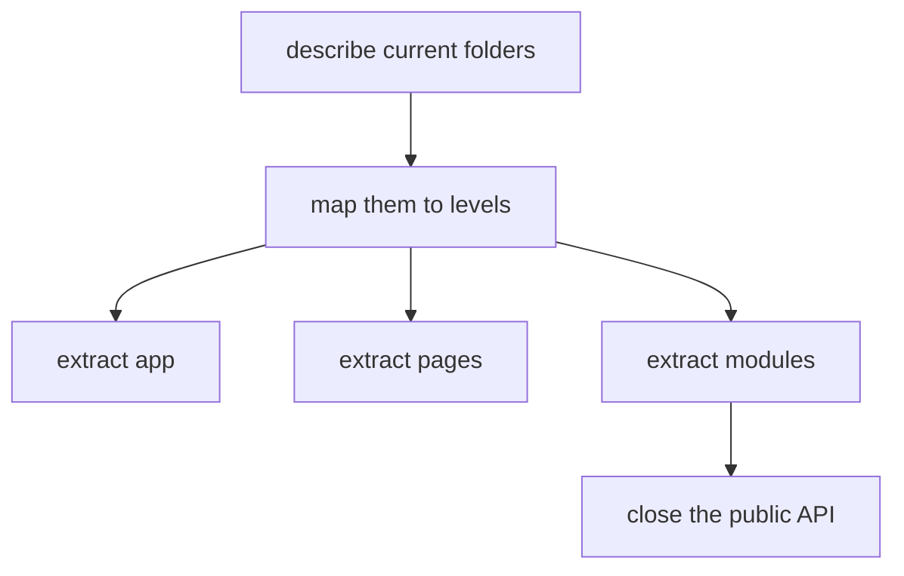

# Existing Project

This tutorial shows a safe first pass through an existing project: identify FEOD levels without rewriting everything at once.



## When to Use It

Use this scenario when a project already lives in an arbitrary structure and needs to move toward FEOD gradually.

## Prerequisites

- There is an existing `src` structure.
- The team can identify the main route-level screens.
- Large product areas are known.
- Imports can be changed gradually.

## Steps

1. Find the application assembly point.

   Move the entry point, providers, router, and top-level wiring into `app`.

2. Separate route-level screens.

   Move route-related screens into `pages`. Do not move shared UI or domain models there.

3. List the product areas.

   Good candidates for `modules`: `auth`, `profile`, `catalog`, `cart`, `checkout`, `billing`, `notifications`.

4. Choose one module for the first pass.

   Do not start with the most coupled legacy area. The first module should give the team a clear example.

5. Create a public API.

   Add a root `index.ts` and move nearby consumers to imports through it.

6. Record temporary violations.

   Legacy deep imports are better marked as debt than hidden behind a new facade before the contract is understood.

7. Sort out `shared`, `utils`, or `common`.

   Keep neutral primitives in `common`. Move domain code to the corresponding modules.

## Resulting Structure

```text
src/
  app/
  pages/
  modules/
    auth/
    profile/
  common/
  global/
```

The structure can be incomplete after the first pass. The important part is to get working boundaries and a clear migration order.

## Checklist

- The entry point and providers are separated from business scenarios.
- Route-level screens are not used as a source of shared logic.
- There is at least one module with a public API.
- New imports go through the public API.
- Legacy deep imports are visible as technical debt.
- `common` has been checked for domain leaks.

## Common Mistakes

- Renaming folders without changing imports -> the architecture looks new, but dependencies remain the same.
- Migrating the whole project in one PR -> review stops seeing the meaning of the changes.
- Creating a facade that exports everything indiscriminately -> no public API appears.
- Moving all helpers into `common` -> common as a dumping ground remains the same problem.

## Related Pages

- [Step-by-Step Migration](./migration-step-by-step.md)
- [Migration from Regular Modular Architecture](../guides/migration-from-modular.md)
- [Code Smells](../reference/code-smells.md)
- [Code Review Checklist](../guides/code-review.md)
