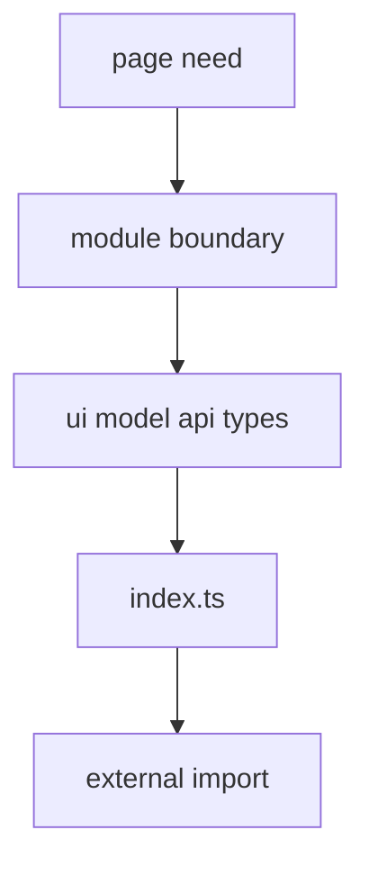

# First Module

This tutorial shows how to design the first FEOD module without turning it into a components folder.



## When to Use It

Use this page when creating the first product module in a new or existing project.

## Prerequisites

- There is a product responsibility.
- The first consumers of the module are known.
- It is clear which parts must be available externally.
- There is a decision that the module lives on the `modules` level.

## Steps

1. Name the responsibility.

   ```text
   checkout - order placement
   notifications - user notifications
   catalog - product browsing and filtering
   ```

   The names `components` or `services` do not work: they describe file types, not a product area.

2. Describe the consumers.

   ```text
   checkout:
   - used by the cart page
   - may use the cart public API
   - is not imported from common
   ```

3. Create the minimal structure.

   ```text
   src/modules/checkout/
     ui/
       checkout-form.tsx
     model/
       use-checkout.ts
     index.ts
   ```

4. Hide internal details.

   ```ts
   // src/modules/checkout/model/use-checkout.ts
   import { submitOrder } from '../api/submit-order';

   export function useCheckout() {
     return { submitOrder };
   }
   ```

   `api/submit-order` remains an internal file if external consumers do not need a direct call.

5. Expose the public API.

   ```ts
   // src/modules/checkout/index.ts
   export { CheckoutForm } from './ui/checkout-form';
   export { useCheckout } from './model/use-checkout';
   ```

6. Check the external import.

   ```ts
   // good
   import { CheckoutForm } from '@/modules/checkout';

   // bad
   import { CheckoutForm } from '@/modules/checkout/ui/checkout-form';
   ```

7. Add a README if the module is not obvious.

   A README is useful when the module has several consumers, dependency constraints, submodules, or a non-trivial public API.

## Resulting Structure

```text
src/modules/checkout/
  ui/
    checkout-form.tsx
  model/
    use-checkout.ts
  api/
    submit-order.ts
  README.md
  index.ts
```

## Checklist

- The module name describes a product responsibility.
- The module has a root `index.ts`.
- External consumers use only the public API.
- The internal API client is not exported unnecessarily.
- The README explains the responsibility if it is not obvious.
- The module does not contain other scenarios.

## Common Mistakes

- Starting with `components`, `hooks`, or `api` directories on the `modules` level -> no product boundary appears.
- Exporting an internal API request outward -> consumers bypass the module scenario.
- Mixing `checkout` and `cart` in one module without a reason -> responsibility becomes blurred.
- Not describing consumers -> the public API forms accidentally.

## Related Pages

- [How to Design a Module](../guides/design-module.md)
- [Module Contract](../reference/module-contract.md)
- [Public API](../reference/public-api.md)
- [How to Write a Module README](../guides/module-readme.md)
