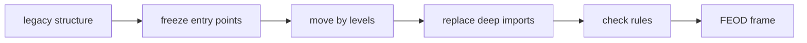

# Step-by-Step Migration

This tutorial defines a migration order for moving to FEOD when the project cannot be stopped for a full rebuild.



## When to Use It

Use this scenario for a long-lived project where FEOD needs to be introduced gradually while product delivery continues.

## Prerequisites

- There is a list of the main pages or routes.
- There is a list of current domain or product areas.
- The team is ready to forbid new deep imports.
- There is an owner for the migration decision.

## Steps

1. Fix the target level map.

   ```text
   app -> pages -> modules -> common
   global is used without direct imports
   ```

2. Introduce the rule for new code.

   New code must not add deep imports into other modules. Even if legacy code still violates the rule, new violations should be stopped.

3. Extract `app`.

   Move the entry point, router, providers, global styles, and wiring. Do not move business logic there.

4. Extract `pages`.

   Route-level components become pages. Their job is to compose a scenario from modules.

5. Choose the first module.

   Start with an area that has clear consumers and a clear responsibility.

6. Build the first module's public API.

   ```ts
   // src/modules/catalog/index.ts
   export { ProductGrid } from './ui/product-grid';
   export { useProducts } from './model/use-products';
   export type { Product } from './model/types';
   ```

7. Move consumers to the public API.

   ```ts
   // good
   import { ProductGrid } from '@/modules/catalog';

   // bad
   import { ProductGrid } from '@/modules/catalog/ui/product-grid';
   ```

8. Repeat for the next modules.

   After each module, check whether shared code has appeared that was incorrectly moved into `common`.

9. Add tooling after the rules stabilize.

   Linters and AI rules are useful once the team has agreed on the basic contracts. Otherwise, the tool will start freezing accidental decisions.

## Resulting Structure

```text
src/
  app/
  pages/
  modules/
    catalog/
    cart/
    checkout/
  common/
  global/
```

## Checklist

- Deep imports are forbidden for new code.
- `app` contains no domain logic.
- `pages` do not export reusable business logic.
- Every migrated module has an `index.ts`.
- Legacy violations are visible and have an order for fixing.
- Tooling is connected to rules the team has already agreed on.

## Common Mistakes

- Writing lint rules first and deciding boundaries later -> the tool freezes chaos.
- Mixing a migration PR with a product task -> review cannot separate behavior from structure.
- Turning `common` into temporary migration storage -> debt becomes the new standard.
- Removing all internal paths before consumers are moved -> migration breaks the build without architectural benefit.

## Related Pages

- [Existing Project](./existing-project.md)
- [Migration from FSD](../guides/migration-from-fsd.md)
- [Migration from Regular Modular Architecture](../guides/migration-from-modular.md)
- [ESLint Plugin](../tools/eslint-plugin.md)
