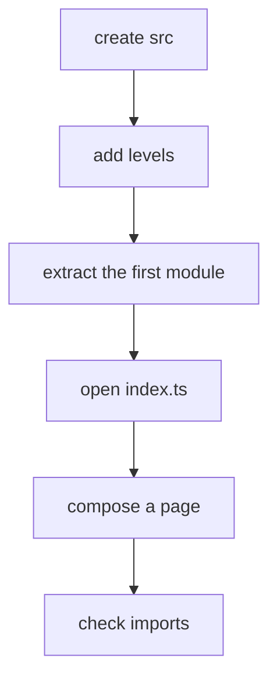

# New Project

This tutorial shows how to start a new frontend project with FEOD without extra levels or premature abstractions.



## When to Use It

Use this scenario when the project is being created from scratch and the team has already decided to keep product areas in `modules`.

## Prerequisites

- A frontend stack has been chosen.
- There is at least one route-level screen.
- The first product scenarios are known.
- The team is ready to import modules only through their public API.

## Steps

1. Create the base levels.

   ```text
   src/
     app/
     pages/
     modules/
     common/
     global/
   ```

2. Put bootstrap code in `app`.

   ```text
   src/app/
     providers/
     router/
     index.ts
   ```

   `app` may know about pages, providers, and application integrations. It does not store business logic for a specific scenario.

3. Create the first page in `pages`.

   ```text
   src/pages/home/
     ui/
       home-page.tsx
     index.ts
   ```

   A page composes a user-facing screen and imports modules through their public API.

4. Extract the first module by responsibility.

   ```text
   src/modules/profile/
     ui/
       profile-card.tsx
     model/
       use-profile.ts
     index.ts
   ```

   The module name should describe a product area, not a technical file type.

5. Expose only the supported public API.

   ```ts
   // src/modules/profile/index.ts
   export { ProfileCard } from './ui/profile-card';
   export { useProfile } from './model/use-profile';
   ```

6. Add `common` only after checking neutrality.

   ```text
   src/common/ui/button/
     button.tsx
     index.ts
   ```

   If code knows about `profile`, `cart`, `checkout`, or another product area, it should not live in `common`.

7. Use `global` only for global declarations and side effects.

   ```text
   src/global/
     env.d.ts
     styles/
       index.css
   ```

## Resulting Structure

```text
src/
  app/
    providers/
    router/
    index.ts
  pages/
    home/
      ui/
        home-page.tsx
      index.ts
  modules/
    profile/
      ui/
        profile-card.tsx
      model/
        use-profile.ts
      index.ts
  common/
    ui/
      button/
        button.tsx
        index.ts
  global/
    env.d.ts
    styles/
      index.css
```

## Checklist

- The project has all five top-level FEOD levels.
- Bootstrap code lives in `app`.
- Route-level screens live in `pages`.
- The first product scenario is shaped as a module.
- The module has a root `index.ts`.
- `common` does not contain domain logic.
- `global` is not used as importable shared code.

## Common Mistakes

- Creating empty modules for the future -> the structure starts reflecting expectations instead of real responsibilities.
- Naming a module technically, such as `components`, `hooks`, or `services` -> the module stops being a product boundary.
- Putting an API for a specific scenario in `common` -> the shared level becomes a hidden domain layer.
- Exporting everything from a module with `export *` -> the public API stops being a contract.

## Related Pages

- [Quick Start](../get-started/quick-start.md)
- [First Module](./first-module.md)
- [Import Matrix](../reference/import-matrix.md)
- [Module Contract](../reference/module-contract.md)
