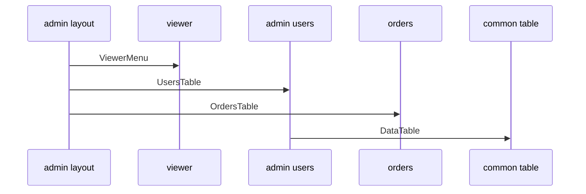

# Example: Dashboard / Admin Panel



## Цель примера

Этот пример показывает FEOD-структуру для dashboard или admin panel: layout, вложенные страницы, несколько продуктовых модулей, общие table/filter primitives и page-level composition.

Пример не является tutorial по конкретному framework. Он фиксирует архитектурные границы и типовые импорты.

## Сценарии

Admin panel поддерживает:

- общий layout с navigation;
- страницу overview;
- управление пользователями;
- просмотр заказов;
- audit log;
- фильтрацию и таблицы в нескольких разделах.

## Структура проекта

```text
src/
  app/
    main.tsx
    App.tsx
    router/
      admin-routes.ts
    providers/
      QueryProvider.tsx
      AuthProvider.tsx
  pages/
    admin-layout/
      index.ts
      ui/AdminLayout.tsx
    dashboard/
      index.ts
      ui/DashboardPage.tsx
    users/
      index.ts
      ui/UsersPage.tsx
    orders/
      index.ts
      ui/OrdersPage.tsx
    audit-log/
      index.ts
      ui/AuditLogPage.tsx
  modules/
    viewer/
      index.ts
      ui/ViewerMenu.tsx
      model/useCurrentViewer.ts
      api/viewer-client.ts
      types.ts
    admin-users/
      README.md
      index.ts
      ui/UsersTable.tsx
      ui/UserStatusBadge.tsx
      model/useUsers.ts
      model/user-filters.ts
      api/users-client.ts
      types.ts
    orders/
      index.ts
      ui/OrdersTable.tsx
      ui/OrderStatusBadge.tsx
      model/useOrders.ts
      api/orders-client.ts
      types.ts
    audit-log/
      index.ts
      ui/AuditLogTable.tsx
      model/useAuditLog.ts
      api/audit-log-client.ts
      types.ts
  common/
    ui/
      data-table/
        index.ts
        DataTable.tsx
      filters-panel/
        index.ts
        FiltersPanel.tsx
      button/
        index.ts
        Button.tsx
    date-range/
      index.ts
      DateRange.tsx
    format-date/
      index.ts
      formatDate.ts
  global/
    env.d.ts
    polyfills/
      intersection-observer.ts
```

## Роли уровней

`app` запускает приложение, подключает providers и router.

`pages/admin-layout` описывает route-level layout: navigation, область контента, breadcrumbs. Это page-level композиция, а не `common`, потому что layout связан с конкретным разделом приложения.

`modules` владеют продуктовыми областями: viewer, admin-users, orders, audit-log.

`common` хранит нейтральные table/filter primitives. Они не знают о пользователях, заказах или audit events.

`global` содержит только декларации и инфраструктурные подключения.

## Public API модулей

```ts
// modules/viewer/index.ts
export { ViewerMenu } from "./ui/ViewerMenu";
export { useCurrentViewer } from "./model/useCurrentViewer";
export type { Viewer } from "./types";
```

```ts
// modules/admin-users/index.ts
export { UsersTable } from "./ui/UsersTable";
export { UserStatusBadge } from "./ui/UserStatusBadge";
export { useUsers } from "./model/useUsers";
export type { AdminUser, UserFilter } from "./types";
```

```ts
// modules/orders/index.ts
export { OrdersTable } from "./ui/OrdersTable";
export { OrderStatusBadge } from "./ui/OrderStatusBadge";
export { useOrders } from "./model/useOrders";
export type { Order, OrderFilter } from "./types";
```

```ts
// modules/audit-log/index.ts
export { AuditLogTable } from "./ui/AuditLogTable";
export { useAuditLog } from "./model/useAuditLog";
export type { AuditLogEvent } from "./types";
```

## Layout and pages

### App

```ts
import { AppRouter } from "@/pages";
import { AuthProvider } from "./providers/AuthProvider";
import { QueryProvider } from "./providers/QueryProvider";

export function App() {
  return (
    <QueryProvider>
      <AuthProvider>
        <AppRouter />
      </AuthProvider>
    </QueryProvider>
  );
}
```

### Admin layout page

```ts
import { ViewerMenu } from "@/modules/viewer";
import { Button } from "@/common/ui/button";

export function AdminLayout({ children }: { children: unknown }) {
  return (
    <section>
      <nav>
        <Button>Dashboard</Button>
        <Button>Users</Button>
        <Button>Orders</Button>
      </nav>
      <ViewerMenu />
      <main>{children}</main>
    </section>
  );
}
```

Layout находится в `pages`, потому что он привязан к route tree admin panel. Он не становится `common` только из-за повторного использования несколькими admin pages.

### Users page

```ts
import { UsersTable } from "@/modules/admin-users";
import { FiltersPanel } from "@/common/ui/filters-panel";

export function UsersPage() {
  return (
    <>
      <FiltersPanel />
      <UsersTable />
    </>
  );
}
```

### Orders page

```ts
import { OrdersTable } from "@/modules/orders";
import { DateRange } from "@/common/date-range";

export function OrdersPage() {
  return (
    <>
      <DateRange />
      <OrdersTable />
    </>
  );
}
```

Страницы собирают сценарий из public API модулей и нейтральных `common`-контрактов. Они не работают с raw clients модулей.

## Shared table/filter components

`DataTable`, `FiltersPanel` и `DateRange` могут жить в `common`, только пока они не знают о доменных типах.

Корректно:

```ts
import { DataTable } from "@/common/ui/data-table";
```

Некорректно:

```ts
import { UserStatusBadge } from "@/common/ui/data-table";
import type { AdminUser } from "@/common/ui/data-table";
```

Нарушение: table primitive начал хранить продуктовый UI и доменный тип.

## Разрешённые импорты

```ts
import { UsersTable } from "@/modules/admin-users";
import { OrdersTable } from "@/modules/orders";
import { ViewerMenu } from "@/modules/viewer";
import { DataTable } from "@/common/ui/data-table";
```

## Запрещённые импорты

```ts
import { usersClient } from "@/modules/admin-users/api/users-client";
import { orderFilters } from "@/modules/orders/model/order-filters";
import { AdminLayout } from "@/pages/admin-layout";
import "@/global/polyfills/intersection-observer";
```

Нарушения:

- внешний код зависит от transport-деталей модуля;
- страница или модуль импортирует внутреннюю model-часть чужого модуля;
- `pages` импортируют другую страницу как обычную зависимость;
- `global` подключён как прикладной контракт вне инфраструктурной точки входа.

## Когда admin code не должен уходить в common

Не переносите в `common`:

- `UserStatusBadge`;
- `OrderStatusBadge`;
- `useUsers`;
- `useOrders`;
- `AdminLayout`, если он привязан к admin route tree;
- filters, которые знают о статусах пользователей или заказов.

Эти сущности имеют продуктовый смысл. Их место в соответствующем модуле или странице.

## Чеклист примера

- [ ] `app` содержит router/providers/bootstrap.
- [ ] Layout admin panel находится на уровне `pages`.
- [ ] Каждый продуктовый раздел имеет модуль с `index.ts`.
- [ ] Таблица и фильтры в `common` остаются нейтральными primitives.
- [ ] Страницы импортируют модули через public API.
- [ ] Модули не импортируют `pages`, `app` или `global`.
- [ ] В примере показаны запрещённые deep imports.

## Связанные страницы

- [Pages](../structure/pages.md)
- [Modules](../structure/modules.md)
- [Common](../structure/common.md)
- [Как не превратить common в свалку](../guides/common-boundaries.md)
- [Матрица импортов](../reference/import-matrix.md)
- [Code smells](../reference/code-smells.md)
