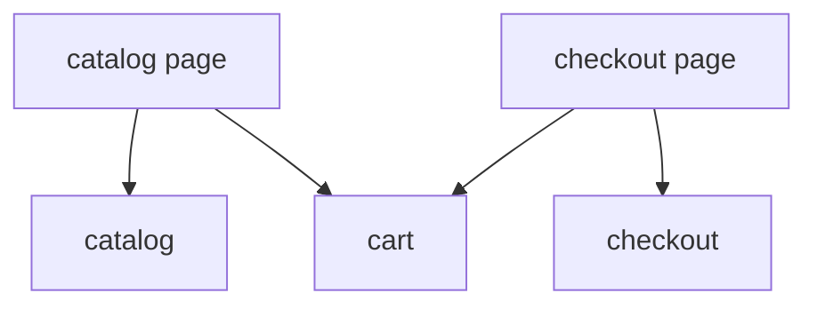

# Example: E-commerce



## Цель примера

Этот пример показывает полный FEOD-каркас для e-commerce приложения: каталог, корзина, оформление заказа и пользовательские данные.

Пример не привязан к конкретному framework или state manager. Важны границы `app`, `pages`, `modules`, `common`, `global` и public API модулей.

## Сценарии

Приложение поддерживает:

- просмотр каталога;
- добавление товара в корзину;
- просмотр корзины;
- оформление заказа;
- отображение данных пользователя.

## Структура проекта

```text
src/
  app/
    main.tsx
    App.tsx
    router/
      routes.ts
    providers/
      QueryProvider.tsx
  pages/
    catalog/
      index.ts
      ui/CatalogPage.tsx
    cart/
      index.ts
      ui/CartPage.tsx
    checkout/
      index.ts
      ui/CheckoutPage.tsx
    profile/
      index.ts
      ui/ProfilePage.tsx
  modules/
    catalog/
      index.ts
      ui/ProductList.tsx
      ui/ProductCard.tsx
      model/useCatalog.ts
      api/catalog-client.ts
      types.ts
    cart/
      index.ts
      ui/CartSummary.tsx
      ui/AddToCartButton.tsx
      model/useCart.ts
      model/cart-store.ts
      types.ts
    checkout/
      index.ts
      ui/CheckoutFlow.tsx
      ui/DeliveryStep.tsx
      ui/PaymentStep.tsx
      model/useCheckout.ts
      api/checkout-client.ts
      types.ts
    user/
      index.ts
      ui/UserMenu.tsx
      model/useCurrentUser.ts
      api/user-client.ts
      types.ts
  common/
    ui/
      button/
        index.ts
        Button.tsx
      page-layout/
        index.ts
        PageLayout.tsx
    format-money/
      index.ts
      formatMoney.ts
  global/
    env.d.ts
    polyfills/
      resize-observer.ts
```

## Public API модулей

```ts
// modules/catalog/index.ts
export { ProductList } from "./ui/ProductList";
export type { Product, ProductId } from "./types";
```

```ts
// modules/cart/index.ts
export { AddToCartButton } from "./ui/AddToCartButton";
export { CartSummary } from "./ui/CartSummary";
export { useCart } from "./model/useCart";
export type { CartItem } from "./types";
```

```ts
// modules/checkout/index.ts
export { CheckoutFlow } from "./ui/CheckoutFlow";
export type { CheckoutDraft } from "./types";
```

```ts
// modules/user/index.ts
export { UserMenu } from "./ui/UserMenu";
export { useCurrentUser } from "./model/useCurrentUser";
export type { User } from "./types";
```

## Страницы и взаимодействие модулей

### Catalog page

```ts
import { ProductList } from "@/modules/catalog";
import { AddToCartButton } from "@/modules/cart";
import { PageLayout } from "@/common/ui/page-layout";

export function CatalogPage() {
  return (
    <PageLayout title="Каталог">
      <ProductList renderAction={(product) => (
        <AddToCartButton productId={product.id} />
      )} />
    </PageLayout>
  );
}
```

Страница собирает сценарий из модулей. Она не импортирует внутренние API-клиенты каталога или корзины.

### Cart page

```ts
import { CartSummary } from "@/modules/cart";
import { PageLayout } from "@/common/ui/page-layout";

export function CartPage() {
  return (
    <PageLayout title="Корзина">
      <CartSummary />
    </PageLayout>
  );
}
```

### Checkout page

```ts
import { CheckoutFlow } from "@/modules/checkout";
import { CartSummary } from "@/modules/cart";
import { PageLayout } from "@/common/ui/page-layout";

export function CheckoutPage() {
  return (
    <PageLayout title="Оформление заказа">
      <CartSummary />
      <CheckoutFlow />
    </PageLayout>
  );
}
```

## User data boundary

Данные пользователя принадлежат модулю `user`. Другие модули не читают внутренний store или API-клиент `user` напрямую.

Корректно:

```ts
import { useCurrentUser } from "@/modules/user";
```

Некорректно:

```ts
import { userStore } from "@/modules/user/model/user-store";
import { userClient } from "@/modules/user/api/user-client";
```

Нарушение: внешний код зависит от внутреннего состояния и transport-деталей модуля `user`.

## Взаимодействие catalog и cart

`catalog` не должен импортировать внутренности `cart`, а `cart` не должен знать внутренний API `catalog`.

Разрешено:

```ts
import { AddToCartButton } from "@/modules/cart";
import type { ProductId } from "@/modules/catalog";
```

Запрещено:

```ts
import { cartStore } from "@/modules/cart/model/cart-store";
import { ProductCard } from "@/modules/catalog/ui/ProductCard";
```

Нарушение: оба импорта обходят public API.

## Где здесь `common`

`common` содержит нейтральные сущности:

- `Button`;
- `PageLayout`;
- `formatMoney`.

`common` не содержит `CartSummary`, `ProductCard`, `CheckoutFlow` или `UserMenu`, потому что это продуктовые сущности конкретных модулей.

## Где здесь `global`

`global` содержит только декларации и инфраструктурные подключения:

- `env.d.ts`;
- polyfills;
- глобальные side-effect файлы, если они подключаются entrypoint-ом.

`global` не содержит `env.ts`, `formatMoney`, UI или API-клиенты.

## Чеклист примера

- [ ] `app` запускает приложение и собирает providers/router.
- [ ] `pages` собирают пользовательские сценарии из модулей.
- [ ] `modules` владеют продуктовыми областями `catalog`, `cart`, `checkout`, `user`.
- [ ] Каждый модуль имеет `index.ts`.
- [ ] Внешний код импортирует модули только через public API.
- [ ] `common` содержит только нейтральные переиспользуемые сущности.
- [ ] `global` не используется как скрытый общий каталог.

## Связанные страницы

- [Modules](../structure/modules.md)
- [Pages](../structure/pages.md)
- [Public API](../reference/public-api.md)
- [Матрица импортов](../reference/import-matrix.md)
- [Code smells](../reference/code-smells.md)
