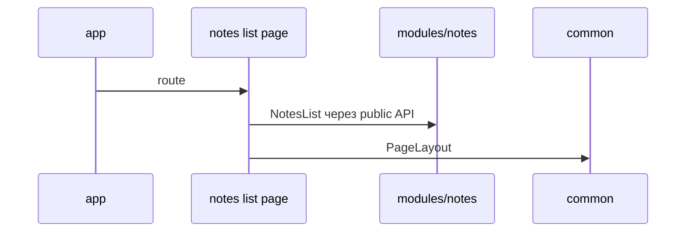

# Example: Минимальный SPA



## Цель примера

Этот пример показывает самый маленький полезный FEOD-каркас для SPA: `app`, две страницы, один продуктовый модуль, несколько нейтральных сущностей `common` и минимальный `global`.

Пример не привязан к конкретному framework или state manager. Имена файлов условные; важны границы и импорты.

## Сценарий

Приложение показывает список заметок и страницу одной заметки.

Минимальные области:

- `app` запускает приложение и подключает router;
- `pages` описывают route-level экраны;
- `modules/notes` владеет заметками;
- `common` хранит UI-примитивы и нейтральные helpers;
- `global` хранит декларации и polyfills.

## Структура проекта

```text
src/
  app/
    main.tsx
    App.tsx
    router/
      routes.ts
  pages/
    notes-list/
      index.ts
      ui/NotesListPage.tsx
    note-details/
      index.ts
      ui/NoteDetailsPage.tsx
  modules/
    notes/
      index.ts
      ui/NotesList.tsx
      ui/NoteCard.tsx
      ui/NoteDetails.tsx
      model/useNotes.ts
      model/useNote.ts
      api/notes-client.ts
      types.ts
  common/
    ui/
      button/
        index.ts
        Button.tsx
      page-layout/
        index.ts
        PageLayout.tsx
    format-date/
      index.ts
      formatDate.ts
  global/
    vite-env.d.ts
    polyfills/
      resize-observer.ts
```

## Public API модуля

```ts
// modules/notes/index.ts
export { NotesList } from "./ui/NotesList";
export { NoteDetails } from "./ui/NoteDetails";
export { useNote } from "./model/useNote";

export type { Note, NoteId } from "./types";
```

Модуль не экспортирует `notes-client`, внутренние mapper-ы и parts-компоненты, если они не являются внешним контрактом.

## App

```ts
import { AppRouter } from "@/pages";

export function App() {
  return <AppRouter />;
}
```

`app` собирает приложение и может импортировать `pages`, `modules` и `common`. Он не должен делать deep imports во внутренности модуля.

## Pages

### Notes list page

```ts
import { NotesList } from "@/modules/notes";
import { PageLayout } from "@/common/ui/page-layout";

export function NotesListPage() {
  return (
    <PageLayout title="Заметки">
      <NotesList />
    </PageLayout>
  );
}
```

### Note details page

```ts
import { NoteDetails } from "@/modules/notes";
import { PageLayout } from "@/common/ui/page-layout";

export function NoteDetailsPage({ noteId }: { noteId: string }) {
  return (
    <PageLayout title="Заметка">
      <NoteDetails noteId={noteId} />
    </PageLayout>
  );
}
```

Страницы собирают route-level сценарий. Они не импортируют `api/notes-client` и не читают внутреннее состояние модуля.

## Разрешённые импорты

```ts
import { NoteDetails, NotesList } from "@/modules/notes";
import { PageLayout } from "@/common/ui/page-layout";
import { formatDate } from "@/common/format-date";
```

## Запрещённые импорты

```ts
import { notesClient } from "@/modules/notes/api/notes-client";
import { NoteCard } from "@/modules/notes/ui/NoteCard";
import "@/global/polyfills/resize-observer";
```

Нарушения:

- страница зависит от transport-детали модуля;
- внешний код импортирует parts-компонент из внутренней папки;
- прикладной код подключает `global` как обычную зависимость.

Глобальный polyfill подключается только через entrypoint, test setup или build/runtime-конфигурацию проекта.

## Где здесь `common`

`PageLayout`, `Button` и `formatDate` нейтральны: они не знают о заметках и могут использоваться в любом сценарии.

Если появляется helper `formatNotePreview`, он принадлежит `modules/notes`, потому что знает о доменной модели заметки.

## Чеклист примера

- [ ] `app` отвечает за запуск и верхнюю композицию.
- [ ] `pages` описывают маршруты и собирают модульный UI.
- [ ] `modules/notes` владеет данными и UI заметок.
- [ ] Public API модуля находится в `modules/notes/index.ts`.
- [ ] `common` содержит только нейтральные сущности.
- [ ] `global` не импортируется как обычный контракт приложения.
- [ ] В примере нет deep imports во внутренности модуля.

## Связанные страницы

- [Быстрый старт](../get-started/quick-start.md)
- [Где хранить код](../guides/where-to-place-code.md)
- [Матрица импортов](../reference/import-matrix.md)
- [Public API](../reference/public-api.md)
- [Глоссарий](../reference/glossary.md)
