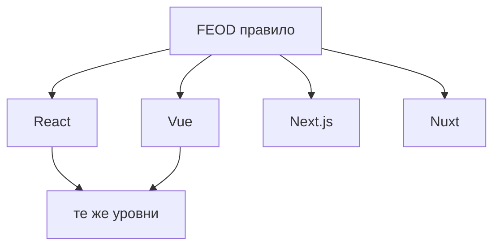

# Framework appendices

Framework appendices показывают, как применять FEOD в популярных frontend-стеках. Они не меняют базовые правила методологии.

## Правило

Если framework-specific рекомендация спорит с `Reference`, приоритет у `Reference`. Appendix может объяснить адаптацию, но не создаёт новое правило импортов или public API.

## Доступные appendices

- [React](./react.md)
- [Vue](./vue.md)
- [Next.js и Nuxt](./next-nuxt.md)

## Что здесь не должно быть

- новая матрица импортов;
- отдельная терминология уровней;
- правила, которые применимы только к одному framework, но подаются как FEOD-норма;
- обход public API ради удобства framework.

## Связанные страницы

- [Быстрый старт](../get-started/quick-start.md)
- [Уровни](../core-concepts/levels.md)
- [Матрица импортов](../reference/import-matrix.md)
