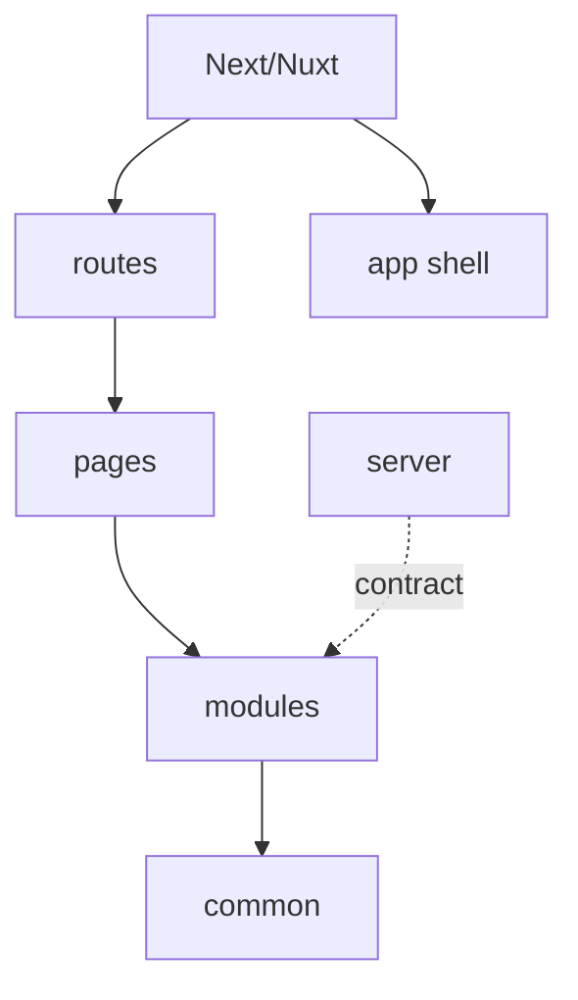

# Next.js и Nuxt

Next.js и Nuxt добавляют filesystem routing и server-side возможности. FEOD при этом остаётся внутренней архитектурой приложения, а не заменой framework-конвенций.



## Главное правило

Framework route files могут быть тонким adapter-слоем. Продуктовая логика и переиспользуемые сценарии должны оставаться в `modules`, а не в route files.

## Next.js

Типовой вариант:

```text
src/
  app/                 # framework routes или bootstrap, если проект использует App Router
  modules/
    catalog/
    cart/
  common/
  global/
```

Если имя `app` занято framework routing, проект должен явно описать, где находится FEOD `app`-уровень или как framework `app` соотносится с ним.

```tsx
// src/app/catalog/page.tsx
import { CatalogPage } from '@/pages/catalog';

export default function Page() {
  return <CatalogPage />;
}
```

Framework route остаётся adapter-слоем, а FEOD page хранит route-level композицию.

## Nuxt

Типовой вариант:

```text
src/
  pages/               # framework routes
  modules/
    catalog/
    cart/
  common/
  global/
```

Если framework уже использует `pages`, команда должна зафиксировать, является ли эта директория одновременно FEOD `pages` или только route adapter.

## Server code

Server handlers, loaders и actions не должны обходить FEOD-контракты только потому, что выполняются на сервере. Если server-side код использует модуль, он должен использовать его public API или отдельный явно экспортированный server contract.

## Good example

```ts
// modules/catalog/index.ts
export { CatalogPageContent } from './ui/catalog-page-content';
export { getProducts } from './server/get-products';
```

`getProducts` экспортирован намеренно как часть server-facing контракта.

## Bad example

```ts
// app/catalog/page.tsx
import { productRepository } from '@/modules/catalog/server/internal/product-repository';
```

Нарушение: framework route обходит public API модуля.

## Чеклист

- Framework route files остаются тонкими adapters.
- FEOD rules явно описывают конфликт имён `app` или `pages`, если он есть.
- Server-side imports не обходят public API.
- Server-facing exports отделены от случайных внутренних файлов.
- `common` не становится местом для server business logic.

## Связанные страницы

- [Public API](../reference/public-api.md)
- [Матрица импортов](../reference/import-matrix.md)
- [Подходит ли FEOD моему проекту](../get-started/is-feod-for-my-project.md)
