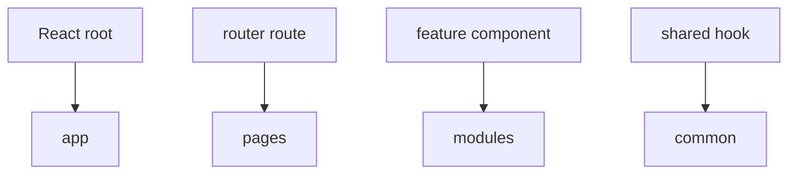

# React

Этот appendix показывает типовое сопоставление FEOD и React-приложения. Базовые правила public API и импортов остаются теми же.



## App

В `app` обычно живут:

- React root;
- providers;
- router;
- error boundary верхнего уровня;
- подключение глобальных стилей.

```text
src/app/
  providers/
    app-providers.tsx
  router/
    router.tsx
  index.tsx
```

## Pages

Route-level React components живут в `pages`.

```tsx
// src/pages/profile/ui/profile-page.tsx
import { ProfileCard } from '@/modules/profile';

export function ProfilePage() {
  return <ProfileCard />;
}
```

## Modules

React hooks, компоненты и локальная модель сценария живут внутри модуля.

```text
src/modules/profile/
  ui/
    profile-card.tsx
  model/
    use-profile.ts
  index.ts
```

```ts
// src/modules/profile/index.ts
export { ProfileCard } from './ui/profile-card';
export { useProfile } from './model/use-profile';
```

## Common

В `common` допустимы нейтральные UI primitives и hooks без доменной привязки.

```text
common/ui/button
common/hooks/use-media-query
common/lib/format-date
```

## Частые ошибки

- Хранить все hooks в `common/hooks` -> доменные hooks теряют владельца.
- Экспортировать внутренние React components модуля напрямую -> public API размывается.
- Помещать route-level state в `app` без необходимости -> `app` начинает знать о бизнесовом сценарии.

## Связанные страницы

- [Public API](../reference/public-api.md)
- [Где хранить код](../guides/where-to-place-code.md)
- [Code review checklist](../guides/code-review.md)
