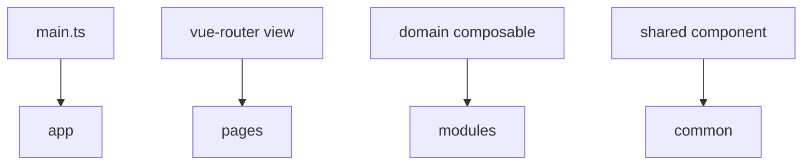

# Vue

Этот appendix показывает типовое сопоставление FEOD и Vue-приложения. FEOD не требует другой матрицы импортов для Vue.



## App

В `app` обычно живут:

- создание Vue application;
- router;
- plugins;
- providers;
- глобальные стили.

```text
src/app/
  router/
    router.ts
  plugins/
    index.ts
  index.ts
```

## Pages

Route-level `.vue` компоненты живут в `pages`.

```vue
<!-- src/pages/profile/ui/ProfilePage.vue -->
<script setup lang="ts">
import { ProfileCard } from '@/modules/profile';
</script>

<template>
  <ProfileCard />
</template>
```

## Modules

Компоненты, composables и внутренняя модель сценария живут внутри модуля.

```text
src/modules/profile/
  ui/
    ProfileCard.vue
  model/
    useProfile.ts
  index.ts
```

```ts
// src/modules/profile/index.ts
export { default as ProfileCard } from './ui/ProfileCard.vue';
export { useProfile } from './model/useProfile';
```

## Common

В `common` допустимы нейтральные composables, UI primitives и helpers.

```text
common/ui/BaseButton
common/composables/useMediaQuery
common/lib/formatDate
```

## Частые ошибки

- Складывать все composables в `common` -> доменные сценарии теряют модуль.
- Импортировать `.vue` файл из внутренней директории чужого модуля -> обход public API.
- Держать business state в router guards без явной причины -> поведение становится скрытым app-level side effect.

## Связанные страницы

- [Матрица импортов](../reference/import-matrix.md)
- [Как работать с подмодулями](../guides/submodules.md)
- [Code smells](../reference/code-smells.md)
