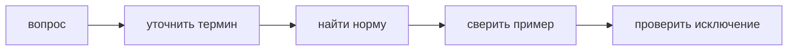

# FAQ

Эта страница отвечает на короткие частые вопросы. Подробные правила находятся в `Core Concepts`, `Structure`, `Guides` и `Reference`.



## FEOD - это FSD?

Нет. FEOD использует меньше верхних уровней и строит проект вокруг `modules`, public API и контролируемых зависимостей.

Если команда приходит из FSD, сначала сопоставьте текущие `entities`, `features` и `widgets` с будущими `modules`, а затем проверьте public API каждого модуля.

Подробнее: [Миграция с FSD](../guides/migration-from-fsd.md).

## Можно ли использовать FEOD без `common`?

Можно, если проект сознательно не выделяет общий уровень. Но тогда нейтральный переиспользуемый код должен иметь другое явное место и не должен попадать в продуктовые модули случайно.

В canonical-структуре FEOD `common` есть, но он не является папкой для неопределённого кода.

Подробнее: [Common](../structure/common.md).

## Можно ли модулю импортировать другой модуль?

Да, если импорт идёт через public API другого модуля и не создаёт циклическую или скрытую зависимость.

```ts
// good
import { Money } from '@/modules/billing';

// bad
import { Money } from '@/modules/billing/model/money';
```

Подробнее: [Матрица импортов](../reference/import-matrix.md).

## Когда подмодуль становится отдельным модулем?

Подмодуль стоит выносить, когда у него появились собственные потребители, отдельная ответственность и контракт, который уже не является внутренней деталью родительского модуля.

Если подмодуль нужен только родителю, оставьте его внутри.

Подробнее: [Как работать с подмодулями](../guides/submodules.md).

## Можно ли делать однофайловые модули?

Можно, если ответственность мала и public API остаётся понятным. Однофайловый модуль не должен становиться оправданием для обхода структуры в крупных сценариях.

Подробнее: [Modules](../structure/modules.md).

## Где хранить API-клиент?

API-клиент конкретной продуктовой области обычно живёт внутри соответствующего модуля. Нейтральная HTTP-обёртка без доменных знаний может жить в `common`.

Подробнее: [Где хранить код](../guides/where-to-place-code.md).

## Нужно ли всегда писать README модуля?

Нет. Маленький очевидный модуль может обойтись именем, структурой и public API. README нужен, когда у модуля есть нетривиальная ответственность, несколько потребителей, подмодули или ограничения зависимостей.

Подробнее: [Как писать README модуля](../guides/module-readme.md).

## Что делать с legacy deep imports?

Не чините всё за один проход без необходимости. Сначала выделите public API, затем переводите потребителей на него и только после этого закрывайте внутренние пути.

Подробнее: [Миграция с обычной модульной архитектуры](../guides/migration-from-modular.md).

## Можно ли нарушить матрицу импортов?

Исключение должно быть явным и локальным. Если нарушение повторяется, это не исключение, а признак неверной границы модуля или уровня.

Подробнее: [Матрица импортов](../reference/import-matrix.md) и [Code smells](../reference/code-smells.md).
