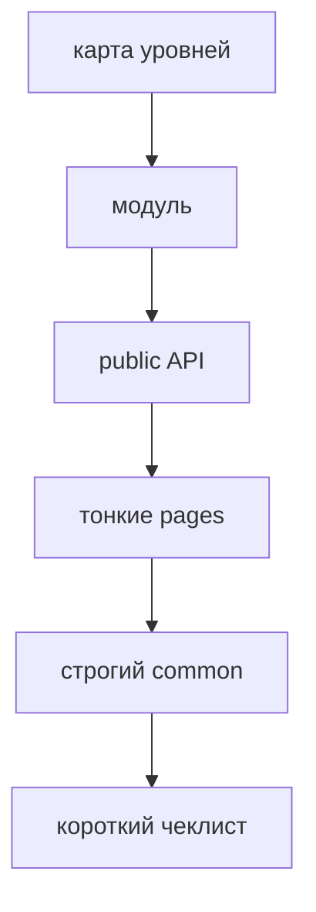

# FEOD за 5 минут

Эта страница даёт самый короткий маршрут: понять уровни, public API и главное правило импортов без полного чтения документации.



## 1. Запомните карту уровней

```text
src/
  app/      # сборка приложения
  pages/    # route-level экраны
  modules/  # продуктовые области
  common/   # нейтральный переиспользуемый код
  global/   # декларации и side effects глобального действия
```

Правило чтения простое: чем ниже уровень в этом списке, тем меньше он должен знать о конкретном приложении.

## 2. Начинайте с модуля

Модуль - основная единица FEOD. Он хранит продуктовую ответственность и открывает наружу только явный контракт.

```text
src/modules/cart/
  ui/
    cart-summary.tsx
  model/
    use-cart.ts
  index.ts
```

```ts
// src/modules/cart/index.ts
export { CartSummary } from './ui/cart-summary';
export { useCart } from './model/use-cart';
```

Внешний код использует только `@/modules/cart`.

## 3. Не обходите public API

Хорошо:

```ts
import { CartSummary } from '@/modules/cart';
```

Плохо:

```ts
import { CartSummary } from '@/modules/cart/ui/cart-summary';
```

Нарушение: внешний код зависит от внутреннего файла модуля.

## 4. Держите pages тонкими

`pages` собирают пользовательский сценарий из модулей и common-сущностей.

```tsx
// src/pages/cart/ui/cart-page.tsx
import { CartSummary } from '@/modules/cart';
import { CheckoutButton } from '@/modules/checkout';

export function CartPage() {
  return (
    <main>
      <CartSummary />
      <CheckoutButton />
    </main>
  );
}
```

Страница не должна становиться источником бизнес-логики для других частей проекта.

## 5. Проверяйте common строже обычного

Код подходит для `common`, если он не знает о продуктовой области.

```text
common/ui/button       # хорошо
common/lib/formatDate  # хорошо
common/cart/helpers    # плохо
```

Нарушение: `common/cart` скрывает доменную ответственность внутри общего уровня.

## 6. Используйте короткий чеклист

- У каждого модуля есть понятная ответственность.
- Внешний код импортирует модуль через `@/modules/<name>`.
- `pages` не экспортируют переиспользуемую бизнес-логику.
- `common` не содержит доменные сценарии.
- `global` не содержит импортируемые helpers.

## Дальше

- [Быстрый старт](./quick-start.md)
- [Где хранить код](../guides/where-to-place-code.md)
- [Матрица импортов](../reference/import-matrix.md)
- [Public API](../reference/public-api.md)
