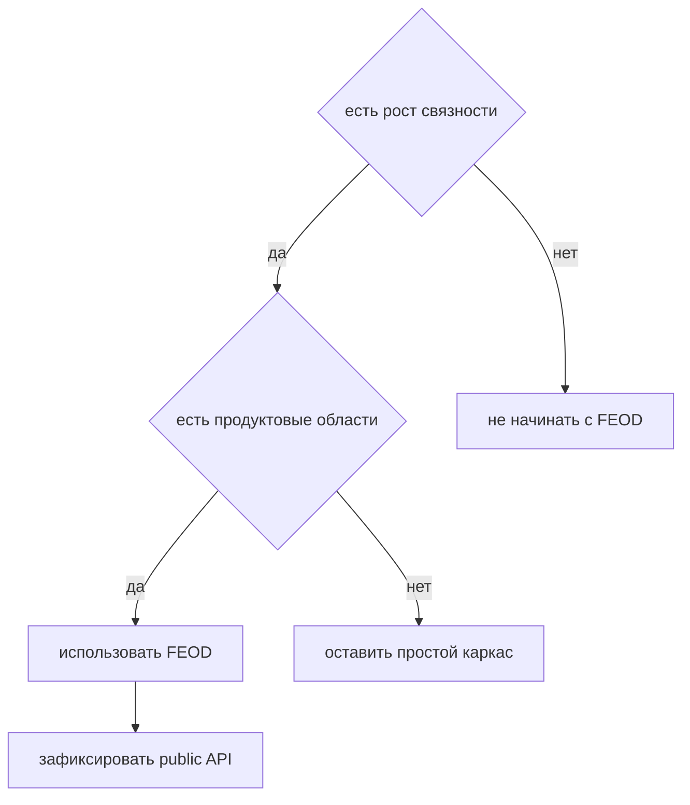

# Подходит ли FEOD моему проекту

FEOD полезен, когда frontend-проекту нужна управляемая структура модулей, public API и проверяемые зависимости. Методология не обязательна для каждого интерфейса.



## Когда использовать

Используйте FEOD, если в проекте есть хотя бы несколько признаков:

- приложение растёт дольше одного короткого релиза;
- несколько разработчиков меняют одни и те же области кода;
- есть бизнесовые сценарии, которые нужно изолировать;
- deep imports уже ломают рефакторинг;
- `shared`, `common` или `utils` стали местом для всего;
- команда хочет проверять архитектуру в review или lint rules.

## Когда не начинать с FEOD

FEOD может быть лишним, если:

- это одноразовый прототип без поддержки;
- весь frontend помещается в несколько файлов;
- архитектурные границы ещё неизвестны и команда сознательно исследует продукт;
- проект является библиотекой UI primitives, а не приложением с пользовательскими сценариями.

В таких случаях достаточно держать код простым и вернуться к FEOD, когда появятся устойчивые продуктовые области.

## Быстрая диагностика

| Вопрос | Если да | Если нет |
| --- | --- | --- |
| Есть ли несколько продуктовых областей? | Начните выделять `modules`. | Оставьте структуру проще. |
| Нужно ли менять внутренности без поломки потребителей? | Введите public API. | Не усложняйте контракт заранее. |
| Есть ли повторные споры о размещении кода? | Используйте guide [Где хранить код](../guides/where-to-place-code.md). | Достаточно локальных соглашений. |
| Есть ли нарушения зависимостей? | Сверьтесь с [Матрицей импортов](../reference/import-matrix.md). | Поддерживайте текущую простоту. |

## Good example

```text
src/
  app/
  pages/
  modules/
    catalog/
    cart/
    checkout/
  common/
  global/
```

Проект содержит несколько устойчивых сценариев. FEOD помогает не смешивать каталог, корзину и оформление заказа.

## Bad example

```text
src/
  app/
  pages/
  modules/
    button/
    modal/
    input/
  common/
```

Нарушение: технические UI primitives названы модулями, хотя у них нет продуктовой ответственности.

## Решение

Если проект уже имеет продуктовые области, начинайте с минимального каркаса FEOD и public API модулей. Если проект слишком мал, используйте FEOD как язык для будущей структуры, но не создавайте пустые уровни ради соответствия.

## Связанные страницы

- [Обзор](./overview.md)
- [Быстрый старт](./quick-start.md)
- [Модульность](../core-concepts/modularity.md)
- [Как не превратить common в свалку](../guides/common-boundaries.md)
