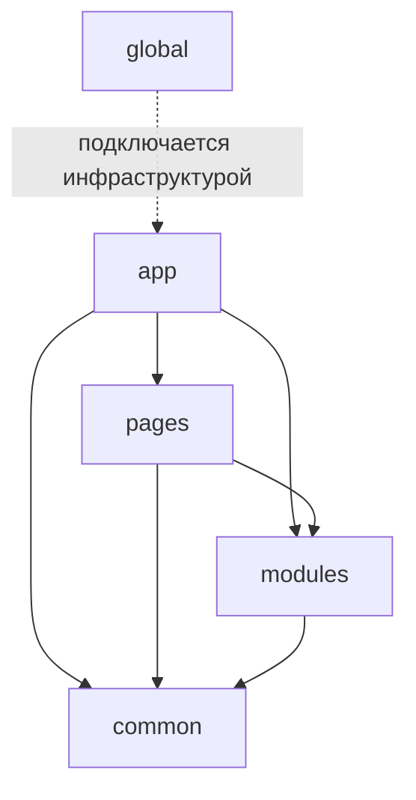

# FEOD: методология frontend-архитектуры

FEOD (Fractal Entity Oriented Design) — это методология организации frontend-приложения вокруг модулей, `public API`, фрактальной структуры и контролируемых зависимостей.



Она нужна в проектах, где обычное деление по папкам перестаёт удерживать границы. Код начинает течь между разделами, появляются обходные импорты, `common` превращается в свалку, а структура проекта держится на договорённостях в голове команды.

FEOD вводит для этого простой каркас:

- у каждого верхнего уровня есть понятная роль;
- модуль публикует наружу только свой `public API`;
- зависимости между уровнями ограничены;
- одна и та же логика организации повторяется на разных масштабах: от проекта до отдельного модуля.

## Какую боль решает FEOD

Без явных границ frontend-проект обычно деградирует одинаково:

- страницы начинают импортировать детали чужих фич напрямую;
- общие утилиты и компоненты складываются в `common` без критериев;
- внутреннее устройство модуля становится частью внешнего контракта;
- любое изменение требует знать слишком много о соседнем коде.

FEOD делает структуру читаемой и проверяемой. По коду должно быть видно:

- где находится точка входа приложения;
- что является страницей;
- что является модулем;
- что можно переиспользовать глобально;
- через какой `public API` модуль разрешено подключать.

## Чем FEOD отличается от обычной модульной архитектуры

Обычная модульная архитектура часто ограничивается тезисом «разбейте проект на модули». Дальше каждая команда сама решает:

- что считать модулем;
- где проходит граница модуля;
- можно ли импортировать внутренности соседей;
- куда складывать общее;
- как устроить одинаковую структуру внутри самих модулей.

FEOD отвечает на эти вопросы заранее:

- верхние уровни фиксированы: `app`, `pages`, `modules`, `common`, `global`;
- внешний доступ к модулю идёт через `index.ts` как `public API`;
- глубокие импорты во внутренности чужого модуля считаются нарушением;
- структура повторяется фрактально: большие части проекта и вложенные части организуются по одним принципам.

Иными словами, FEOD — это не просто идея «делить код на части», а набор правил, которые удерживают эти части независимыми.

## Чем FEOD отличается от FSD

FEOD и FSD решают близкую задачу: сделать архитектуру frontend-проекта понятной и устойчивой. Но FEOD описывает её через уровни `app`, `pages`, `modules`, `common`, `global` и делает модуль главным строительным блоком.

Практическая разница обычно такая:

- в FEOD основной термин — **уровень**, а не слой;
- в FEOD нет обязательного набора FSD-слоёв вроде `entities`, `features`, `widgets`;
- FEOD концентрируется на модуле, его `public API` и границе зависимостей;
- FEOD проще применять в проектах, где не нужна глубокая таксономия доменных типов, но нужны строгие правила импортов и масштабируемая структура.

Если вы знаете FSD, можно думать о FEOD как о более прямом каркасе вокруг модулей и уровней. Но это отдельная методология, а не переименование FSD-терминов.

## Верхние уровни FEOD

На верхнем уровне проекта FEOD использует только пять имён:

```text
src/
  app/
  pages/
  modules/
  common/
  global/
```

- `app` — запуск приложения, роутинг, провайдеры, композиция верхнего уровня.
- `pages` — страницы и крупные сценарии входа.
- `modules` — самостоятельные модули с собственным `public API`.
- `common` — переиспользуемые FEOD-сущности без привязки к конкретному модулю.
- `global` — декларации окружения, shims, polyfills и редкие side-effect подключения, которые действуют на всё приложение.

Эти уровни дают минимальную карту проекта. Дальше важнее не запомнить определения, а начать пользоваться ими последовательно.

## Куда идти дальше

Если вы только входите в FEOD, продолжайте в таком порядке:

1. [Быстрый старт](./quick-start.md) — минимальный каркас проекта и правила импортов.
2. [Уровни](../core-concepts/levels.md) и страницы Structure про [App](../structure/app.md), [Pages](../structure/pages.md), [Modules](../structure/modules.md), [Common](../structure/common.md), [Global](../structure/global.md) — чтобы закрепить роль каждого уровня.
3. [Матрица импортов](../reference/import-matrix.md), [Public API](../reference/public-api.md) и [Code smells](../reference/code-smells.md) — чтобы не размыть границы в реальном проекте.

Этого достаточно, чтобы понять базовую модель FEOD примерно за 10 минут и начать раскладывать код без смешения философии и справочных правил.

## Связанные страницы

- [Быстрый старт](./quick-start.md)
- [Уровни](../core-concepts/levels.md)
- [Матрица импортов](../reference/import-matrix.md)
- [Глоссарий](../reference/glossary.md)
