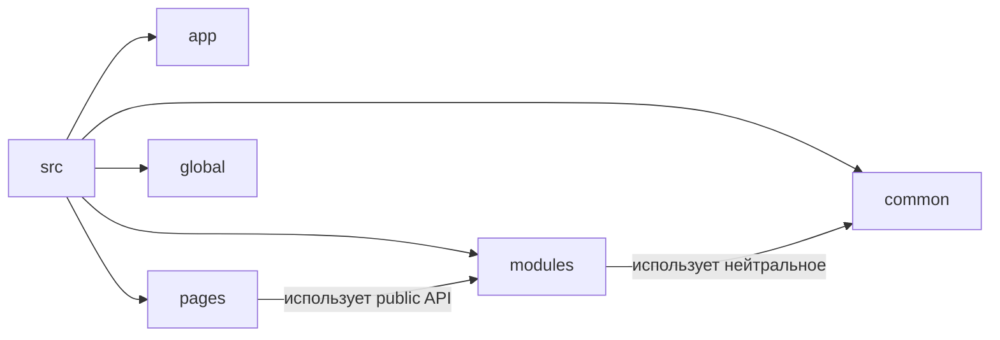

# Быстрый старт

Ниже — минимальная структура FEOD для нового frontend-проекта. Она не покрывает все варианты, но даёт рабочий каркас, на который можно опереться с первого дня.



## Минимальная структура

```text
src/
  app/
    providers/
    router/
    index.ts
  pages/
    home/
      ui/
        home-page.tsx
      index.ts
  modules/
    header/
      ui/
        header.tsx
      model/
        use-header-state.ts
      index.ts
  common/
    ui/
      button/
        button.tsx
        index.ts
  global/
    styles/
      index.css
```

Минимальная роль уровней:

- `app` собирает приложение и знает о маршрутах, провайдерах и инициализации.
- `pages` описывает страницы и может подключать модули.
- `modules` хранит самостоятельные части приложения с собственным `public API`.
- `common` хранит переиспользуемые FEOD-сущности, не привязанные к одному модулю.
- `global` хранит действительно глобальные артефакты.

## Пример страницы

```tsx
// src/pages/home/ui/home-page.tsx
import { Header } from '@/modules/header';

export function HomePage() {
  return (
    <main>
      <Header />
      <h1>Главная</h1>
    </main>
  );
}
```

```ts
// src/pages/home/index.ts
export { HomePage } from './ui/home-page';
```

Страница зависит от модуля через его `public API`, а не от внутренних файлов.

## Пример модуля

```tsx
// src/modules/header/ui/header.tsx
import { useHeaderState } from '../model/use-header-state';

export function Header() {
  const { title } = useHeaderState();

  return <header>{title}</header>;
}
```

```ts
// src/modules/header/model/use-header-state.ts
export function useHeaderState() {
  return {
    title: 'FEOD Docs',
  };
}
```

```ts
// src/modules/header/index.ts
export { Header } from './ui/header';
```

`index.ts` — это `public API` модуля. Всё, что разрешено использовать снаружи, должно быть экспортировано здесь явно.

## Good / Bad: public API

Хорошо:

```ts
import { Header } from '@/modules/header';
```

Плохо:

```ts
import { Header } from '@/modules/header/ui/header';
```

Почему плохо: внешний код начинает зависеть от внутренней структуры модуля. Любое перемещение файла превращается в ломающее изменение.

## Good / Bad: разрешённый импорт и deep import

Хорошо:

```ts
// src/pages/home/ui/home-page.tsx
import { Button } from '@/common/ui/button';
import { Header } from '@/modules/header';
```

Плохо:

```ts
// src/pages/home/ui/home-page.tsx
import { useHeaderState } from '@/modules/header/model/use-header-state';
```

Почему плохо: страница обходит `public API` чужого модуля и начинает знать о его внутренних деталях.

## Что делать дальше

После этого каркаса обычно достаточно трёх следующих шагов:

1. Сверить правило внешних импортов с [Public API](../reference/public-api.md).
2. Проверять кандидатов на общий код через guide [Как не превратить common в свалку](../guides/common-boundaries.md).
3. Разбирать каждую новую папку через guide [Где хранить код](../guides/where-to-place-code.md).

## Короткий чеклист

- В проекте есть уровни `app`, `pages`, `modules`, `common`, `global`.
- У модуля есть `index.ts` с явным `public API`.
- Страницы импортируют модули через `@/modules/<name>`, а не через внутренние файлы.
- `common` не используется как папка «на потом разберёмся».
- `global` не подменяет собой модульный или page-level код.

Если эти пункты выполняются, у проекта уже есть базовый FEOD-каркас, на который можно наращивать более строгие правила.

## Связанные страницы

- [Обзор](./overview.md)
- [Уровни](../core-concepts/levels.md)
- [Матрица импортов](../reference/import-matrix.md)
- [Public API](../reference/public-api.md)
- [Где хранить код](../guides/where-to-place-code.md)
