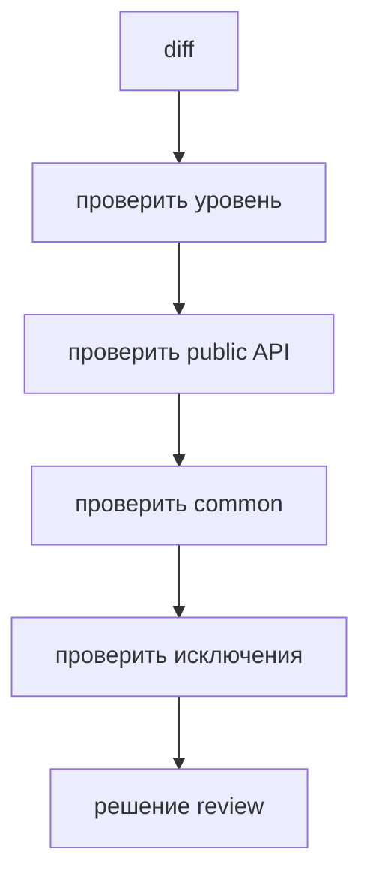

# Code review checklist

Этот guide помогает проверять FEOD-изменения в PR: новые модули, перенос кода, public API и исправление архитектурных нарушений.



## Когда использовать

Используйте checklist при review изменений, которые затрагивают структуру `app`, `pages`, `modules`, `common`, `global` или меняют импорты между ними.

## Входные условия

- Автор PR указал, какие уровни и модули меняются.
- В PR видны новые или изменённые импорты.
- Для нового модуля понятны потребители.
- Если есть исключение, оно описано в PR или проектной документации.

## Шаги

1. Проверьте уровень изменённого кода.

   Код должен лежать там, где его роль совпадает с ролью уровня.

2. Проверьте public API.

   Новый внешний потребитель модуля должен импортировать только `@/modules/<name>`.

3. Найдите deep imports.

   ```ts
   // bad
   import { useCart } from '@/modules/cart/model/use-cart';
   ```

   Нарушение: внешний код зависит от внутренней структуры модуля.

4. Проверьте `common`.

   Если файл в `common` знает о продуктовой области, он должен быть кандидатом на перенос в модуль.

5. Проверьте `pages`.

   Страница может собирать сценарий, но не должна становиться источником переиспользуемой бизнес-логики.

6. Проверьте `global`.

   `global` не должен содержать helpers, UI или бизнес-логику.

7. Проверьте расширение public API.

   Каждый новый export из `index.ts` должен иметь внешнего потребителя или явную причину.

8. Проверьте README модуля.

   Если модуль крупный, README должен совпадать с фактической структурой и public API.

## Итоговая структура

Результат review - не идеальная структура всего проекта, а PR без новых скрытых нарушений:

```text
changed files
  -> correct level
  -> imports through public API
  -> no accidental common
  -> no accidental public exports
```

## Чеклист

- Изменённые файлы находятся на правильных уровнях.
- Внешние импорты модулей идут через public API.
- PR не добавляет новый deep import.
- `common` остаётся нейтральным.
- `pages` не экспортируют reusable business logic.
- `global` содержит только глобальные декларации или side effects.
- Новый public export нужен потребителю.
- Исключения описаны явно.

## Типичные ошибки

- Проверять только дерево файлов, а не импорты -> архитектурное нарушение остаётся в зависимостях.
- Пропустить `export *` -> внутренности модуля становятся публичными.
- Принять доменный helper в `common` из-за короткого имени -> общий уровень получает скрытую бизнес-логику.
- Требовать идеальной миграции всего legacy в одном PR -> review блокирует постепенное улучшение.

## Связанные страницы

- [Code smells](../reference/code-smells.md)
- [Матрица импортов](../reference/import-matrix.md)
- [Контракт модуля](../reference/module-contract.md)
- [ESLint plugin](../tools/eslint-plugin.md)
