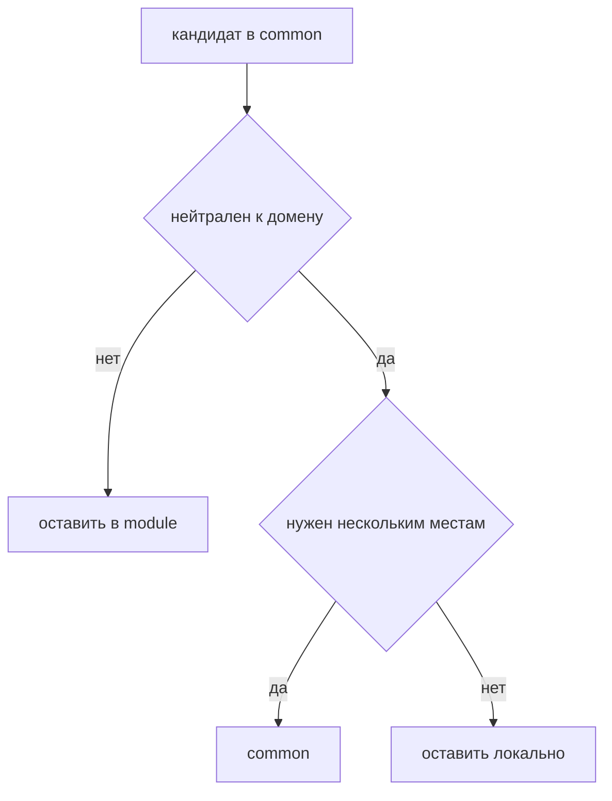

# Как не превратить common в свалку



## Когда использовать

Используйте этот guide при любом предложении перенести код в `common`. Особенно если аргумент звучит как "это пригодится везде", "это используют два модуля" или "непонятно, куда положить".

`common` нужен для нейтральных технических сущностей. Он не должен становиться запасным контейнером для доменной логики.

## Входные условия

- Вы понимаете, какую задачу решает код.
- Известно, какие модули или страницы хотят его использовать.
- Можно ответить, есть ли у кода предметный смысл.
- Есть готовность оставить код внутри модуля, даже если его используют несколько мест.

## Решающее правило

Код можно положить в `common`, только если он остаётся полезным и понятным без знания продуктовой области.

Если helper, type, hook, component или adapter знает о пользователях, заказах, правах, корзине, тарифах, документах или другом домене проекта, это не `common`.

## Шаги

1. Проверьте предметный смысл.

   Вопрос: `Можно ли объяснить этот код без слов из продукта?`

   Можно в `common`:

   ```ts
   formatDate(value: Date): string
   useDebounce(value, delay)
   Button
   PageLayout
   HttpClient
   ```

   Нельзя в `common`:

   ```ts
   formatOrderTotal(order)
   mapCheckoutPayload(draft)
   useCurrentUser()
   canEditInvoice(user, invoice)
   ```

2. Отличите технический helper от доменного helper.

   Технический helper работает с нейтральными типами. Доменный helper выражает правило продукта.

   Технический:

   ```ts
   export function clamp(value: number, min: number, max: number) {}
   ```

   Доменный:

   ```ts
   export function clampDiscount(discount: Discount, plan: BillingPlan) {}
   ```

   Второй helper знает о правилах скидок и тарифов, поэтому должен принадлежать модулю, который владеет этой областью.

3. Проверьте, не нужен ли отдельный модуль.

   Если код нужен нескольким модулям, но имеет предметный смысл, часто нужен сквозной модуль.

   Хорошо:

   ```text
   modules/
     viewer/
       index.ts
       model/useCurrentUser.ts
       api/viewer-client.ts
   ```

   Плохо:

   ```text
   common/
     user/
       useCurrentUser.ts
       viewer-client.ts
   ```

   Нарушение: предметная область пользователя спрятана в общий уровень.

4. Не переносите типы в `common` ради удобного импорта.

   Тип принадлежит владельцу данных. Если `Order` описывает модуль `orders`, экспортируйте его из public API модуля.

   Корректно:

   ```ts
   import type { Order } from "@/modules/orders";
   ```

   Некорректно:

   ```ts
   import type { Order } from "@/common/types";
   ```

   Нарушение: доменная модель отделена от модуля, который отвечает за её смысл.

5. Разделяйте сущности `common` как самостоятельные мини-контракты.

   В `common` не нужен один общий `utils`.

   Хорошо:

   ```text
   common/
     button/
       index.ts
       ui/Button.tsx
     format-date/
       index.ts
       lib/formatDate.ts
     http-client/
       index.ts
       lib/createHttpClient.ts
   ```

   Плохо:

   ```text
   common/
     utils/
       formatDate.ts
       Button.tsx
       orderMapper.ts
       userStore.ts
   ```

   Нарушение: папка не показывает контракт и смешивает технические и доменные вещи.

6. Проверьте зависимости `common`.

   Сущность `common` не импортирует `app`, `pages`, `modules` или `global`. Она может импортировать внешние пакеты и public API других самостоятельных сущностей `common`.

   Разрешено:

   ```ts
   import { cx } from "@/common/cx";
   ```

   Запрещено:

   ```ts
   import type { User } from "@/modules/user";
   import { AppConfig } from "@/app/config";
   ```

   Нарушение: общий уровень начинает зависеть от продуктового или app-level кода.

## Когда код должен переехать из common в модуль

Переносите код из `common` в модуль, если:

- в имени появились продуктовые слова;
- типы зависят от доменной модели;
- тесты описывают бизнес-правила;
- изменение кода требует знания одного продукта или сценария;
- потребителей мало и все они связаны одной предметной областью;
- код нельзя безопасно использовать вне этого сценария.

Пример миграции:

```text
common/
  order-mapper/
    index.ts
```

становится:

```text
modules/
  orders/
    index.ts
    lib/map-order.ts
```

Если mapper нужен снаружи, модуль сам решает, открывать ли его через public API или дать более устойчивую публичную функцию.

## Чеклист

- [ ] Код в `common` можно объяснить без терминов продукта.
- [ ] Сущность имеет собственный `index.ts`.
- [ ] Внутри нет доменных типов, stores, API конкретного модуля или бизнес-правил.
- [ ] `common` не импортирует `modules`, `pages`, `app` или `global`.
- [ ] Типы доменной области экспортируются из владельца, а не из общего мешка типов.
- [ ] Повторное использование не подменило вопрос ответственности.

## Типичные ошибки

- Считать "используется в двух местах" достаточным основанием для `common`.
- Класть в `common` stores и query state, потому что ими пользуются несколько страниц.
- Делать `common/types.ts` для всех доменных типов проекта.
- Прятать API конкретного модуля в общий http-каталог.
- Добавлять `utils` без public API и владельца.

## Связанные страницы

- [Common](../structure/common.md)
- [Modules](../structure/modules.md)
- [Матрица импортов](../reference/import-matrix.md)
- [Где хранить код](./where-to-place-code.md)
