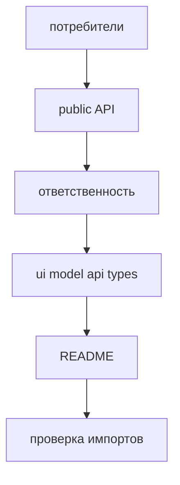

# Как проектировать модуль

Этот guide помогает спроектировать модуль так, чтобы его можно было использовать через явный public API, менять без deep imports и проверять на code review. Начинайте не со структуры папок, а с ответственности модуля и его потребителей.



## Когда использовать

Используйте этот guide, когда вы:

- создаёте новый модуль;
- разбиваете большой сценарий на отдельные модули;
- выносите логику из `pages` или `app` в `modules`;
- пересобираете public API существующего модуля;
- проверяете, не утекли ли наружу детали реализации.

## Входные условия

- Вы можете назвать одну основную ответственность модуля.
- Вы понимаете, кто будет потребителем: `pages`, `app`, другой модуль или только сам модуль.
- Вы знаете, какие зависимости модуль действительно должен иметь.
- Вы готовы держать внутреннюю структуру приватной.

Если вы пока не можете сформулировать одну ответственность, модуль ещё не спроектирован. Сначала опишите сценарий и его границы.

## Шаги

1. Сформулируйте ответственность модуля одним коротким утверждением.

   Хорошая формулировка отвечает на вопрос: `Что этот модуль делает для продукта?`

   Хорошо:

   - `checkout` оформляет заказ;
   - `notifications` показывает и группирует уведомления;
   - `viewer` даёт текущего пользователя и его сессию.

   Плохо:

   - `shared-tools` хранит всё полезное;
   - `utils` содержит helpers для разных задач;
   - `user-and-order` объединяет две несвязанные области.

   Anti-example:

   ```text
   modules/
     shared-tools/
       Button.tsx
       auth-client.ts
       order-mapper.ts
   ```

   Нарушение: модуль не выражает одну ответственность.

2. Определите потребителей модуля до выбора файлов.

   Спросите:

   - Кто будет импортировать модуль?
   - Что именно им нужно: компонент, функция, hook, тип, provider?
   - Что должно остаться внутренней деталью?

   Типовые решения:

   - `Компонент` экспортируйте, если он нужен вне модуля; внутренние parts-компоненты оставляйте приватными.
   - `API-client` не экспортируйте автоматически; обычно наружу нужен сценарий или адаптированная функция, а не transport-деталь.
   - `store` экспортируйте только если внешний код действительно должен работать с ним как с контрактом.
   - `helper` держите приватным, пока он не стал частью сценария модуля.
   - `types` экспортируйте только если они описывают публичные входы и выходы.

   Good example:

   ```text
   Потребители checkout:
   - pages/checkout нужен <CheckoutFlow />
   - pages/checkout нужен тип CheckoutFlowProps
   - другой модуль может вызвать startCheckout()
   - paymentClient и mapCheckoutPayload остаются внутренними
   ```

3. Спроектируйте public API как минимальный контракт.

   External code импортирует модуль только из корня модуля. Public API должен открывать только то, что вы готовы поддерживать как внешний контракт.

   Good example:

   ```ts
   // modules/checkout/index.ts
   export { CheckoutFlow } from "./ui/CheckoutFlow";
   export { startCheckout } from "./model/startCheckout";

   export type { CheckoutFlowProps } from "./ui/CheckoutFlow";
   export type { CheckoutResult } from "./model/checkout.types";
   ```

   Anti-example:

   ```ts
   // modules/checkout/index.ts
   export * from "./api";
   export * from "./model";
   export * from "./ui";
   export * from "./lib";
   ```

   Нарушение: `export *` превращает внутреннюю структуру в неявный контракт и выпускает наружу лишние детали.

4. Разложите внутренности по роли, а не по привычке.

   Внутри модуля допустимы `ui`, `model`, `api`, `lib`, `config`, `types` и другие папки, если они помогают держать одну ответственность. Эти папки не являются обязательными и не должны копироваться механически.

   Практическое правило:

   - `ui` -> публичные и внутренние компоненты модуля;
   - `model` -> состояние, hooks, actions, selectors, domain state;
   - `api` -> transport и адаптеры сценария;
   - `lib` -> внутренние преобразования и helpers;
   - `types` или `*.types.ts` -> типы рядом с владельцем данных;
   - `README.md` -> назначение и границы, если они неочевидны.

   Good example:

   ```text
   modules/
     notifications/
       index.ts
       ui/
         NotificationsBell.tsx
         NotificationsPanel.tsx
         NotificationRow.tsx
       model/
         useNotifications.ts
         notifications-store.ts
         notifications.types.ts
       api/
         notifications-client.ts
       lib/
         group-notifications.ts
   ```

   Anti-example:

   ```text
   modules/
     notifications/
       index.ts
       helper.ts
       helper-2.ts
       new.ts
       test.ts
   ```

   Нарушение: файловая куча не показывает роль частей модуля и быстро ломает навигацию.

5. Скройте детали реализации и запретите deep imports.

   Внешний код не должен знать про `ui`, `api`, `model` и `lib` внутри модуля. Если потребителю нужен внутренний файл, это сигнал пересобрать public API, а не разрешить deep import.

   Good example:

   ```ts
   import { NotificationsBell } from "@/modules/notifications";
   ```

   Anti-example:

   ```ts
   import { NotificationsBell } from "@/modules/notifications/ui/NotificationsBell";
   import { notificationsClient } from "@/modules/notifications/api/notifications-client";
   ```

   Нарушение: потребитель зависит от структуры папок, а не от контракта модуля.

6. Проверьте зависимости модуля до первой интеграции.

   Короткая проверка по матрице:

   - модуль может импортировать `common`;
   - модуль может импортировать public API других модулей;
   - модуль не импортирует `app`;
   - модуль не импортирует `pages`;
   - модуль не импортирует `global`;
   - модуль не делает deep import во внутренности чужого модуля;
   - type-only import не является исключением.

   Good example:

   ```ts
   import { Button } from "@/common/button";
   import { getViewer } from "@/modules/viewer";
   ```

   Anti-example:

   ```ts
   import { AppShell } from "@/app/AppShell";
   import { CatalogPage } from "@/pages/catalog";
   import { normalizeUser } from "@/modules/user/lib/normalizeUser";
   ```

   Нарушение: модуль зависит от запрещённых уровней и внутренних файлов чужого модуля.

7. Добавьте README, если без него границы модуля неочевидны.

   README особенно нужен, если:

   - модуль крупный;
   - у него есть заметные подмодули;
   - public API не сводится к одному компоненту;
   - есть нетривиальные правила использования;
   - ownership важен для review и поддержки.

   Минимум для README:

   - назначение модуля;
   - кто его потребители;
   - что экспортируется из public API;
   - что считается внутренней деталью;
   - какие зависимости считаются ключевыми.

   Anti-example:

   ```md
   # Checkout

   Тут лежит разный код для оформления заказа.
   ```

   Нарушение: README не фиксирует границы, контракт и правила использования.

## Итоговая структура

Типовой результат выглядит так:

```text
modules/
  checkout/
    README.md
    index.ts
    ui/
      CheckoutFlow.tsx
      CheckoutSummary.tsx
    model/
      startCheckout.ts
      useCheckout.ts
      checkout.types.ts
    api/
      checkout-client.ts
    lib/
      map-checkout-payload.ts
    __tests__/
      startCheckout.test.ts
```

Типовой `README.md` модуля:

```md
# Checkout

## Назначение

Модуль оформляет заказ и собирает сценарий checkout.

## Потребители

- `pages/checkout`
- модули, которым нужен `startCheckout`

## Public API

- `CheckoutFlow`
- `startCheckout`
- `CheckoutFlowProps`
- `CheckoutResult`

## Внутренние детали

- `checkout-client`
- `map-checkout-payload`
- внутренние parts-компоненты
```

## Чеклист

- У модуля есть одна основная ответственность.
- Потребители модуля названы до проектирования файловой структуры.
- Public API минимален и перечислен явно в корневом `index.ts`.
- В `index.ts` нет `export *` из внутренних директорий.
- Внутренние helpers, API-клиенты и store не экспортируются без явной причины.
- Доменные типы экспортируются только если они нужны внешнему контракту.
- Модуль не импортирует `app`, `pages`, `global` и внутренности чужих модулей.
- Внешний код может использовать модуль без deep imports.
- Структура модуля объясняет роли частей: `ui`, `model`, `api`, `lib` или другие осмысленные зоны.
- README добавлен, если без него границы модуля неочевидны.

## Типичные ошибки

- Проектировать модуль от списка файлов, а не от ответственности -> модуль быстро становится случайным каталогом.
- Экспортировать наружу `api-client`, `store` и helpers "на всякий случай" -> public API разрастается и фиксирует внутренности.
- Делать `export *` из папок модуля -> любое внутреннее изменение становится потенциальным breaking change.
- Выносить доменные типы в `common` ради удобства -> ответственность модуля распадается.
- Разрешать deep imports как временную меру -> файловая структура становится частью внешнего контракта.
- Держать в одном модуле две несвязанные области -> изменения начинают конфликтовать по ownership и review.
- Не фиксировать потребителей и правила использования в README для крупного модуля -> границы снова приходится объяснять устно.

## Связанные страницы

- [Modules](../structure/modules.md)
- [Public API](../reference/public-api.md)
- [Как писать README модуля](./module-readme.md)
- [Правила именования](../reference/naming.md)
