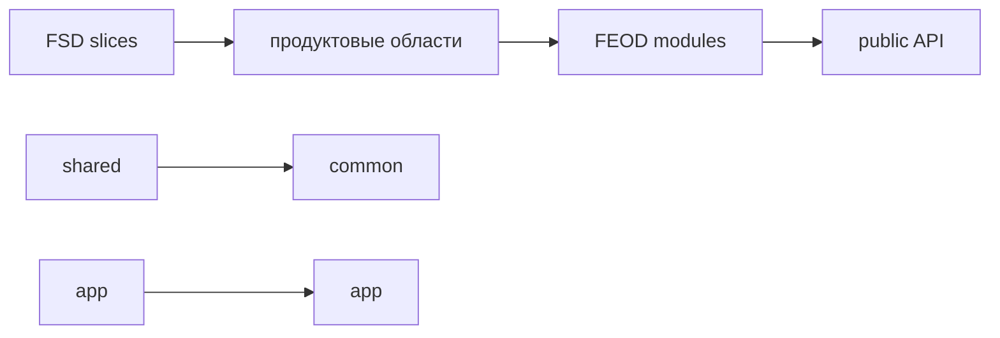

# Миграция с FSD



## Когда использовать

Используйте этот guide, если проект уже построен на Feature-Sliced Design и команда хочет перейти к FEOD без переписывания приложения с нуля.

FSD-термины здесь используются только для сопоставления. После миграции основной язык проекта - уровни FEOD: `app`, `pages`, `modules`, `common`, `global`.

## Входные условия

- Есть текущая FSD-структура и список используемых слоёв.
- Команда понимает, какие `entities`, `features`, `widgets` являются самостоятельными продуктовыми областями.
- Есть возможность вводить public API и менять импорты постепенно.

## Шаги

1. Опишите текущие FSD-слои.

   Зафиксируйте, какие папки реально используются: `app`, `pages`, `widgets`, `features`, `entities`, `shared`. Отдельно отметьте места, где слой существует только номинально.

2. Перенесите `app` почти напрямую.

   FSD `app` обычно хорошо соответствует FEOD `app`: entrypoints, providers, router, bootstrap и композиция верхнего уровня.

3. Перенесите `pages` почти напрямую.

   FSD `pages` обычно остаётся FEOD `pages`. Проверьте, что страницы не стали источником переиспользуемой бизнес-логики.

4. Разберите `shared`.

   Нейтральные UI-примитивы, utilities, framework helpers и общие типы переходят в `common`. Код с продуктовым смыслом не должен оставаться в `common`.

5. Сведите `entities`, `features`, `widgets` к `modules`, если это соответствует выбранной канонической FEOD-версии.

   Группируйте не по старому названию слоя, а по ответственности. Например, `entities/user`, `features/change-email` и `widgets/profile-card` могут стать частями одного модуля `user`, если они описывают одну область.

6. Перепроверьте public API каждого модуля.

   Старые `index.ts` могут экспортировать слишком много. Новый public API должен открывать только поддерживаемый внешний контракт.

7. Упростите спорные границы.

   Если код был размазан между `entities`, `features` и `widgets`, выберите одну ответственность и соберите связанные части рядом.

8. Зафиксируйте отличия в проектном README.

   README должен объяснить, что проект больше не использует FSD как основной язык, а FSD-термины остаются только в migration context.

9. Технические проверки отложите до стабилизации.

   Lint rules, FEOD config и AI rules добавляются на следующем техническом этапе. До этого важно не имитировать архитектуру проверками, а выровнять реальные контракты.

## Пример сопоставления

| FSD | FEOD | Комментарий |
| --- | --- | --- |
| `app` | `app` | Обычно переносится почти напрямую. |
| `pages` | `pages` | Остаётся route-level композицией. |
| `shared` | `common` или `global` | Только нейтральные сущности идут в `common`; декларации и polyfills - в `global`. |
| `entities` | `modules` | Если entity описывает продуктовую область. |
| `features` | `modules` | Если feature является сценарием или частью ответственности модуля. |
| `widgets` | `modules` или `pages` | Зависит от того, это reusable product unit или page composition. |

## Good example

```text
src/
  modules/
    user/
      index.ts
      ui/
        UserMenu.tsx
      model/
        useCurrentUser.ts
      api/
        user-client.ts
```

```ts
import { UserMenu, useCurrentUser } from "@/modules/user";
```

Здесь бывшие части `entities/user`, `features/current-user` и `widgets/user-menu` собраны вокруг одной ответственности и открываются через public API.

## Bad example

```text
src/
  modules/
    entities/
    features/
    widgets/
```

Нарушение: проект переименовал верхний уровень, но сохранил FSD как внутреннюю таксономию без FEOD-границ ответственности.

```ts
import { userModel } from "@/modules/user/model/user-model";
```

Нарушение: миграция не закрыла deep imports и оставила внутренности модуля внешним контрактом.

## Чеклист

- [ ] FSD-термины используются только в migration guide и README, не как основной язык FEOD.
- [ ] `app` и `pages` перенесены без смешения с бизнес-логикой.
- [ ] `shared` разобран на `common`, `global` и продуктовые modules.
- [ ] `entities`, `features`, `widgets` сгруппированы по ответственности в `modules`.
- [ ] У каждого модуля есть явный public API.
- [ ] Deep imports заменяются поэтапно.
- [ ] Технические проверки отложены до стабилизации структуры.

## Типичные ошибки

- Сохранять FSD-слои внутри `modules` -> FEOD становится только внешним переименованием.
- Считать `shared` автоматическим `common` -> доменный код попадает в общий уровень.
- Переносить `widgets` в `pages`, хотя они используются в нескольких сценариях -> reusable product unit теряет владельца.
- Переписать структуру без обновления public API -> потребители продолжают зависеть от внутренних файлов.
- Включить lint до завершения mapping -> команда получает ошибки на переходных состояниях, а не помощь.

## Связанные страницы

- [Уровни](../core-concepts/levels.md)
- [Модульность](../core-concepts/modularity.md)
- [Матрица импортов](../reference/import-matrix.md)
- [Public API](../reference/public-api.md)
- [Термины](../reference/terms.md)
