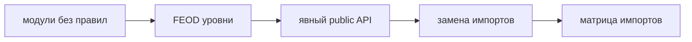

# Миграция с обычной модульной архитектуры



## Когда использовать

Используйте этот guide, если проект уже разделён на крупные папки или модули, но в нём нет явных уровней FEOD, public API модулей и проверяемых правил импортов.

Цель миграции - не переписать проект за один раз, а постепенно сделать границы видимыми и управляемыми.

## Входные условия

- Есть текущая структура проекта.
- Команда может выделить основные страницы и продуктовые области.
- Есть возможность менять импорты постепенно.
- Для спорных мест можно временно оставить migration aliases или совместимые exports.

## Шаги

1. Зафиксируйте текущую карту проекта.

   Выпишите entrypoints, route-level экраны, продуктовые области, общие UI-примитивы, утилиты и глобальные подключения. Не переименовывайте файлы на этом шаге.

2. Выделите `app`.

   В `app` перенесите запуск приложения, провайдеры, router верхнего уровня, layout shell и wiring. Не переносите сюда бизнес-логику конкретных сценариев.

3. Выделите `pages`.

   Route-level экраны должны стать страницами. Страница собирает сценарий из модулей и `common`, но не становится источником переиспользуемой логики.

4. Разделите бизнесовые модули и `common`.

   Код с продуктовой ответственностью переносите в `modules`. Нейтральные UI-примитивы, utilities, framework helpers и общие типы без доменной привязки оставляйте в `common`.

5. Введите public API для модулей.

   У каждого модуля должен появиться корневой `index.ts`. Сначала экспортируйте существующие внешние точки использования, затем постепенно сужайте контракт.

6. Найдите deep imports.

   Ищите импорты во внутренние папки модулей: `ui`, `model`, `api`, `lib`, `config`, `types`. Каждый такой импорт либо переводится на public API, либо фиксируется как временный migration debt.

7. Закрывайте внутренности модулей постепенно.

   Не ломайте всех потребителей сразу. Добавляйте совместимые exports, обновляйте потребителей партиями и удаляйте временные входы после миграции.

8. Добавьте архитектурные проверки на следующем техническом этапе.

   Lint rules, AI rules и FEOD config подключаются после того, как базовая структура стабилизирована. Этот guide фиксирует порядок миграции, а не техническую реализацию проверок.

## Итоговая структура

```text
src/
  app/
    main.tsx
    router/
    providers/
  pages/
    catalog/
      index.ts
      ui/
  modules/
    catalog/
      index.ts
      ui/
      model/
      api/
    cart/
      index.ts
      ui/
      model/
  common/
    ui/
    format-date/
    http-client/
  global/
    env.d.ts
    polyfills/
```

## Good example

```ts
// pages/catalog/ui/CatalogPage.tsx
import { ProductList } from "@/modules/catalog";
import { PageLayout } from "@/common/ui/page-layout";
```

Импорт идёт по разрешённому направлению и через public API.

## Bad example

```ts
// pages/catalog/ui/CatalogPage.tsx
import { ProductList } from "@/modules/catalog/ui/ProductList";
import { cartStore } from "@/modules/cart/model/cart-store";
```

Нарушение: страница зависит от внутренностей модулей и закрепляет старую файловую структуру как внешний контракт.

## Чеклист

- [ ] Entry points и providers находятся в `app`.
- [ ] Route-level экраны находятся в `pages`.
- [ ] Продуктовые области находятся в `modules`.
- [ ] Нейтральные UI и utilities находятся в `common`.
- [ ] Глобальные декларации и polyfills находятся в `global`.
- [ ] У каждого модуля есть `index.ts`.
- [ ] Новые импорты не обходят public API.
- [ ] Временные deep imports отмечены как migration debt.
- [ ] Lint/technical checks вынесены в следующий технический этап.

## Типичные ошибки

- Пытаться сделать big bang rewrite -> миграция останавливает продуктовую работу.
- Сначала переименовать все папки, не меняя зависимости -> структура выглядит как FEOD, но контракты остаются старыми.
- Перенести общий доменный код в `common` -> продуктовая ответственность теряет владельца.
- Закрыть public API без совместимых exports -> потребители ломаются одновременно.
- Подключить линтер до стабилизации структуры -> команда получает шум вместо управляемой миграции.

## Связанные страницы

- [Матрица импортов](../reference/import-matrix.md)
- [Public API](../reference/public-api.md)
- [Где хранить код](./where-to-place-code.md)
