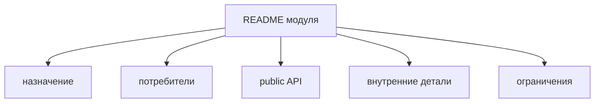

# Как писать README модуля



## Когда использовать

README нужен не каждому маленькому модулю. Пишите его, когда без отдельного текста трудно понять ответственность, public API, ограничения или ownership модуля.

Используйте этот guide, если:

- модуль крупный или критичный;
- у модуля есть подмодули;
- public API не сводится к одному компоненту;
- модуль используют другие модули;
- в review регулярно возникают вопросы о границах;
- у модуля есть ограничения по зависимостям, runtime или миграции.

## Входные условия

- У модуля есть имя и одна основная ответственность.
- Известны внешние потребители.
- Public API уже выражен в корневом `index.ts` или планируется как часть работы.
- Понятно, какие файлы считаются внутренними деталями.

## Структура README

Минимальный README модуля должен отвечать на четыре вопроса:

- зачем существует модуль;
- что можно импортировать извне;
- что нельзя импортировать извне;
- какие зависимости и ограничения важны для изменений.

Рекомендуемый шаблон:

```md
# <Module name>

## Назначение

Коротко: какую продуктовую ответственность держит модуль.

## Потребители

- `pages/...`
- `app`, если модуль подключается на верхнем уровне
- другие modules, если это разрешено через public API

## Public API

- `ExportName`
- `useSomething`
- `SomeType`

## Внутренние детали

- `api/*`
- `model/internal-*`
- parts-компоненты

## Подмодули

- `delivery` - ...
- `payment` - ...

## Зависимости и ограничения

- что модуль может импортировать;
- какие зависимости запрещены;
- временные migration notes, если они есть.
```

Удаляйте секции, которые не нужны конкретному модулю. README не должен становиться формальным документом ради документа.

## Good example

```md
# Checkout

## Назначение

Модуль оформляет заказ: собирает delivery, payment и финальное подтверждение.

## Потребители

- `pages/checkout`
- `pages/cart`, если нужен краткий переход к checkout

## Public API

- `CheckoutFlow`
- `startCheckout`
- `CheckoutResult`

## Внутренние детали

- `api/checkout-client`
- `delivery/*`
- `payment/*`
- `lib/map-checkout-payload`

## Подмодули

- `delivery` хранит форму доставки и её локальную model-логику.
- `payment` хранит шаг оплаты и адаптацию payment provider.

## Зависимости и ограничения

Модуль может импортировать `common` и public API других модулей. Внешние потребители используют только `@/modules/checkout`. Подмодули не импортируются напрямую.
```

Что здесь правильно:

- назначение связано с продуктовой ответственностью;
- public API перечислен явно;
- внутренние детали названы как закрытые;
- подмодули описаны как части родителя;
- ограничения связаны с матрицей импортов.

## Bad example

```md
# Checkout

Тут лежит всё для checkout.

Компоненты в `ui`, логика в `model`, api в `api`.
```

Нарушение: README повторяет имена папок, но не объясняет границы, потребителей и public API.

## Шаги

1. Начните с назначения.

   Одна-две фразы должны ответить, за что отвечает модуль. Если нужно перечислять несвязанные области, модуль, вероятно, слишком широкий.

2. Назовите потребителей.

   Укажите, кто импортирует модуль. Это помогает проверить, действительно ли каждый экспорт нужен внешнему коду.

3. Перечислите public API.

   Список должен совпадать по смыслу с корневым `index.ts`. README не заменяет `index.ts`, но помогает понять намерение.

4. Зафиксируйте внутренние детали.

   Назовите то, что нельзя импортировать извне: raw clients, stores, mappers, parts-компоненты, внутренние типы.

5. Опишите подмодули, если они есть.

   Подмодули описываются как внутренние части родителя. Если внешний код должен использовать их результат, путь всё равно идёт через public API родительского модуля.

6. Добавьте ограничения.

   Фиксируйте только важные правила:

   - запрещённые зависимости;
   - временные migration aliases;
   - требования к тестам;
   - ownership или review notes.

## Чеклист

- [ ] README объясняет ответственность модуля, а не только структуру папок.
- [ ] Public API перечислен явно и не противоречит `index.ts`.
- [ ] Внутренние детали названы закрытыми.
- [ ] Подмодули не описаны как автоматический внешний контракт.
- [ ] Ограничения помогают review и сопровождению.
- [ ] В README нет обещаний про будущую реализацию без текущего решения.

## Типичные ошибки

- Писать README как каталог файлов -> через неделю он устаревает и не помогает.
- Не перечислять public API -> внешний контракт снова приходится угадывать по exports.
- Не объяснять, что закрыто -> потребители продолжают делать deep imports.
- Документировать каждую маленькую функцию -> README превращается в ручной API reference.
- Оставлять migration notes без срока или владельца -> временное правило становится постоянным.

## Связанные страницы

- [Как проектировать модуль](./design-module.md)
- [Как работать с подмодулями](./submodules.md)
- [Modules](../structure/modules.md)
- [Public API](../reference/public-api.md)
