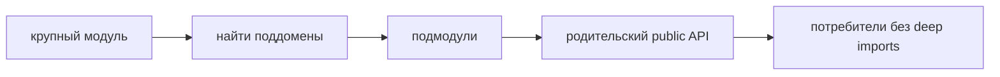

# Как разбивать большой модуль



## Когда использовать

Используйте этот guide, когда один модуль стал слишком большим для review, тестирования и навигации, но его ответственность ещё нельзя просто перенести в `common` или разбросать по страницам.

Сигналы, что модуль нужно пересмотреть:

- изменения в разных сценариях постоянно конфликтуют в одних файлах;
- public API разросся и перестал быть понятным;
- внутри модуля появились устойчивые подзадачи со своим UI, model, api или tests;
- часть кода хочется вынести в `common`, но он всё ещё знает о предметной области;
- новые авторы не могут быстро понять, где находится ответственность.

## Входные условия

- У модуля уже есть явный `index.ts`.
- Команда может назвать основную ответственность модуля.
- Известны основные потребители public API.
- Есть понимание, какие части модуля меняются вместе, а какие живут почти независимо.

Если эти условия не выполнены, сначала опишите модуль через guide [Как проектировать модуль](./design-module.md). Без границ ответственности разбиение будет механическим.

## Шаги

1. Зафиксируйте текущую ответственность.

   Сформулируйте, что модуль делает для продукта, и проверьте, не объединяет ли он несколько несвязанных областей.

   Хорошо:

   - `checkout` оформляет заказ;
   - `notifications` управляет уведомлениями;
   - `admin-users` управляет пользователями в админке.

   Плохо:

   - `shared-tools`;
   - `user-and-billing`;
   - `dashboard-utils`.

2. Разделите внутренние зоны по причинам изменения.

   Ищите части, которые меняются по разным причинам:

   - разные пользовательские сценарии;
   - разные backend-контракты;
   - разные группы UI-компонентов;
   - разные модели состояния;
   - разные owners или review paths.

   Если две части всегда меняются вместе, их не нужно разделять только ради симметрии.

3. Решите: подмодуль, отдельный модуль или внутренняя папка.

   Используйте практическое правило:

   - подмодуль нужен, если это устойчивая часть той же ответственности;
   - отдельный модуль нужен, если часть имеет самостоятельную продуктовую ответственность и потребителей;
   - обычная внутренняя папка подходит, если часть маленькая и не требует собственного контракта.

   Good example:

   ```text
   modules/
     checkout/
       index.ts
       delivery/
         index.ts
         ui/DeliveryForm.tsx
         model/useDelivery.ts
       payment/
         index.ts
         ui/PaymentForm.tsx
         model/usePayment.ts
       model/useCheckout.ts
   ```

   Нарушение:

   ```text
   modules/
     checkout/
       delivery/
         payment/
           card/
             three-ds/
               ui/
   ```

   Глубина больше двух-трёх уровней обычно означает, что границы выбраны слишком поздно или модуль пытается вместить отдельную область.

4. Сохраните внешний public API маленьким.

   Разбиение внутренностей не должно автоматически раздувать `index.ts` родительского модуля.

   Корректно:

   ```ts
   // modules/checkout/index.ts
   export { CheckoutFlow } from "./ui/CheckoutFlow";
   export { startCheckout } from "./model/startCheckout";

   export type { CheckoutResult } from "./model/checkout.types";
   ```

   Некорректно:

   ```ts
   // modules/checkout/index.ts
   export * from "./delivery";
   export * from "./payment";
   export * from "./discounts";
   export * from "./api";
   ```

   Нарушение: внутренние зоны становятся внешним контрактом без решения команды.

5. Переведите внешние deep imports на public API.

   До разбиения найдите импорты во внутренности модуля. После разбиения не переносите эти импорты на новые внутренние пути.

   Было плохо:

   ```ts
   import { PaymentForm } from "@/modules/checkout/ui/PaymentForm";
   ```

   Должно стать:

   ```ts
   import { CheckoutFlow } from "@/modules/checkout";
   ```

   Если потребителю действительно нужен отдельный контракт, сначала добавьте его в корневой `index.ts` и только потом меняйте потребителя.

6. Проверьте кандидатов на переезд в `common`.

   В `common` можно выносить только нейтральный технический код. Повторное использование не делает код общим.

   Оставить в модуле:

   ```ts
   // знает о заказе и правилах checkout
   export function mapCheckoutPayload(draft: CheckoutDraft) {}
   ```

   Можно вынести в `common`:

   ```ts
   // не знает о предметной области
   export function formatDate(value: Date) {}
   ```

7. Добавьте README, если модуль стал крупным.

   После разбиения README должен объяснять:

   - ответственность модуля;
   - внешний public API;
   - какие внутренние зоны существуют;
   - какие зависимости считаются допустимыми;
   - что не нужно импортировать извне.

## Итоговая структура

```text
modules/
  checkout/
    README.md
    index.ts
    ui/
      CheckoutFlow.tsx
    delivery/
      index.ts
      ui/DeliveryForm.tsx
      model/useDelivery.ts
    payment/
      index.ts
      ui/PaymentForm.tsx
      model/usePayment.ts
    api/
      checkout-client.ts
    model/
      startCheckout.ts
      checkout.types.ts
```

## Чеклист

- [ ] Модуль всё ещё описывает одну ответственность.
- [ ] Внутренние зоны выделены по причинам изменения, а не по размеру файлов.
- [ ] Подмодули не стали внешним public API автоматически.
- [ ] Глубина больше двух-трёх уровней обоснована как исключение.
- [ ] Внешние потребители используют корневой `index.ts` модуля.
- [ ] Доменный helper не вынесен в `common` только из-за повторного использования.
- [ ] README обновлён, если границы стали неочевидны.

## Типичные ошибки

- Делить модуль по типам файлов, не меняя ответственность -> структура становится глубже, но понятнее не становится.
- Экспортировать каждый подмодуль наружу -> внутреннее разбиение превращается в публичный контракт.
- Выносить доменные helpers в `common` -> модуль теряет владельца своей логики.
- Создавать многоступенчатую вложенность вместо отдельного модуля -> навигация становится хуже, а зависимости не яснее.
- Оставлять старые deep imports как "временные" без срока удаления -> новая структура закрепляет старую проблему.

## Связанные страницы

- [Как проектировать модуль](./design-module.md)
- [Как работать с подмодулями](./submodules.md)
- [Как не превратить common в свалку](./common-boundaries.md)
- [Public API](../reference/public-api.md)
