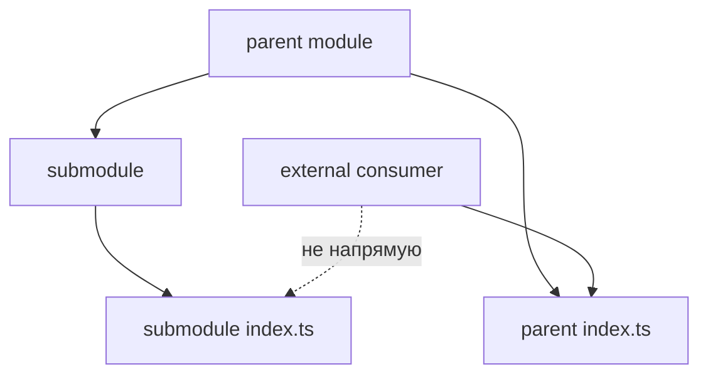

# Как работать с подмодулями



## Когда использовать

Используйте этот guide, если внутри одного модуля появились устойчивые части со своей структурой: `delivery`, `payment`, `permissions`, `filters`, `settings`, `details`.

Подмодуль помогает организовать внутренности крупного модуля. Он не создаёт новый верхний уровень FEOD и не становится внешним контрактом сам по себе.

## Входные условия

- Родительский модуль имеет одну понятную ответственность.
- Подчасть относится к этой ответственности, а не к самостоятельной продуктовой области.
- Есть причина держать у подчасти собственные `ui`, `model`, `api`, `lib` или tests.
- Команда понимает, кто будет использовать подчасть: только родительский модуль или внешний потребитель через public API родителя.

## Шаги

1. Проверьте, что подмодуль не должен стать отдельным модулем.

   Подмодуль подходит, если он не имеет самостоятельного жизненного цикла вне родительской ответственности.

   Подмодуль:

   ```text
   modules/
     checkout/
       delivery/
       payment/
   ```

   Отдельный модуль:

   ```text
   modules/
     payments/
       index.ts
     checkout/
       index.ts
   ```

   Если `payments` используется не только в checkout и имеет свой внешний контракт, лучше сделать самостоятельный модуль.

2. Дайте подмодулю внутренний `index.ts` только для локальной организации.

   Внутренний `index.ts` помогает родительскому модулю не знать файловую структуру подмодуля.

   ```ts
   // modules/checkout/payment/index.ts
   export { PaymentStep } from "./ui/PaymentStep";
   export { usePayment } from "./model/usePayment";
   ```

   Этот файл не означает, что внешний код может импортировать `@/modules/checkout/payment`.

3. Экспортируйте наружу только через родителя.

   Если внешний потребитель должен использовать часть подмодуля, родительский модуль явно включает её в свой public API.

   Корректно:

   ```ts
   // modules/checkout/index.ts
   export { CheckoutFlow } from "./ui/CheckoutFlow";
   export { PaymentStep } from "./payment";
   ```

   ```ts
   import { PaymentStep } from "@/modules/checkout";
   ```

   Некорректно:

   ```ts
   import { PaymentStep } from "@/modules/checkout/payment";
   import { usePayment } from "@/modules/checkout/payment/model/usePayment";
   ```

   Нарушение: потребитель обходит public API родительского модуля.

4. Не используйте подмодуль как способ спрятать лишнюю глубину.

   Подмодуль должен иметь понятную границу. Если внутри него сразу появляются ещё несколько уровней подмодулей, проверьте модель заново.

   Допустимая глубина:

   ```text
   modules/
     admin-users/
       filters/
         index.ts
         ui/UserFilters.tsx
         model/useUserFilters.ts
   ```

   Подозрительная глубина:

   ```text
   modules/
     admin/
       users/
         filters/
           advanced/
             presets/
   ```

   Глубина больше двух-трёх уровней допустима только как осознанное исключение для сложной области с понятным ownership.

5. Держите зависимости подмодуля в рамках родителя.

   Подмодуль может использовать внутренние части родительского модуля и `common`, если это не создаёт циклическую зависимость. Он не должен импортировать `app`, `pages`, `global` или внутренности чужих модулей.

   Разрешено:

   ```ts
   import { Button } from "@/common/button";
   import { useCheckoutDraft } from "../model/useCheckoutDraft";
   ```

   Запрещено:

   ```ts
   import { CheckoutPage } from "@/pages/checkout";
   import { paymentClient } from "@/modules/payments/api/payment-client";
   ```

6. Документируйте только значимые подмодули.

   Не каждый подмодуль требует отдельный README. Но если подмодуль влияет на public API родителя, имеет нетривиальные ограничения или часто вызывает ошибки в review, опишите его в README родительского модуля.

## Good example

```text
modules/
  user/
    README.md
    index.ts
    ui/UserMenu.tsx
    permissions/
      index.ts
      ui/UserPermissionsPanel.tsx
      model/useUserPermissions.ts
    model/useCurrentUser.ts
```

```ts
// modules/user/index.ts
export { UserMenu } from "./ui/UserMenu";
export { UserPermissionsPanel } from "./permissions";
export { useCurrentUser } from "./model/useCurrentUser";
```

Потребитель использует только корень модуля:

```ts
import { UserMenu, UserPermissionsPanel } from "@/modules/user";
```

## Bad example

```ts
import { UserPermissionsPanel } from "@/modules/user/permissions";
import { mapPermission } from "@/modules/user/permissions/lib/mapPermission";
```

Нарушение: наличие `permissions/index.ts` принято за разрешение на внешний импорт подмодуля.

## Чеклист

- [ ] Подмодуль остаётся частью одной ответственности родителя.
- [ ] Внутренний `index.ts` подмодуля не считается внешним public API.
- [ ] Всё, что нужно снаружи, экспортируется через корень родительского модуля.
- [ ] Глубина вложенности не больше двух-трёх уровней без явного обоснования.
- [ ] Подмодуль не импортирует `app`, `pages`, `global` и внутренности чужих модулей.
- [ ] README родителя объясняет значимые подмодули и ограничения.

## Связанные страницы

- [Modules](../structure/modules.md)
- [Public API](../reference/public-api.md)
- [Матрица импортов](../reference/import-matrix.md)
- [Как разбивать большой модуль](./split-large-module.md)
