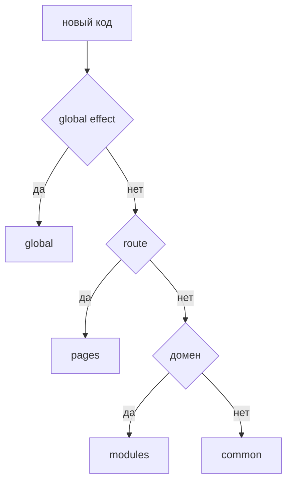

# Где хранить код

Этот guide помогает быстро выбрать уровень для нового кода: `app`, `pages`, `modules`, `common` или `global`. Начните с ответственности кода, а не с удобной папки.



## Когда использовать

Используйте этот guide, когда вы:

- добавляете новый компонент, helper, store, API-client, типы или страницу;
- выносите код из перегруженной папки;
- проверяете, не попал ли код не на свой уровень;
- хотите принять решение без чтения всего reference-раздела.

## Входные условия

- Вы понимаете, какую задачу решает новый код.
- Вы знаете, кто будет его использовать: entrypoint, страница, один модуль, несколько модулей или всё приложение.
- Вы готовы отличать продуктовую ответственность от технической переиспользуемости.

Если эти условия не выполнены, сначала опишите сценарий использования. Без этого любой выбор уровня будет случайным.

## Шаги

1. Определите, даёт ли код глобальный эффект.

   Если файл нужен для `.d.ts`, shim, polyfill, `declare global` или side-effect подключения, его место в `global`.

   Good example:

   ```text
   global/
     vite-env.d.ts
     polyfills/
       resize-observer.ts
   ```

   Anti-example:

   ```text
   global/
     env.ts
     lib/formatMoney.ts
   ```

   Нарушение: обычный импортируемый код нельзя прятать в `global`.

2. Проверьте, собирает ли код приложение целиком.

   Если код отвечает за bootstrap, router верхнего уровня, providers, app shell или wiring между крупными частями системы, его место в `app`.

   Сюда обычно попадают:

   - entrypoint;
   - `App.tsx`;
   - корневой router;
   - app-level providers;
   - подключение глобальных эффектов из entrypoint.

   Good example:

   ```ts
   import { AppRouter } from "@/pages";
   import { AuthSessionProvider } from "@/modules/auth";
   import { ErrorBoundary } from "@/common/error-boundary";

   export function App() {
     return (
       <ErrorBoundary>
         <AuthSessionProvider>
           <AppRouter />
         </AuthSessionProvider>
       </ErrorBoundary>
     );
   }
   ```

   Anti-example:

   ```ts
   import { normalizeUser } from "@/modules/user/lib/normalizeUser";
   ```

   Нарушение: `app` не должен делать deep import во внутренности модуля.

3. Проверьте, относится ли код к конкретному маршруту или экрану.

   Если код существует только как route-level композиция, читает route params, собирает page-level loading/error state или описывает конкретный экран, его место в `pages`.

   Типовой вопрос: `Это page или module?`

   - Если сущность имеет смысл только внутри одного маршрута, это `pages`.
   - Если сущность выражает самостоятельный продуктовый сценарий и может использоваться на нескольких экранах, это `modules`.

   Good example:

   ```text
   pages/
     checkout/
       index.ts
       ui/
         CheckoutPage.tsx
       model/
         useCheckoutRoute.ts
   ```

   Anti-example:

   ```ts
   import { CatalogPage } from "@/pages/catalog";
   import { paymentClient } from "@/modules/checkout/api/paymentClient";
   ```

   Нарушение: страница не импортирует другую страницу и не лезет во внутренности модуля.

4. Проверьте, выражает ли код самостоятельную продуктовую ответственность.

   Если код описывает продуктовый сценарий, предметную область или изолированную возможность, его место в `modules`.

   Сигналы, что нужен модуль:

   - у кода есть собственные потребители;
   - у него будут UI, model, API и tests вокруг одной ответственности;
   - его нужно использовать из нескольких страниц или других модулей;
   - его можно открыть через явный public API.

   Типовые решения:

   - `Компонент` -> в `modules`, если он продуктовый; в `common`, если это технический или UI-примитив без предметного смысла.
   - `API-client` -> в `modules`, если он обслуживает один продуктовый сценарий; в `common`, если это нейтральный транспорт или framework adapter.
   - `store` -> в `modules`, если состояние принадлежит сценарию; в `pages`, если состояние только route-level; не в `common`, если это продуктовый store.
   - `helper` -> в `modules`, если helper знает о предметной области; в `common`, если это техническая утилита без бизнес-смысла.
   - `types` -> рядом с владельцем ответственности; доменные типы модуля не выносятся в `common` ради удобства импорта.

   Good example:

   ```text
   modules/
     checkout/
       index.ts
       ui/
         CheckoutFlow.tsx
       model/
         useCheckout.ts
         checkout.types.ts
       api/
         checkout-client.ts
       lib/
         map-checkout-payload.ts
   ```

   ```ts
   import { CheckoutFlow } from "@/modules/checkout";
   ```

   Anti-example:

   ```text
   modules/
     shared-tools/
       Button.tsx
       useDebounce.ts
       auth-client.ts
       order-mapper.ts
   ```

   Нарушение: каталог смешивает несвязанные ответственности и маскирует свалку.

5. Проверьте, является ли код технически общим, а не продуктовым.

   Если сущность переиспользуема без привязки к предметной области и не знает о конкретном модуле, её место в `common`.

   Сюда обычно попадают:

   - UI primitives;
   - formatters;
   - validators без доменного смысла;
   - framework helpers;
   - небизнесовые hooks;
   - нейтральные инфраструктурные adapters.

   Good example:

   ```text
   common/
     button/
       index.ts
       ui/Button.tsx
     use-debounce/
       index.ts
       lib/useDebounce.ts
   ```

   Anti-example:

   ```text
   common/
     checkout-api/
       api/createOrder.ts
     user/
       model/userStore.ts
   ```

   Нарушение: продуктовые API и store не становятся `common` только потому, что их удобно переиспользовать.

6. Сверьтесь с деревом решений перед созданием файла.

   ```text
   Новый код
   ├─ Даёт глобальный эффект или декларацию окружения?
   │  └─ Да -> global
   ├─ Собирает приложение целиком, bootstrap или app wiring?
   │  └─ Да -> app
   ├─ Существует только как маршрут или экран?
   │  └─ Да -> pages
   ├─ Выражает продуктовую ответственность или сценарий?
   │  └─ Да -> modules
   ├─ Является технически общей сущностью без продуктового смысла?
   │  └─ Да -> common
   └─ Иначе -> вы ещё не определили ответственность; не создавайте файл
   ```

7. Проверьте, не противоречит ли выбор матрице импортов.

   Короткая проверка:

   - `app` может импортировать `pages`, `modules`, `common`;
   - `pages` может импортировать `modules`, `common`;
   - `modules` может импортировать `common` и public API других модулей;
   - `common` может импортировать только public API других сущностей `common` и внешние пакеты;
   - `global` не является обычной прикладной зависимостью.

   Если новый код требует запрещённого импорта, проблема почти всегда в выбранном уровне, а не в матрице.

## Итоговая структура

Типовая раскладка после принятия решения выглядит так:

```text
app/
  App.tsx
  router/
pages/
  checkout/
    index.ts
    ui/
modules/
  checkout/
    index.ts
    ui/
    model/
    api/
    lib/
common/
  button/
    index.ts
    ui/
  use-debounce/
    index.ts
global/
  vite-env.d.ts
  polyfills/
```

Краткая памятка по типовым сущностям:

| Сущность | Куда класть |
| --- | --- |
| Страница | `pages` |
| Route-level loader, error state, чтение params | `pages` |
| Продуктовый компонент | `modules` |
| UI primitive | `common` |
| API-client одного сценария | `modules` |
| Нейтральный HTTP adapter | `common` |
| Store продуктового сценария | `modules` |
| Store только для одного маршрута | `pages` |
| Бизнесовый helper | `modules` |
| Технический helper | `common` |
| Доменные типы модуля | рядом с модулем |
| `.d.ts`, polyfill, shim | `global` |

## Чеклист

- Код размещён по ответственности, а не по удобству импорта.
- Для сущности можно коротко ответить, почему это `app`, `pages`, `modules`, `common` или `global`.
- Новый путь не требует запрещённых импортов по матрице.
- Продуктовая логика не попала в `common`.
- Route-level код не попал в `app` или `modules` без причины.
- Импортируемый обычный код не попал в `global`.
- Доменные типы, store и API-client лежат рядом со своим владельцем.
- Внешние потребители будут использовать сущность через public API её уровня или модуля.

## Типичные ошибки

- Класть код в `common`, потому что он используется в двух местах -> `common` превращается в скрытый каталог продуктовой логики.
- Класть большой пользовательский сценарий в `pages` -> экран начинает владеть бизнес-логикой, которую нельзя нормально переиспользовать.
- Класть технический helper в `modules`, потому что он появился рядом с модулем -> модуль начинает тащить чужую ответственность.
- Класть импортируемый runtime-конфиг в `global` -> появляется запрещённая прикладная зависимость от `global`.
- Выносить доменные типы в `common` ради удобства -> модель модуля теряет владельца.
- Нарушать public API deep import-ами, чтобы "не создавать лишний экспорт" -> файловая структура становится неявным контрактом.

## Связанные страницы

- [Уровни](../core-concepts/levels.md)
- [Матрица импортов](../reference/import-matrix.md)
- [Public API](../reference/public-api.md)
- [Code smells](../reference/code-smells.md)
